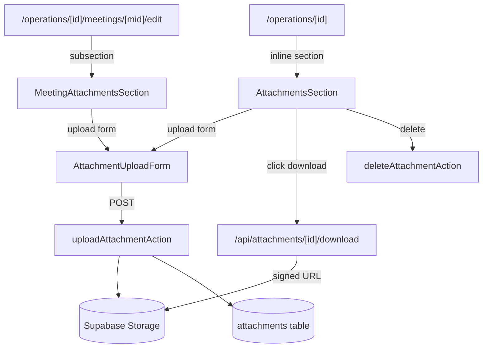

# attachments Design

**Spec**: `.specs/features/attachments/spec.md`

---

## Architecture Overview

Supabase Storage + tabela `attachments` no DB. 2 contextos: Operação (section inline) e Reunião (sub-section no MeetingForm edit). Upload via Server Action; download via Route Handler com signed URL.



---

## Code Reuse

| What | How |
|---|---|
| Server Action pattern (ActionResult) | upload/delete actions |
| `requireUserAction` | guard auth |
| `getOperation` | preload nas pages |
| `Pill`, `Card`, `Button` | UI |
| `relativeFromNow` | exibição |
| `createAdmin` em queries (resolver email do uploader) | reusa do briefings |
| `getMeeting` | validar meeting_id pertence à op |

---

## Data Model

### Bucket Storage

```sql
INSERT INTO storage.buckets (id, name, public)
VALUES ('attachments', 'attachments', false)
ON CONFLICT (id) DO NOTHING;
```

### Storage Policies

```sql
-- SELECT: authenticated lê tudo do bucket
CREATE POLICY storage_attachments_authenticated_read
  ON storage.objects FOR SELECT TO authenticated
  USING (bucket_id = 'attachments');

-- INSERT: authenticated faz upload
CREATE POLICY storage_attachments_authenticated_insert
  ON storage.objects FOR INSERT TO authenticated
  WITH CHECK (bucket_id = 'attachments');

-- DELETE: authenticated remove
CREATE POLICY storage_attachments_authenticated_delete
  ON storage.objects FOR DELETE TO authenticated
  USING (bucket_id = 'attachments');

-- Sem UPDATE: substituir = delete + upload
```

### Tabela `attachments`

```sql
CREATE TABLE public.attachments (
  id uuid PRIMARY KEY DEFAULT gen_random_uuid(),
  operation_id uuid NOT NULL,
  meeting_id uuid,
  storage_path text NOT NULL,
  filename text NOT NULL,
  mime_type text NOT NULL,
  size_bytes bigint NOT NULL,
  description text,
  uploaded_by uuid,
  created_at timestamptz NOT NULL DEFAULT now(),
  updated_at timestamptz NOT NULL DEFAULT now(),
  CONSTRAINT fk_attachments_operation_id
    FOREIGN KEY (operation_id) REFERENCES public.operations(id) ON DELETE CASCADE,
  CONSTRAINT fk_attachments_meeting_id
    FOREIGN KEY (meeting_id) REFERENCES public.meetings(id) ON DELETE SET NULL,
  CONSTRAINT fk_attachments_uploaded_by
    FOREIGN KEY (uploaded_by) REFERENCES auth.users(id) ON DELETE SET NULL,
  CONSTRAINT chk_attachments_size_range
    CHECK (size_bytes > 0 AND size_bytes <= 10485760),
  CONSTRAINT chk_attachments_path_prefix
    CHECK (storage_path LIKE operation_id::text || '/%')
);

CREATE INDEX idx_attachments_operation_created
  ON public.attachments (operation_id, created_at DESC);

CREATE INDEX idx_attachments_meeting_created
  ON public.attachments (meeting_id, created_at DESC)
  WHERE meeting_id IS NOT NULL;

COMMENT ON TABLE public.attachments IS
  'attachment: ref pro Supabase Storage. Path prefixado com operation_id/ (Inv. 11). Meeting_id opcional pra ata/slides.';
```

CHECK `chk_attachments_path_prefix` é defense-in-depth contra path malformado.

### RLS DB

```sql
ALTER TABLE public.attachments ENABLE ROW LEVEL SECURITY;

CREATE POLICY attachments_authenticated_full
  ON public.attachments FOR ALL TO authenticated
  USING (true) WITH CHECK (true);
```

### Trigger updated_at

```sql
CREATE TRIGGER set_attachments_updated_at
  BEFORE UPDATE ON public.attachments
  FOR EACH ROW EXECUTE FUNCTION public.set_updated_at();
```

---

## Componentes Novos

### `src/lib/validators/attachment.ts`

```ts
const MAX_BYTES = 10 * 1024 * 1024;

export const attachmentUploadSchema = z.object({
  filename: z.string().min(1, "Nome obrigatório.").max(200),
  size_bytes: z.number().int().positive().max(MAX_BYTES, "Arquivo > 10MB."),
  mime_type: z.string().min(1).max(200),
  description: z.preprocess(
    (v) => (v === "" || v == null ? undefined : v),
    z.string().max(500).optional(),
  ),
  meeting_id: z.preprocess(
    (v) => (v === "" || v == null ? undefined : v),
    z.string().uuid().optional(),
  ),
});
```

### `src/lib/utils/file.ts`

```ts
// "My Pdf File.pdf" → "My_Pdf_File.pdf"
export function sanitizeFilename(name: string): string;
// 1234567 → "1.2 MB"
export function formatBytes(n: number): string;
// "application/pdf" → "PDF" | "Imagem" | "Doc" | "Arquivo"
export function mimeCategory(mime: string): { label, icon };
```

### `src/lib/db/queries/attachments.ts`

```ts
export type AttachmentRow = ...;

export type AttachmentListItem = {
  id; filename; mimeType; sizeBytes; description; createdAt;
  uploaderEmail: string | null;
  meetingId: string | null;
};

async function listAttachmentsByOperation(operationId, opts?: { withMeeting?: boolean }): Promise<AttachmentListItem[]>;
//   - default: WHERE meeting_id IS NULL (só da Op direto)
//   - withMeeting=true: WHERE meeting_id IS NOT NULL
//   - sem param: tudo
async function listAttachmentsByMeeting(meetingId): Promise<AttachmentListItem[]>;
async function countAttachmentsByMeeting(operationId): Promise<Map<meetingId, count>>;
async function getAttachment(id): Promise<AttachmentRow | null>;
```

`uploaderEmail` resolvido via `createAdmin().auth.admin.getUserById()` (reusa pattern dos briefings).

### `src/lib/actions/attachments.ts`

```ts
async function uploadAttachmentAction(
  operationId: string,
  formData: FormData, // { file, description?, meeting_id? }
): Promise<ActionResult<{ id: string; operationId: string }>>;

async function deleteAttachmentAction(
  attachmentId: string,
): Promise<ActionResult<{ operationId: string }>>;
```

Fluxo upload:
1. Guard auth → user.id
2. Lê file:File do FormData; valida via attachmentUploadSchema (filename, size, mime)
3. Se meeting_id presente: valida via `getMeeting(meeting_id).operation_id === operationId`
4. Sanitize filename → `${operationId}/${crypto.randomUUID()}-${sanitized}`
5. `supabase.storage.from('attachments').upload(path, file, { contentType: file.type })`
6. Se upload falha → return dbErr
7. INSERT em attachments com metadata + uploaded_by
8. Se INSERT falha → tenta `storage.remove([path])` best-effort, return dbErr
9. revalidatePath
10. ok

Fluxo delete:
1. Guard + getAttachment
2. DELETE no DB
3. `storage.remove([storage_path])` best-effort (ignora erro)
4. revalidatePath

### `src/components/domain/AttachmentUploadForm.tsx`

`'use client'`. Form simples (sem RHF — file input não é serialize-friendly via RHF).

```tsx
type Props = {
  operationId: string;
  meetingId?: string;
  onSuccess?: () => void;
};
```

Comportamento:
- file input + description (textarea pequeno) + "Enviar" button
- Validação client: file.size <= MAX_BYTES antes de submit
- Submit:
  - Cria FormData manualmente, adiciona file
  - Chama uploadAttachmentAction(operationId, fd)
  - Em sucesso: router.refresh() (server section re-renderiza)
- Pattern busy

### `src/components/domain/AttachmentsSection.tsx`

Server component (recebe lista pré-carregada). Props: `attachments: AttachmentListItem[]`, `operationId`, `meetingId?` (opcional — quando renderizado dentro de meeting edit).

Estrutura:
- Header: h2 (ajusta nivel se meeting context) + Pill contagem + `<AttachmentUploadForm operationId meetingId />` colapsado em Button "Enviar arquivo" que toggla
- Empty state com CTA
- Lista: cada linha
  - Icon (Lucide: FileText pdf, Image image, FileBox doc, File default)
  - Filename (Link `/api/attachments/[id]/download`)
  - Description (text-mute)
  - Pill mono com tamanho formatado
  - Autor (email) + data relativa mono
  - Button "×" (window.confirm + delete via client wrapper)

Atualizar Timeline component pra mostrar "📎 N" em meeting items que têm anexos — opcional, decisão:
- **Decisão**: passar prop `meetingAttachmentCounts: Map<meetingId, number>` para `MeetingsDecisionsTimeline`. Page /operations/[id] computa via `countAttachmentsByMeeting`.

### `src/app/api/attachments/[id]/download/route.ts`

```ts
export async function GET(req, { params }) {
  // Guard authenticated
  const att = await getAttachment(params.id);
  if (!att) return new Response('Not found', { status: 404 });
  const supabase = await createServer();
  const { data, error } = await supabase.storage
    .from('attachments')
    .createSignedUrl(att.storage_path, 300); // 5min TTL
  if (error || !data) return new Response('Storage error', { status: 500 });
  return Response.redirect(data.signedUrl, 302);
}
```

---

## Páginas / Pontos de integração

| Ponto | Mudança |
|---|---|
| `/operations/[id]/page.tsx` | Carrega `listAttachmentsByOperation(opId)` (só sem meeting_id) + `countAttachmentsByMeeting(opId)`; passa pra `<AttachmentsSection />` e prop nova `meetingAttachmentCounts` em `<MeetingsDecisionsTimeline />` |
| `/operations/[id]/meetings/[mid]/edit/page.tsx` | Carrega `listAttachmentsByMeeting(mid)`; passa pra `<AttachmentsSection attachments operationId meetingId />` |
| `MeetingsDecisionsTimeline` (existing) | Aceita prop opcional `meetingAttachmentCounts: Map<string, number>`; renderiza "📎 N" em items que têm |
| `/api/attachments/[id]/download/route.ts` | **Nova route handler** |

---

## Error Handling

| Scenario | Action | UI |
|---|---|---|
| Auth ausente | err unauthenticated | toast |
| File > 10MB | client + Zod + DB CHECK | inline "Arquivo > 10MB" |
| File vazio | Zod size > 0 | inline |
| Filename vazio | Zod min 1 | inline |
| meeting_id inválido / outro op | action `invalid_meeting` | inline / toast |
| Storage upload falha | dbErr | toast genérico |
| DB insert falha pós-upload | best-effort cleanup + dbErr | toast |
| Operation arquivada | redirect page (assume MVP: bloqueia upload novo via guard na page) | — |
| Download de attachment removido | 404 | — |

---

## Tech Decisions

| Decision | Choice | Rationale |
|---|---|---|
| Bucket privado | Sim | Princípio menor privilégio; download via signed URL |
| Path prefix `<operation_id>/` | Sim, CHECK no DB | Inv. 11 (Casa Financeira pattern); permite RLS storage por op no futuro |
| UUID no filename do path | Sim | Evita colisão; preserva original em `filename` |
| Polimorfismo Frente/Decisão | Não | Op + Meeting cobre 80% |
| Limit 10MB | CHECK no DB + Zod + client | Triplo guard; user errors viram inline |
| MIME whitelist | Não | User sabe; CHECK só tamanho |
| Versionamento | Não | Replace = delete + upload |
| Storage RLS | Authenticated full | Sem profiles; refinar v2 |
| Signed URL TTL | 5min | Suficiente pra clicar; reduz vazamento |
| RHF no upload form | Não | File input não combina; form manual mais simples |
| Storage cleanup órfão | Best-effort | DB é fonte da verdade; órfãos custam $0.01/mês, aceitável |
| Multi-upload | Não | 1 por submit; refator pra batch fica pra v2 |
| Cleanup ao archive de Op | Não automático | Archive ≠ delete; archived_at é só flag. Quando Op for hard-deleted, CASCADE limpa DB; órfãos no Storage idem |
| Preview inline | Não | Download é universal; preview é polish |

---

## Notes

- Storage policies precisam estar na migration, não na UI. Migration usa `CREATE POLICY ... ON storage.objects`.
- Bucket criado via INSERT em `storage.buckets`; idempotente.
- `next.config.ts` não precisa ajuste — não vamos servir arquivos diretamente do app.
- DATABASE_SCHEMA.md ganha tabela `attachments` (+ menção ao bucket).
- Timeline change: `MeetingsDecisionsTimeline` ganha prop opcional, não obrigatória — backward-compatível.
- File input em FormData: Server Actions Next 16 aceitam nativamente; `formData.get("file") as File`.
- Sem `next/dynamic` necessário — AttachmentUploadForm é leve.
