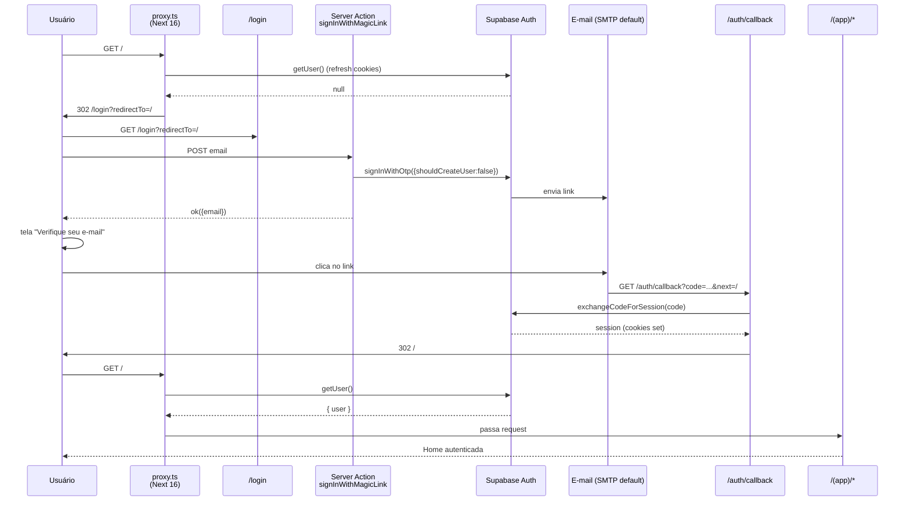

# auth Design

**Spec**: `.specs/features/auth/spec.md`
**Status**: Draft

---

## Architecture Overview

Magic link sob Supabase Auth, com **proxy** do Next 16 (antigo `middleware`, renomeado na v16) gerenciando refresh de sessão e protegendo rotas `(app)`. Server Actions pra mutações de auth, Server Components pra leitura, Client Component hook pra reagir a mudanças.

---

## Code Reuse Analysis

### Existing Components to Leverage

| Component | Location | How to Use |
|---|---|---|
| `createServer()` | `src/lib/db/client.ts:14-37` | Já trata `cookies()` async (Next 15+). Reutilizado em `getUser()`, `requireUser()`, Server Actions, callback. |
| `createBrowser()` | `src/lib/db/client.ts:40-45` | Reutilizado no hook `useUser()` (Client Component) pra subscribe ao `onAuthStateChange`. |
| `ActionResult<T>` + `ok`/`err`/`dbErr` | A criar em `src/lib/actions/_types.ts` (não existe ainda — referenciado em CLAUDE.md "Server Actions") | Esta feature **cria** o módulo. Pattern do CLAUDE.md verbatim. |
| Token DS v2 (cores, fontes, radius) | `src/styles/globals.css` + skill `dryos-design-system` | Form de `/login` usa `bg-bg`, `font-display`, `text-mute`, `rounded`. |
| `requiredEnv()` | `src/lib/db/client.ts:7-12` | Já lança erro explícito em env faltando — auth herda. |

### Integration Points

| System | Integration Method |
|---|---|
| Supabase Auth | `@supabase/ssr` (já instalado). `signInWithOtp`, `exchangeCodeForSession`, `signOut`, `onAuthStateChange`, `getUser`. |
| Next 16 Proxy | `proxy.ts` na raiz de `src/`. Chama `getUser()` em cada request, redireciona/permite com base em rota + sessão. |
| RLS Postgres | Já configurado (`authenticated_full_access`). Auth desbloqueia automaticamente. |
| E-mail | SMTP default do Supabase (rate limit 3 e-mails/hora no free; OK pra MVP de 2-5 usuários). Trocar pra Resend é fora de escopo. |
| Vercel envs | `NEXT_PUBLIC_SUPABASE_URL`, `NEXT_PUBLIC_SUPABASE_PUBLISHABLE_KEY`, `SUPABASE_SECRET_KEY`, `NEXT_PUBLIC_APP_URL` — todas já listadas em `.env.local.example`. `NEXT_PUBLIC_APP_URL` precisa ser preenchida com `https://delivery-os-phi.vercel.app` em produção pra o `emailRedirectTo` apontar pro callback certo. |
| Dashboard Supabase | Convite manual de usuários (Auth → Users → Add user → Send invitation). Self-signup desligado no projeto config. |

---

## Components

### `src/proxy.ts` (Next 16)

- **Purpose**: Refresh de sessão em toda request + redirect baseado em auth/rota.
- **Location**: `src/proxy.ts` (Next 16: arquivo na raiz de src/)
- **Interfaces**:
  - `export async function proxy(request: NextRequest): Promise<NextResponse>`
  - `export const config = { matcher: [...] }` — exclui `_next/static`, `_next/image`, `favicon.ico`, assets públicos.
- **Dependencies**: `@supabase/ssr` (`createServerClient` direto com cookies do `request`/`response` — não dá pra reutilizar `createServer()` que usa `next/headers`).
- **Reuses**: O **pattern** do `createServer()` (`getAll`/`setAll` de cookies), adaptado pra `NextRequest`/`NextResponse` — Supabase recomenda copiar essa boilerplate no proxy. Helper `requiredEnv()` reusado.

### `src/lib/actions/_types.ts`

- **Purpose**: Padrão `ActionResult<T>` + helpers `ok`/`err`/`dbErr` (CLAUDE.md "Server Actions" section).
- **Location**: `src/lib/actions/_types.ts`
- **Interfaces**:
  - `type ActionResult<T> = { ok: true; data: T } | { ok: false; error: string; code?: string }`
  - `function ok<T>(data: T): ActionResult<T>`
  - `function err(error: string, code?: string): ActionResult<never>`
  - `function dbErr(error: { message: string }, context: string): ActionResult<never>`
- **Dependencies**: nenhuma.
- **Reuses**: snippet verbatim do CLAUDE.md.
- **Nota**: Esta feature cria o módulo; vai ser usado por toda Server Action daqui em diante.

### `src/lib/auth/server.ts`

- **Purpose**: Helpers de auth pra Server Components, Server Actions, Route Handlers.
- **Location**: `src/lib/auth/server.ts`
- **Interfaces**:
  - `async function getUser(): Promise<User | null>` — usa `createServer()`.
  - `async function requireUser(redirectTo?: string): Promise<User>` — se null, chama `redirect('/login?redirectTo=...')` do `next/navigation`.
  - `async function requireUserAction(): Promise<ActionResult<User>>` — variante pra Server Actions retornarem `err(...)` em vez de throw/redirect, integrando com `ActionResult<T>`.
- **Dependencies**: `src/lib/db/client.ts`, `next/navigation`, `@supabase/supabase-js` (type `User`).
- **Reuses**: `createServer()`.

### `src/lib/auth/client.ts`

- **Purpose**: Hook `useUser()` pra Client Components.
- **Location**: `src/lib/auth/client.ts`
- **Interfaces**:
  - `function useUser(): { user: User | null; loading: boolean }` — subscribe ao `onAuthStateChange`.
- **Dependencies**: `react`, `src/lib/db/client.ts` (`createBrowser`), `@supabase/supabase-js` (type `User`).
- **Reuses**: `createBrowser()`. Marcado `'use client'`.

### `src/app/(public)/login/page.tsx`

- **Purpose**: Tela de login. Server Component que decide qual view renderizar (form vs check-email) com base em `searchParams` ou state.
- **Location**: `src/app/(public)/login/page.tsx`
- **Interfaces**: `export default async function LoginPage({ searchParams }: { searchParams: Promise<{ redirectTo?: string; error?: string }> }): Promise<JSX.Element>` (Next 15+ searchParams é async).
- **Dependencies**: `src/components/auth/LoginForm.tsx` (client), DS tokens.
- **Reuses**: Layout root (fontes + body class). Mockup de referência: `docs/mockup-v2.html` (mas sem hero — login é minimal).

### `src/components/auth/LoginForm.tsx`

- **Purpose**: Client Component com form de e-mail + estados (idle/sending/sent/error). Usa Server Action `signInWithMagicLinkAction`.
- **Location**: `src/components/auth/LoginForm.tsx`
- **Interfaces**: `function LoginForm({ redirectTo, initialError }: { redirectTo: string; initialError?: string }): JSX.Element`.
- **Dependencies**: `react` (`useState`, `useTransition`), Server Action import, DS tokens (`bg-card`, `font-display`, `text-mute`, `rounded`).
- **Reuses**: Visual respeita DS v2 (tipografia, cores, radius). Sem componentes UI canônicos ainda (Pill/Card etc são sem 02) — usa Tailwind direto com tokens.

### `src/lib/actions/auth.ts`

- **Purpose**: Server Actions de auth.
- **Location**: `src/lib/actions/auth.ts`
- **Interfaces**:
  - `'use server'` no topo.
  - `signInWithMagicLinkAction(formData: FormData): Promise<ActionResult<{ email: string }>>` — chama `signInWithOtp({ email, options: { emailRedirectTo, shouldCreateUser: false } })`. Trata o erro `Signups not allowed for otp` → `err('Acesso não autorizado. Contate o admin.', 'not_invited')`. Rate-limit → `err('Muitas tentativas. Aguarde 1 minuto.', 'rate_limited')`.
  - `signOutAction(): Promise<void>` — chama `signOut()` e `redirect('/login')`.
- **Dependencies**: `src/lib/db/client.ts`, `src/lib/actions/_types.ts`, `next/navigation` (`redirect`).
- **Reuses**: `createServer()`, `ActionResult` helpers.

### `src/app/auth/callback/route.ts`

- **Purpose**: Route Handler que recebe o redirect do magic link (`?code=...&next=...`), troca por sessão.
- **Location**: `src/app/auth/callback/route.ts`
- **Interfaces**: `export async function GET(request: Request): Promise<Response>`.
- **Dependencies**: `src/lib/db/client.ts`, `next/server` (`NextResponse`).
- **Reuses**: `createServer()` (cookies via `next/headers`).
- **Lógica**:
  1. Lê `code` e `next` da URL.
  2. Chama `supabase.auth.exchangeCodeForSession(code)`.
  3. Se sucesso: `NextResponse.redirect(new URL(next || '/', request.url))`.
  4. Se erro: redirect pra `/login?error=callback_failed`.

### `src/app/(app)/page.tsx` (modificação) + `src/app/page.tsx` (remoção)

- **Purpose**: Mover `page.tsx` placeholder pra dentro de `(app)/` pra ficar protegido pelo proxy. Adicionar botão "Sair" temporário (até sidebar real na sem 02).
- **Location**: `src/app/(app)/page.tsx` (novo), `src/app/page.tsx` (deletado)
- **Interfaces**: `export default async function Page(): Promise<JSX.Element>` — usa `requireUser()` ou só `getUser()` (proxy já garantiu auth).
- **Dependencies**: `src/lib/auth/server.ts`, Server Action `signOutAction`.
- **Reuses**: tokens DS.

### `src/app/(app)/layout.tsx` (novo)

- **Purpose**: Layout pro route group autenticado. Por agora um wrapper minimalista; sidebar real entra na sem 02 (`ui-foundation`).
- **Location**: `src/app/(app)/layout.tsx`
- **Interfaces**: `export default async function AppLayout({ children }): Promise<JSX.Element>`.
- **Dependencies**: nenhuma específica (layout vazio com `{children}`).
- **Reuses**: Layout root já cuida das fontes.

---

## Data Models

Nenhum. Nenhuma migration nessa feature. RLS já existe (sem 1). Tabela `profiles` é feature separada (out of scope, registrado no spec).

Anotação: Supabase já mantém a tabela interna `auth.users` automaticamente quando a gente convida pelo dashboard. Não criamos shadow.

---

## Error Handling Strategy

| Error Scenario | Handling | User Impact |
|---|---|---|
| E-mail não convidado | Server Action retorna `err('Acesso não autorizado. Contate o admin.', 'not_invited')` | Form mostra mensagem em vermelho abaixo do botão. **Mensagem genérica** — não confirma existência. |
| Rate limit do Supabase (>3 e-mails/h por destinatário) | Server Action retorna `err('Muitas tentativas. Aguarde 1 minuto.', 'rate_limited')` | Form mostra mensagem. Botão volta a `idle`. |
| Magic link expirado (>1h) ou usado | Callback retorna `redirect('/login?error=link_expired')` | `/login` mostra "Link expirado. Solicite novo." |
| Code inválido no callback (URL adulterada) | Callback retorna `redirect('/login?error=callback_failed')` | `/login` mostra "Falha ao autenticar. Tente novamente." |
| Env vars faltando em produção | `requiredEnv()` lança erro explícito; Next mostra error page | Dev vê stack trace; user vê erro genérico Next |
| Cookie de sessão expirado | Proxy detecta `getUser() === null` → redirect `/login` | User volta pro login transparentemente |

---

## Tech Decisions

| Decision | Choice | Rationale |
|---|---|---|
| `middleware.ts` vs `proxy.ts` | **`src/proxy.ts`** (Next 16) | Next 16 renomeou. Default export ou named `proxy`. Funcionalidade idêntica. Usar `middleware.ts` ainda funciona com warning de deprecation, mas o novo nome é canônico daqui em diante. |
| Magic link vs senha | Magic link only | AskUser. Sem reset flow, sem hash, sem form de cadastro. |
| `shouldCreateUser: false` | Sim | Bloqueia self-signup sem precisar de allowlist custom no app. Convite manual no dashboard cria o user; só aí `signInWithOtp` funciona. |
| Tela "verifique e-mail" in-place vs rota separada | **In-place** no `/login` | Toggle de view via state local. P3 do spec pode promover pra rota separada se ganhar peso. |
| Hook `useUser` lê de Supabase client vs Context Provider | **Client direto + onAuthStateChange** | Simpler. Sem provider extra. Re-renderiza só onde `useUser` é chamado. Trade-off: cada Client Component que usa abre subscription — irrelevante pra MVP. |
| Server Action retorno: throw `redirect` ou `ActionResult` | **`ActionResult` pro form (`signInWithMagicLinkAction`)**, **`redirect` direto pro `signOutAction`** | Form precisa exibir erro inline (não dá pra throw); logout é fluxo "do it and go" sem necessidade de erro UI. CLAUDE.md Invariante 13: actions de mutação retornam `ActionResult` — `signOut` é exceção justificada. |
| Onde colocar `page.tsx` placeholder | **Mover pra `src/app/(app)/page.tsx`** | Route group `(app)` é protegido pelo proxy. `src/app/page.tsx` atual fica fora do grupo → desautenticado vê home, autenticado também vê — quebra UX. Movendo, `/` só renderiza pra autenticado. |
| Proxy faz refresh de sessão E redirect, ou só refresh | **Ambos** (mas refresh é primeiro) | `@supabase/ssr` recomenda chamar `getUser()` em todo request pra refresh transparente. Em seguida, decide redirect com base no path + presença de user. |
| Matcher do proxy | `'/((?!_next/static\|_next/image\|favicon.ico\|.*\\..*).*)'` | Pula assets estáticos. Roda em todo HTML/server path. |
| `emailRedirectTo` na Server Action | `${NEXT_PUBLIC_APP_URL}/auth/callback?next=${redirectTo}` | `NEXT_PUBLIC_APP_URL` precisa estar setada em produção. Em dev = `http://localhost:3000`. |
| Cor visual do `/login` | DS v2 minimal: `bg-bg`, card centralizado `bg-card rounded shadow-sm border border-line`, `font-display` no título, `font-body` no texto. Sem hero oak. | Login não é a face do produto; é gate. Hero oak fica pra Operação aberta (sem 02+). |
| Tela `/auth/check-email` separada | Não (in-place no /login) | P3 do spec; mantém código simples. |

---

## Notes

- **Cuidado com Server Component caching**: Next 16 + Turbopack pode cachear Server Components agressivamente. O proxy contorna porque roda em cada request (não cacheável por construção). Páginas como `/(app)/page.tsx` que dependem de `getUser()` precisam ser dinâmicas — a chamada `cookies()` já marca como dinâmico automaticamente.
- **Quando criar `profiles` (próxima feature)**: vai precisar de trigger Supabase que insere row em `profiles` toda vez que `auth.users` recebe insert. Não nessa feature.
- **Rate limit do SMTP Supabase**: 3 e-mails/hora por destinatário, 30/hora por projeto no plano free. Pra MVP (2-5 usuários, login esporádico) folga. Se virar problema, trocar pra Resend custom SMTP fica como follow-up.
