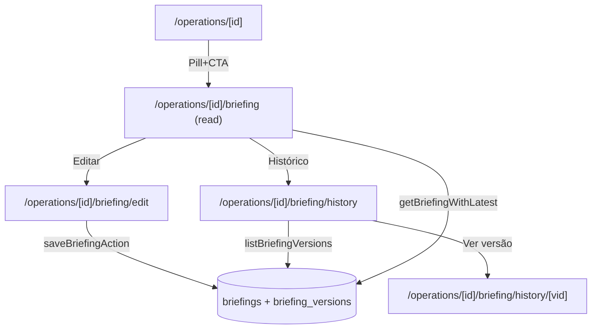

# briefing-vivo Design

**Spec**: `.specs/features/briefing-vivo/spec.md`

---

## Architecture Overview

Primeiro elemento "vivo" do sistema: documento estruturado da Operação com snapshots por save. Schema 2 tabelas (briefings 1:1 com Operation + briefing_versions append-only). 3 rotas: read, edit, history. Sem markdown rico; text puro com `whitespace-pre-wrap`. RLS append-only em versions.



---

## Code Reuse

| What | How |
|---|---|
| RHF + zodResolver | BriefingForm (pattern do skill, igual aos outros forms) |
| ActionResult + helpers | saveBriefingAction |
| `requireUserAction` / guard auth | Action |
| `getOperation` | Pages preload |
| `Pill`, `Card`, `Button`, `Avatar` | UI |
| `relativeFromNow` (utils/date) | "atualizado há Xd" |
| `getInitials` | Avatar do autor |

---

## Data Model

### Tabela `briefings`

```sql
CREATE TABLE public.briefings (
  id uuid PRIMARY KEY DEFAULT gen_random_uuid(),
  operation_id uuid NOT NULL UNIQUE,
  current_version_id uuid,
  created_at timestamptz NOT NULL DEFAULT now(),
  updated_at timestamptz NOT NULL DEFAULT now(),
  CONSTRAINT fk_briefings_operation_id
    FOREIGN KEY (operation_id) REFERENCES public.operations(id) ON DELETE CASCADE,
  CONSTRAINT fk_briefings_current_version_id
    FOREIGN KEY (current_version_id) REFERENCES public.briefing_versions(id) ON DELETE SET NULL
);

COMMENT ON TABLE public.briefings IS
  'briefing: documento estruturado 1:1 com operation. Conteúdo vive em briefing_versions (snapshots).';

COMMENT ON COLUMN public.briefings.current_version_id IS
  'Denormalização: aponta pra versão mais recente. Atualizado no save action.';
```

> Note: `briefings.current_version_id` referencia versão FK; criamos a tabela `briefing_versions` antes na mesma migration via forward declaration ou usamos `ALTER TABLE ADD CONSTRAINT` depois.

### Tabela `briefing_versions`

```sql
CREATE TABLE public.briefing_versions (
  id uuid PRIMARY KEY DEFAULT gen_random_uuid(),
  briefing_id uuid NOT NULL,
  contexto text,
  objetivos text,
  escopo_incluido text,
  escopo_excluido text,
  premissas text,
  riscos text,
  stakeholders text,
  observacoes text,
  author_id uuid,
  created_at timestamptz NOT NULL DEFAULT now(),
  CONSTRAINT fk_briefing_versions_briefing_id
    FOREIGN KEY (briefing_id) REFERENCES public.briefings(id) ON DELETE CASCADE,
  CONSTRAINT fk_briefing_versions_author_id
    FOREIGN KEY (author_id) REFERENCES auth.users(id) ON DELETE SET NULL
);

CREATE INDEX idx_briefing_versions_briefing_created
  ON public.briefing_versions (briefing_id, created_at DESC);

COMMENT ON TABLE public.briefing_versions IS
  'briefing: snapshot append-only. Cada save cria linha. RLS rejeita UPDATE/DELETE.';
```

### RLS

```sql
ALTER TABLE public.briefings ENABLE ROW LEVEL SECURITY;
ALTER TABLE public.briefing_versions ENABLE ROW LEVEL SECURITY;

-- briefings: full crud pra authenticated (sem 1 vibe; refinar com profiles depois)
DROP POLICY IF EXISTS briefings_authenticated_full ON public.briefings;
CREATE POLICY briefings_authenticated_full ON public.briefings
  FOR ALL TO authenticated USING (true) WITH CHECK (true);

-- briefing_versions: SELECT + INSERT only; UPDATE/DELETE rejeitados
DROP POLICY IF EXISTS briefing_versions_authenticated_select ON public.briefing_versions;
CREATE POLICY briefing_versions_authenticated_select ON public.briefing_versions
  FOR SELECT TO authenticated USING (true);

DROP POLICY IF EXISTS briefing_versions_authenticated_insert ON public.briefing_versions;
CREATE POLICY briefing_versions_authenticated_insert ON public.briefing_versions
  FOR INSERT TO authenticated WITH CHECK (true);

-- sem policy de UPDATE/DELETE = bloqueado por default
```

### Trigger updated_at em briefings

Reusa pattern existente:

```sql
CREATE TRIGGER set_briefings_updated_at
  BEFORE UPDATE ON public.briefings
  FOR EACH ROW EXECUTE FUNCTION public.set_updated_at();
```

---

## Componentes Novos

### `src/lib/validators/briefing.ts`

```ts
const optionalText = z.preprocess(
  (v) => (v === "" || v == null ? undefined : v),
  z.string().max(5000, "Máx 5000 caracteres.").optional(),
);

export const briefingSchema = z.object({
  contexto: optionalText,
  objetivos: optionalText,
  escopo_incluido: optionalText,
  escopo_excluido: optionalText,
  premissas: optionalText,
  riscos: optionalText,
  stakeholders: optionalText,
  observacoes: optionalText,
});

export type BriefingInput = z.input<typeof briefingSchema>;
export type BriefingOutput = z.output<typeof briefingSchema>;
```

### `src/lib/db/queries/briefings.ts` (novo)

```ts
export type BriefingContent = {
  contexto: string | null;
  objetivos: string | null;
  escopo_incluido: string | null;
  escopo_excluido: string | null;
  premissas: string | null;
  riscos: string | null;
  stakeholders: string | null;
  observacoes: string | null;
};

export type BriefingVersionRow = BriefingContent & {
  id: string;
  briefing_id: string;
  author_id: string | null;
  created_at: string;
};

export type BriefingWithLatest = {
  id: string;
  operation_id: string;
  current_version_id: string | null;
  updated_at: string;
  latestVersion: BriefingVersionRow | null;
  authorEmail: string | null;
  versionsCount: number;
};

async function getBriefingByOperation(operationId: string): Promise<BriefingWithLatest | null>;
async function getBriefingVersion(versionId: string): Promise<BriefingVersionRow | null>;
async function listBriefingVersions(briefingId: string, limit?: number): Promise<Array<BriefingVersionRow & { authorEmail: string | null }>>;
async function getBriefingFreshness(operationId: string): Promise<{ hasBriefing: boolean; updatedAt: string | null }>;
```

`authorEmail` resolvido via JOIN com `auth.users` (Supabase: `select author:users!fk_briefing_versions_author_id(email)`).

### `src/lib/actions/briefings.ts`

```ts
async function saveBriefingAction(
  operationId: string,
  formData: FormData,
): Promise<ActionResult<{ operationId: string; versionId: string }>>;
```

Fluxo:
1. Guard `auth.getUser()` → err se null. Captura `user.id`.
2. Zod parse.
3. UPSERT `briefings` (ON CONFLICT operation_id DO UPDATE SET updated_at=now() RETURNING id). 
   - Implementação: tenta SELECT → se existe usa id; senão INSERT.
4. INSERT em `briefing_versions` com 8 colunas (parsed; vazias → null) + `author_id=user.id` RETURNING id.
5. UPDATE `briefings` SET current_version_id = newVersionId.
6. `revalidatePath('/operations/[id]/briefing', 'layout')` ou específicos.
7. ok({ operationId, versionId }).

Sem `throw`. Erros DB via `dbErr`.

### `src/components/domain/BriefingForm.tsx`

`'use client'`. RHF + zodResolver. 8 textareas (rows={6}, monospace stack opcional). Props:

```ts
type Props =
  | { mode: "create"; operationId: string }
  | { mode: "edit"; operationId: string; initialData: BriefingContent };
```

Submit → `saveBriefingAction(operationId, formData)` → `router.push(\`/operations/${operationId}/briefing\`)`.

Pattern busy = isSubmitting.

### `src/components/domain/BriefingView.tsx`

Server component. Recebe `latestVersion: BriefingVersionRow` + `sections` config (label + key). Renderiza cada seção como bloco `<section>` com `<h2>` Funnel Display + body `<p whitespace-pre-wrap>` ou empty fallback.

Reuso em both `/briefing` (current) e `/briefing/history/[vid]` (versão específica).

### `src/components/domain/BriefingHero.tsx` (server) ou Pill embedded

Atualização do `OperationHero` (existing): aceita prop `briefingFreshness?: { hasBriefing: boolean; updatedAt: string | null }`. Renderiza Pill:
- `hasBriefing=false` → Pill warning "Sem briefing" + Link "criar →"
- `hasBriefing=true` → Pill sage "Briefing vivo · atualizado há Xd" + Link "→"

Decisão: estender `OperationHero` (passar prop). Sem componente novo.

### `src/components/domain/BriefingHistoryList.tsx`

Server component. Recebe `versions: Array<...>` + `currentVersionId`. Renderiza lista:
- Cada linha: Pill data (sage se current; neutra senão) + Avatar(sm) + autor + preview 120 chars + Link "Ver versão completa"
- Top: pill "Atual" na primeira

---

## Páginas

| Rota | Função |
|---|---|
| `/operations/[id]/briefing` | View atual ou empty state |
| `/operations/[id]/briefing/edit` | BriefingForm (create ou edit conforme exists) |
| `/operations/[id]/briefing/history` | Lista versões |
| `/operations/[id]/briefing/history/[vid]` | Ver versão específica em readonly |

Em todas: UUID guard (`UUID_RE`), preload `getOperation(id)` + cross-validation com briefing/version.

`OperationHero` atualizado pra mostrar status do briefing.

---

## Constants

`src/lib/constants/briefing.ts`:

```ts
export const BRIEFING_SECTIONS = [
  { key: "contexto", label: "Contexto" },
  { key: "objetivos", label: "Objetivos" },
  { key: "escopo_incluido", label: "Escopo incluído" },
  { key: "escopo_excluido", label: "Escopo excluído" },
  { key: "premissas", label: "Premissas" },
  { key: "riscos", label: "Riscos" },
  { key: "stakeholders", label: "Stakeholders" },
  { key: "observacoes", label: "Observações" },
] as const;

export type BriefingSectionKey = (typeof BRIEFING_SECTIONS)[number]["key"];
```

---

## Error Handling

| Scenario | Action | UI |
|---|---|---|
| Auth ausente | err('Sessão expirada.', 'unauthenticated') | toast / redirect |
| Campo > 5000 chars | Zod | erro inline |
| operationId inválido | redirect /operations | — |
| Briefing inexistente em view | empty state | CTA criar |
| Briefing inexistente em history | redirect /briefing | — |
| Version não pertence ao briefing | redirect /briefing/history | — |
| Operação arquivada | edit page redirect /operations/[id]/briefing (readonly mode); view ok | Pill warning "Arquivada" |
| FK 23503 (op deletada entre fetch e save) | dbErr | — (rara; redirect) |

---

## Tech Decisions

| Decision | Choice | Rationale |
|---|---|---|
| 1 tabela com JSONB vs 8 colunas | 8 colunas separadas | Tipagem forte, queries simples, fácil índice por seção. JSONB seria flex demais pra schema 8-fixed |
| Snapshot completo vs diff | Snapshot completo | Storage barato (text < 40KB típico); robusto contra falha de aplicação de patch |
| current_version_id denormalizado | Sim | Evita JOIN+MAX em toda leitura. Trade-off: 2 statements no save (insert version + update briefings); aceitável |
| UPSERT atômico via SQL function vs 2 queries no app | 2 queries no app (mais simples; race aceitável) | Race em concurrent edits cria duas versions ambas válidas; ok |
| RLS append-only via missing policies | Sim | Postgres rejeita ops sem policy explícita = padrão seguro |
| Markdown rendering | Não (text + pre-wrap) | Plain text cobre 80% do valor; markdown adiciona dep (`react-markdown`) sem requisito declarado |
| Validação visibility (público vs privado) | Não no MVP | Vem com public-link-skeleton |
| Limit 5000/campo | Sim (Zod, sem CHECK SQL) | Briefing é narrativa; força concisão; CHECK SQL adiciona migration complexa por validação editorial — Zod basta |
| Restore button | Out of scope | Cobertura via copy-paste no MVP |
| Author display | Email direto | profiles ainda não existe; email é suficiente |
| ON DELETE SET NULL pra author | Sim | Versões preservadas mesmo após user removido (raro, mas correto) |
| CASCADE de Operation pra Briefing | Sim | Briefing morre com Operation; sem orfã |

---

## Notes

- `docs/DATABASE_SCHEMA.md`: adicionar módulo **Briefing** com 2 tabelas (após sem 03 init).
- `OperationHero` recebe prop opcional `briefingFreshness`; pages que renderizam Op (operations/[id]) chamam `getBriefingFreshness` e passam.
- Snapshot append-only via RLS sem policy de UPDATE/DELETE é elegante; documentar isso no comment da tabela.
- `revalidatePath` em `/operations/${id}/briefing` (e variants) após save garante leitura fresh.
- Pra evitar problema de race com `current_version_id` (versão criada mas update da briefing falhou), no get usar fallback: se `current_version_id` null OR não encontra version, busca MAX(created_at). Implementado em `getBriefingByOperation`.
