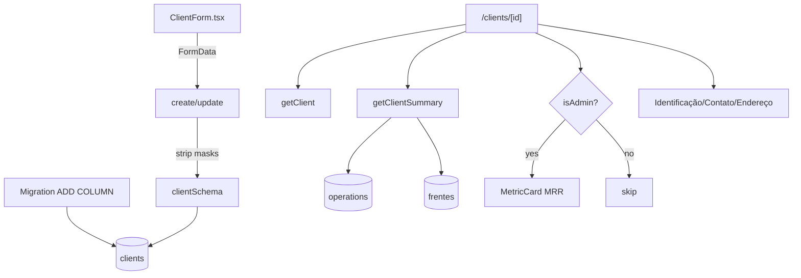

# clients-enrich Design

**Spec**: `.specs/features/clients-enrich/spec.md`

---

## Architecture Overview

Migration ADD COLUMN (13 colunas nullable, 4 CHECKs). Validador Zod estendido. Form ganha sections com máscaras client-side em CNPJ/CEP (armazena dígitos). Página `/clients/[id]` ganha 2 sections novas (Resumo agregado + Identificação/Contato/Endereço) reaproveitando `MetricCard`. Helper de formatação CNPJ/CEP/telefone.



---

## Code Reuse

| What | How |
|---|---|
| `clientSchema` | estender com novos campos |
| `clients` table | ALTER TABLE ADD COLUMN |
| `getClient` | já retorna Row inteira (vai pegar novas cols automaticamente após regen types) |
| `ClientForm` | adicionar sections, mantém pattern existente (RHF + Zod resolver) |
| `MetricCard` | reuso pro resumo |
| `getActiveOperations({clientId})` | já existe; agregar count |
| Pattern `requireUserAction` / `requireAdminAction` | inalterado |
| `formatMoneyBR` | display MRR |

---

## Data Model

### Migration `<ts>_clients_enrich.sql`

```sql
ALTER TABLE public.clients
  ADD COLUMN IF NOT EXISTS legal_name text,
  ADD COLUMN IF NOT EXISTS cnpj text,
  ADD COLUMN IF NOT EXISTS inscricao_estadual text,
  ADD COLUMN IF NOT EXISTS primary_contact_name text,
  ADD COLUMN IF NOT EXISTS primary_contact_email text,
  ADD COLUMN IF NOT EXISTS primary_contact_phone text,
  ADD COLUMN IF NOT EXISTS address_street text,
  ADD COLUMN IF NOT EXISTS address_number text,
  ADD COLUMN IF NOT EXISTS address_complement text,
  ADD COLUMN IF NOT EXISTS address_district text,
  ADD COLUMN IF NOT EXISTS address_city text,
  ADD COLUMN IF NOT EXISTS address_state text,
  ADD COLUMN IF NOT EXISTS address_zip text;

-- CHECKs (idempotente via IF NOT EXISTS no constraint manual)
DO $$ BEGIN
  IF NOT EXISTS (SELECT 1 FROM pg_constraint WHERE conname = 'check_clients_cnpj_length') THEN
    ALTER TABLE public.clients
      ADD CONSTRAINT check_clients_cnpj_length
      CHECK (cnpj IS NULL OR char_length(cnpj) = 14);
  END IF;
  IF NOT EXISTS (SELECT 1 FROM pg_constraint WHERE conname = 'check_clients_state_length') THEN
    ALTER TABLE public.clients
      ADD CONSTRAINT check_clients_state_length
      CHECK (address_state IS NULL OR char_length(address_state) = 2);
  END IF;
  IF NOT EXISTS (SELECT 1 FROM pg_constraint WHERE conname = 'check_clients_zip_length') THEN
    ALTER TABLE public.clients
      ADD CONSTRAINT check_clients_zip_length
      CHECK (address_zip IS NULL OR char_length(address_zip) = 8);
  END IF;
  IF NOT EXISTS (SELECT 1 FROM pg_constraint WHERE conname = 'check_clients_email_shape') THEN
    ALTER TABLE public.clients
      ADD CONSTRAINT check_clients_email_shape
      CHECK (primary_contact_email IS NULL OR primary_contact_email LIKE '%_@_%.%');
  END IF;
END $$;

COMMENT ON COLUMN public.clients.cnpj IS 'Só dígitos (14 chars). Sem máscara. Display formata como 00.000.000/0000-00.';
COMMENT ON COLUMN public.clients.address_zip IS 'Só dígitos (8 chars).';
COMMENT ON COLUMN public.clients.address_state IS 'UF (2 chars).';
COMMENT ON COLUMN public.clients.primary_contact_name IS 'Contato principal — texto livre, não FK pra persons.';
```

---

## Validator — `src/lib/validators/client.ts`

```ts
const optionalText = (max: number) =>
  z.preprocess(
    emptyToUndefined,
    z.string().trim().max(max).optional(),
  );

const optionalDigits = (len: number, msg: string) =>
  z.preprocess(
    emptyToUndefined,
    z.string().regex(new RegExp(`^\\d{${len}}$`), msg).optional(),
  );

const optionalEmail = z.preprocess(
  emptyToUndefined,
  z.string().email("E-mail inválido.").max(150).optional(),
);

const optionalState = z.preprocess(
  emptyToUndefined,
  z.string().regex(/^[A-Z]{2}$/, "UF deve ter 2 letras maiúsculas.").optional(),
);

export const clientSchema = z.object({
  name: /* existing */,
  slug: /* existing */,
  notes: /* existing */,
  legal_name: optionalText(200),
  cnpj: optionalDigits(14, "CNPJ deve ter 14 dígitos."),
  inscricao_estadual: optionalText(30),
  primary_contact_name: optionalText(120),
  primary_contact_email: optionalEmail,
  primary_contact_phone: optionalText(30),
  address_street: optionalText(150),
  address_number: optionalText(20),
  address_complement: optionalText(100),
  address_district: optionalText(100),
  address_city: optionalText(100),
  address_state: optionalState,
  address_zip: optionalDigits(8, "CEP deve ter 8 dígitos."),
});
```

---

## Actions — `src/lib/actions/clients.ts`

`formDataToClientInput` helper estendido:
- Strip não-dígitos de `cnpj` e `address_zip` antes de validar (`raw.replace(/\D/g, '')`)
- Strip mascara do telefone? **Não** — telefone é livre (BR vs intl)
- UF em uppercase automático

`createClientAction` + `updateClientAction` passam os novos campos pro `insert`/`update`. Reaproveitar pattern: spread do `parsed.data`, com `null` em vez de `undefined` pra Supabase aceitar.

```ts
const payload = {
  name: parsed.data.name,
  slug: parsed.data.slug,
  notes: parsed.data.notes ?? null,
  legal_name: parsed.data.legal_name ?? null,
  cnpj: parsed.data.cnpj ?? null,
  inscricao_estadual: parsed.data.inscricao_estadual ?? null,
  primary_contact_name: parsed.data.primary_contact_name ?? null,
  primary_contact_email: parsed.data.primary_contact_email ?? null,
  primary_contact_phone: parsed.data.primary_contact_phone ?? null,
  address_street: parsed.data.address_street ?? null,
  address_number: parsed.data.address_number ?? null,
  address_complement: parsed.data.address_complement ?? null,
  address_district: parsed.data.address_district ?? null,
  address_city: parsed.data.address_city ?? null,
  address_state: parsed.data.address_state ?? null,
  address_zip: parsed.data.address_zip ?? null,
};
```

---

## Queries — `src/lib/db/queries/clients.ts`

Nova função:

```ts
export type ClientSummary = {
  activeOperations: number;
  archivedOperations: number;
  activeFrentes: number;
  mrrTotal: number;
};

export async function getClientSummary(clientId: string): Promise<ClientSummary>;
```

Implementação:
- 1 fetch operations do cliente (id, archived_at, monthly_recurring_revenue) — agregar local
- 1 count frentes via join INNER `operations!inner(client_id)` filtrando `archived_at IS NULL` em ambos
- Reuso de pattern do `getDashboardSummary`

---

## Components

### `ClientForm.tsx` — atualização

Quatro sections com headers visuais, todos colapsando em mobile via simples grid 1-col:

```tsx
<Section title="Identificação">
  <Field label="Nome (fantasia)" required>name</Field>
  <Field label="Slug" required>slug</Field>
  <Field label="Razão social">legal_name</Field>
  <Field label="CNPJ">cnpj (com máscara)</Field>
  <Field label="Inscrição Estadual">inscricao_estadual</Field>
</Section>

<Section title="Contato">
  <Field label="Nome do contato">primary_contact_name</Field>
  <Field label="E-mail" type="email">primary_contact_email</Field>
  <Field label="Telefone">primary_contact_phone</Field>
</Section>

<Section title="Endereço">
  <Field label="Rua">address_street</Field>
  <Field label="Número">address_number</Field>
  <Field label="Complemento">address_complement</Field>
  <Field label="Bairro">address_district</Field>
  <Field label="Cidade">address_city</Field>
  <Field label="UF" select>address_state (27 opções)</Field>
  <Field label="CEP">address_zip (máscara)</Field>
</Section>

<Section title="Observações">
  <Field label="Notas">notes</Field>
</Section>
```

**Máscaras client-side via onChange handler** (sem lib): CNPJ formata `00.000.000/0000-00`; CEP `00000-000`. Helper `formatCnpjMask` / `formatCepMask` em `src/lib/utils/mask.ts` (novo arquivo). Submissão strip via `replace(/\D/g, '')` antes de FormData.

UF: `<select>` com 27 opções (lista de constantes hardcoded em `src/lib/utils/ufs.ts`).

`<Section>` helper local pro form (header h3 + border-top sutil).

### `ClientSummarySection.tsx` (novo, server)

```tsx
type Props = {
  summary: ClientSummary;
  isAdmin: boolean;
};
```

Render: header h2 "Resumo" + grid `grid-cols-2 md:grid-cols-3 lg:grid-cols-4` de MetricCards (3 pra member, 4 pra admin com MRR).

### `ClientIdentitySection.tsx` (novo, server)

Mostra os blocos PJ + Contato + Endereço formatados. Helper local pra esconder bloco vazio.

```tsx
type Props = {
  client: ClientDetail;
};
```

Layout: 3 colunas em desktop (PJ | Contato | Endereço), stack em mobile. Cada bloco com header pequeno + linhas chave/valor. Esconde bloco inteiro se TODOS os campos relevantes estiverem null.

### Helpers novos

**`src/lib/utils/mask.ts`:**
```ts
export function formatCnpj(digits: string | null): string | null;  // 14 digits → '00.000.000/0000-00'
export function formatCep(digits: string | null): string | null;   // 8 digits → '00000-000'
export function applyCnpjMask(raw: string): string;                // live mask (parcial ok)
export function applyCepMask(raw: string): string;
export function stripDigits(raw: string): string;
```

**`src/lib/utils/ufs.ts`:**
```ts
export const UFS = [
  'AC','AL','AM','AP','BA','CE','DF','ES','GO','MA','MG','MS','MT','PA','PB',
  'PE','PI','PR','RJ','RN','RO','RR','RS','SC','SE','SP','TO',
] as const;
```

---

## Pages — `/clients/[id]/page.tsx` (update)

Adicionar:
1. `getProfile()` no Promise.all (já tem outras fetches paralelas)
2. `getClientSummary(id)` no Promise.all
3. Renderizar `<ClientSummarySection summary={summary} isAdmin={isAdmin} />` antes da lista de Operações
4. Renderizar `<ClientIdentitySection client={client} />` antes ou depois do Resumo (decisão: DEPOIS do Resumo, ANTES da lista de Operações)

Estrutura final da página:
```
PageHeader
notes (se houver)
ClientSummarySection   ← novo
ClientIdentitySection  ← novo
ExternalPersonsList    ← existente
ClientDiagnosticSection ← existente
Lista de Operações     ← existente
```

---

## Error Handling

| Scenario | Action | UI |
|---|---|---|
| CNPJ < 14 dígitos | Zod fail | error inline no field cnpj |
| CNPJ duplicado | Permitido | n/a |
| Email malformado | Zod fail | error inline |
| UF inválida | Select limita | n/a |
| CEP < 8 | Zod fail | error inline |
| Client com legacy null em todos os campos | Section identity skip blocos vazios | "—" ou bloco oculto |
| MRR pra member | server skip prop | card não renderiza |
| Migration falha CHECK em dado existente | Improvável — todos os campos novos | n/a |

---

## Tech Decisions

| Decision | Choice | Rationale |
|---|---|---|
| ADD COLUMN único migration | Sim, 13 colunas + 4 CHECKs | Atomic |
| Nullable tudo | Sim | Cliente legado sem dados |
| CNPJ só dígitos | Sim no banco | Format no display |
| Máscara CNPJ no input | Sim, live | UX |
| Máscara CEP no input | Sim | UX |
| Máscara telefone | Não | BR/intl variation; preserva input |
| UF select | Sim | Evita lixo "Sao Paulo" no campo |
| MRR admin-only | Sim, prop drilling | Inv. 14 |
| Resumo posição | Antes de Identidade e Operações | Pergunta principal primeiro |
| ClientForm: zodResolver | Mantém | Pattern existente |
| Section helper | Local no form | Sem promover pra DS ainda |
| FK contato | Não | Texto livre (decisão usuário) |
| 4 sections separadas | Sim | Form grande precisa de quebra visual |
| Strip masks no action | Sim, antes de validar | Garante banco limpo |
| Migration retro CHECK | Improvável quebrar | Todos campos novos = null |

---

## Notes

- Migration aplicada via MCP `apply_migration`.
- Regenerar types após apply.
- `ClientInput` / `ClientOutput` ganham 13 chaves novas; updates devem propagar via lint.
- `clients` query `listClients` continua leve (não precisa retornar PJ/contato/endereço — só nome+slug pra lista).
- `getClient` retorna Row completa → automaticamente tem os campos novos após gen:types.
- Smoke: criar cliente novo com tudo preenchido, editar campos PJ, verificar máscara display.
- DATABASE_SCHEMA.md: atualizar tabela `clients` com novas colunas.
