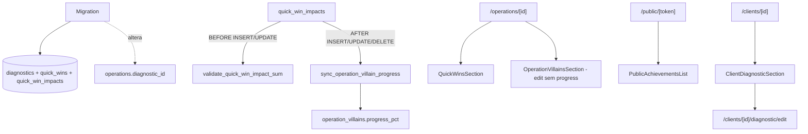

# diagnostico-quickwins Design

**Spec**: `.specs/features/diagnostico-quickwins/spec.md`

---

## Architecture Overview

3 tabelas novas + 1 ALTER + 1 enum + **2 triggers críticos** que enforçam Inv. 08 e mantêm `operation_villains.progress_pct` derivado.



---

## Code Reuse

| What | How |
|---|---|
| RHF + zodResolver | DiagnosticForm + QuickWinForm |
| ActionResult + helpers | actions |
| `requireUserAction` | guard |
| `Pill`, `Card`, `Button` | UI |
| `relativeFromNow`, `formatDateBR` | datas |
| `resolveVillainIcon` | chips com icon |
| `createAdmin` | public queries + opener email resolve |
| `OperationVillainListItem` | join via operation_villain_id em impacts |
| Padrão de inline form (collapsible) | QuickWinForm reusa do AssignVillainForm |

---

## Data Model

### Enum product_recommendation

```sql
DO $$
BEGIN
  IF NOT EXISTS (SELECT 1 FROM pg_type WHERE typname = 'product_recommendation') THEN
    CREATE TYPE product_recommendation AS ENUM ('core', 'spark', 'studio');
  END IF;
END $$;
```

### Tabela diagnostics

```sql
CREATE TABLE public.diagnostics (
  id uuid PRIMARY KEY DEFAULT gen_random_uuid(),
  client_id uuid NOT NULL UNIQUE,
  notes text NOT NULL,
  recommended_product product_recommendation,
  conducted_at date,
  created_at timestamptz NOT NULL DEFAULT now(),
  updated_at timestamptz NOT NULL DEFAULT now(),
  CONSTRAINT fk_diagnostics_client_id
    FOREIGN KEY (client_id) REFERENCES public.clients(id) ON DELETE CASCADE,
  CONSTRAINT chk_diagnostics_notes_length
    CHECK (length(notes) >= 10 AND length(notes) <= 10000)
);

COMMENT ON TABLE public.diagnostics IS
  'Diagnóstico precede a Operação (PRD §04). 1 por cliente no MVP; revisões viram v2.';
```

### ALTER operations

```sql
ALTER TABLE public.operations
  ADD COLUMN IF NOT EXISTS diagnostic_id uuid;

DO $$
BEGIN
  IF NOT EXISTS (
    SELECT 1 FROM pg_constraint WHERE conname = 'fk_operations_diagnostic_id'
  ) THEN
    ALTER TABLE public.operations
      ADD CONSTRAINT fk_operations_diagnostic_id
      FOREIGN KEY (diagnostic_id) REFERENCES public.diagnostics(id)
      ON DELETE SET NULL;
  END IF;
END $$;

COMMENT ON COLUMN public.operations.diagnostic_id IS
  'Link opcional pro diagnóstico do Cliente que originou esta Operação.';
```

### Tabela quick_wins

```sql
CREATE TABLE public.quick_wins (
  id uuid PRIMARY KEY DEFAULT gen_random_uuid(),
  operation_id uuid NOT NULL,
  frente_id uuid,
  executor_id uuid,
  title text NOT NULL,
  description text,
  happened_at date NOT NULL DEFAULT current_date,
  created_at timestamptz NOT NULL DEFAULT now(),
  updated_at timestamptz NOT NULL DEFAULT now(),
  CONSTRAINT fk_quick_wins_operation_id
    FOREIGN KEY (operation_id) REFERENCES public.operations(id) ON DELETE CASCADE,
  CONSTRAINT fk_quick_wins_frente_id
    FOREIGN KEY (frente_id) REFERENCES public.frentes(id) ON DELETE SET NULL,
  CONSTRAINT fk_quick_wins_executor_id
    FOREIGN KEY (executor_id) REFERENCES auth.users(id) ON DELETE SET NULL,
  CONSTRAINT chk_quick_wins_title_length
    CHECK (length(title) >= 3 AND length(title) <= 200),
  CONSTRAINT chk_quick_wins_description_length
    CHECK (description IS NULL OR length(description) <= 5000)
);

CREATE INDEX idx_quick_wins_operation_happened
  ON public.quick_wins (operation_id, happened_at DESC);

COMMENT ON TABLE public.quick_wins IS
  'Quick Win: unidade de avanço narrativo. Vinculada a Operação (e opcionalmente Frente). Impactos em vilões via quick_win_impacts.';
```

### Tabela quick_win_impacts

```sql
CREATE TABLE public.quick_win_impacts (
  id uuid PRIMARY KEY DEFAULT gen_random_uuid(),
  quick_win_id uuid NOT NULL,
  operation_villain_id uuid NOT NULL,
  impact_pct integer NOT NULL,
  created_at timestamptz NOT NULL DEFAULT now(),
  CONSTRAINT fk_quick_win_impacts_quick_win_id
    FOREIGN KEY (quick_win_id) REFERENCES public.quick_wins(id) ON DELETE CASCADE,
  CONSTRAINT fk_quick_win_impacts_operation_villain_id
    FOREIGN KEY (operation_villain_id) REFERENCES public.operation_villains(id) ON DELETE CASCADE,
  CONSTRAINT uq_quick_win_impacts_qw_ov
    UNIQUE (quick_win_id, operation_villain_id),
  CONSTRAINT chk_quick_win_impacts_pct_range
    CHECK (impact_pct >= 1 AND impact_pct <= 100)
);

CREATE INDEX idx_quick_win_impacts_operation_villain
  ON public.quick_win_impacts (operation_villain_id);

COMMENT ON TABLE public.quick_win_impacts IS
  'M:N entre quick_win e operation_villain. Soma de impact_pct por operation_villain capped 100% (Inv. 08, trigger).';
```

### Trigger validate_quick_win_impact_sum (Inv. 08)

```sql
CREATE OR REPLACE FUNCTION public.validate_quick_win_impact_sum()
RETURNS TRIGGER AS $$
DECLARE
  current_sum int;
BEGIN
  SELECT COALESCE(SUM(impact_pct), 0)
    INTO current_sum
    FROM public.quick_win_impacts
    WHERE operation_villain_id = NEW.operation_villain_id
      AND id != COALESCE(NEW.id, '00000000-0000-0000-0000-000000000000'::uuid);

  IF current_sum + NEW.impact_pct > 100 THEN
    RAISE EXCEPTION 'Soma de impactos excede 100%% para este vilão (atual: %, novo: %, total seria: %). Inv. 08.',
      current_sum, NEW.impact_pct, current_sum + NEW.impact_pct
      USING ERRCODE = 'check_violation';
  END IF;
  RETURN NEW;
END;
$$ LANGUAGE plpgsql;

CREATE TRIGGER validate_quick_win_impacts_sum
  BEFORE INSERT OR UPDATE ON public.quick_win_impacts
  FOR EACH ROW EXECUTE FUNCTION public.validate_quick_win_impact_sum();
```

### Trigger sync_operation_villain_progress (deriva progress_pct)

```sql
CREATE OR REPLACE FUNCTION public.sync_operation_villain_progress()
RETURNS TRIGGER AS $$
DECLARE
  target_ov_id uuid;
  new_sum int;
BEGIN
  -- Em DELETE, OLD; em INSERT/UPDATE, NEW (ou ambos se UPDATE muda ov_id)
  IF TG_OP = 'DELETE' THEN
    target_ov_id := OLD.operation_villain_id;
  ELSE
    target_ov_id := NEW.operation_villain_id;
  END IF;

  SELECT COALESCE(SUM(impact_pct), 0)
    INTO new_sum
    FROM public.quick_win_impacts
    WHERE operation_villain_id = target_ov_id;

  UPDATE public.operation_villains
    SET progress_pct = new_sum
    WHERE id = target_ov_id;

  -- Se UPDATE mudou operation_villain_id, recalcular o antigo também
  IF TG_OP = 'UPDATE' AND OLD.operation_villain_id IS DISTINCT FROM NEW.operation_villain_id THEN
    SELECT COALESCE(SUM(impact_pct), 0)
      INTO new_sum
      FROM public.quick_win_impacts
      WHERE operation_villain_id = OLD.operation_villain_id;
    UPDATE public.operation_villains
      SET progress_pct = new_sum
      WHERE id = OLD.operation_villain_id;
  END IF;

  RETURN NULL; -- AFTER trigger
END;
$$ LANGUAGE plpgsql;

CREATE TRIGGER sync_operation_villain_progress_after
  AFTER INSERT OR UPDATE OR DELETE ON public.quick_win_impacts
  FOR EACH ROW EXECUTE FUNCTION public.sync_operation_villain_progress();
```

**Cuidado com o trigger de `lock_operation_villain_initial_severity`:** ele já existe em operation_villains BEFORE UPDATE. O novo trigger sync vai disparar UPDATE de progress_pct. Verificar que o lock não bloqueia mudança de progress_pct (ele só checa initial_severity — ok).

### Triggers updated_at

```sql
CREATE TRIGGER set_diagnostics_updated_at BEFORE UPDATE ON diagnostics ...;
CREATE TRIGGER set_quick_wins_updated_at BEFORE UPDATE ON quick_wins ...;
```

### RLS

3 tabelas: `authenticated_full` policy (mesmo padrão).

---

## Componentes Novos

### Validators

```ts
// src/lib/validators/diagnostic.ts
export const diagnosticSchema = z.object({
  notes: z.string().trim().min(10).max(10000),
  recommended_product: z.preprocess(
    (v) => (v === "" || v == null ? undefined : v),
    z.enum(["core", "spark", "studio"]).optional(),
  ),
  conducted_at: z.preprocess(
    (v) => (v === "" || v == null ? undefined : v),
    z.string().regex(/^\d{4}-\d{2}-\d{2}$/).optional(),
  ),
});

// src/lib/validators/quick-win.ts
const impactSchema = z.object({
  operation_villain_id: z.string().uuid(),
  impact_pct: z.coerce.number().int().min(1).max(100),
});

export const quickWinSchema = z.object({
  title: z.string().trim().min(3).max(200),
  description: optionalText, // max 5000
  happened_at: z.string().regex(/^\d{4}-\d{2}-\d{2}$/),
  frente_id: optionalUuid,
  impacts: z.array(impactSchema).max(7).default([]),
});
```

### Queries

```ts
// src/lib/db/queries/diagnostics.ts
async function getDiagnosticByClient(clientId): Promise<DiagnosticRow | null>;

// src/lib/db/queries/quick-wins.ts
export type QuickWinListItem = {
  id; title; description; happenedAt; frenteId; frenteName; executorEmail;
  impacts: Array<{
    id; impactPct; operationVillainId;
    villain: { id, name, slug, iconName, pillVariant };
  }>;
};
async function listQuickWinsByOperation(operationId): Promise<QuickWinListItem[]>;
async function getQuickWin(id): Promise<QuickWinRow | null>;
async function listPublicQuickWins(operationId, limit=12): Promise<QuickWinListItem[]>;
//   createAdmin; ORDER happened_at DESC LIMIT
```

### Actions

```ts
// src/lib/actions/diagnostics.ts
async function upsertDiagnosticAction(clientId, formData): Promise<ActionResult<{id}>>;

// src/lib/actions/quick-wins.ts
async function createQuickWinAction(operationId, formData): Promise<ActionResult<{id}>>;
//   INSERT QW + batch INSERT impacts dentro de transaction implícita
//   Se trigger Inv. 08 rejeitar → rollback (Supabase: separate inserts; precisamos transação manual via RPC OU lidar best-effort)
//   MVP: INSERT QW + INSERT impacts sequencial. Se algum impact falhar com check_violation → DELETE o QW pra rollback manual.

async function updateQuickWinAction(qwId, formData): Promise<ActionResult>;
//   UPDATE QW + DELETE impacts existentes + INSERT novos (mesmo pattern do meeting_attendees)
//   Se algum INSERT impact falhar → ainda assim, os DELETE já aconteceram. Idealmente RPC transactional.
//   MVP: aceitar limitação; trigger rejeita = retorna erro impact_cap_exceeded; admin re-tenta com valores ajustados.

async function deleteQuickWinAction(qwId): Promise<ActionResult>;
//   CASCADE remove impacts; trigger sync recalcula progress
```

> **Limitação MVP:** sem RPC transactional, batch insert de impacts pode deixar QW criado se 1 impact rejeitar. Mitigação: validação client-side soma local antes de submit + check final via trigger.

### Components

- `src/components/domain/DiagnosticForm.tsx` — client RHF
- `src/components/domain/ClientDiagnosticSection.tsx` — server; card display em /clients/[id]
- `src/components/domain/QuickWinForm.tsx` — client RHF; impactos como array dinâmico (useFieldArray)
- `src/components/domain/QuickWinRow.tsx` — server; lista item com chips impacto + edit/delete
- `src/components/domain/QuickWinsSection.tsx` — server; container
- `src/components/domain/PublicAchievementsList.tsx` — server; público
- Update `EditOperationVillainForm` — remove progress_pct input, mantém evidence

### Page

`/clients/[id]/diagnostic/edit/page.tsx`:
- UUID guard
- getClient + getDiagnosticByClient
- DiagnosticForm (mode varies se exists)

---

## Páginas / Pontos de integração

| Página | Mudança |
|---|---|
| `/clients/[id]` | adicionar ClientDiagnosticSection |
| `/clients/[id]/diagnostic/edit` | **nova** rota |
| `/operations/[id]` | adicionar QuickWinsSection entre Vilões e Frentes |
| OperationForm | adicionar select diagnostic_id (carrega via cliente) |
| OperationDetail query | incluir diagnostic_id |
| `/public/[token]` | adicionar PublicAchievementsList após PublicVillainsList |

---

## Error Handling

| Scenario | Action | UI |
|---|---|---|
| Auth ausente | err unauthenticated | toast |
| Diagnostic notes < 10 chars | Zod | inline |
| QW title < 3 | Zod | inline |
| impact_pct fora 1-100 | Zod + CHECK | inline |
| Soma impacts > 100 (trigger Inv. 08) | check_violation → err `impact_cap_exceeded` | toast com mensagem clara |
| Diagnostic já existe pra cliente em CREATE | 23505 → action faz UPDATE (upsert) | sem erro UX |
| Operation_villain referenciado é da outra op | Validação action (fetch e check op_id) | err `invalid_villain` |
| Cliente sem diagnóstico em OperationForm | select disabled / oculto | "Cliente não tem diagnóstico" hint |

---

## Tech Decisions

| Decision | Choice | Rationale |
|---|---|---|
| diagnostic 1:1 cliente | UNIQUE(client_id) | MVP single |
| Notes vs estruturado | Notes text + product enum | Flexível MVP |
| Promote vilões diagnostic→op | Manual MVP | Auto promote = v2 |
| QW impact storage | Tabela separada qw_impacts | Inv. 08 + audit |
| progress_pct derived | Sim, via trigger AFTER | Single source of truth |
| Edit progress manual | Removido | Limpa modelo |
| Trigger BEFORE vs AFTER | BEFORE pra rejeitar + AFTER pra sync | Cleanest |
| Transaction QW + impacts | Não MVP (limitação) | RPC pode entrar v2 se virar problema real |
| Public achievements limit | 12 | Cobertura razoável |
| Diagnostic public | Não | Foco em vilões + QWs |
| Impact pct = 0 | Não permitido (CHECK 1+) | Sem QW sem efeito |
| Multiple QWs same villain | Permitido | Soma capped 100 |
| Update QW pode mudar ov_id de impact | Sim; trigger recalcula ambos | Robusto |
| Trigger lock_severity conflita? | Não — checa apenas severity column | Independent |

---

## Notes

- Migration unifica enum + 3 tabelas + ALTER + 2 triggers + 2 updated_at + RLS x3 num arquivo grande.
- `OperationVillainListItem` shape não muda; só semântica de progress_pct.
- `EditOperationVillainForm` pode ficar com info "Progresso derivado dos Quick Wins" + lista de QWs que impactaram (futuro polish).
- `OperationForm` precisa fetcha diagnostic do cliente em paralelo; passa pra form.
- Public ordering: happened_at DESC. Cliente vê narrativa recente primeiro.
- DATABASE_SCHEMA.md ganha 3 tabelas + enum + nota em operations.
