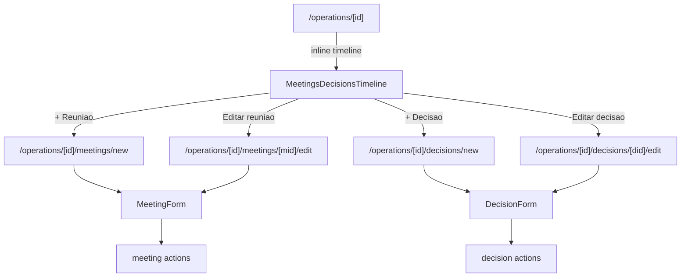

# meetings-decisions Design

**Spec**: `.specs/features/meetings-decisions/spec.md`

---

## Architecture Overview

Duas entidades irmãs (reunião + decisão) com FK opcional entre elas. Timeline inline na page da Operação intercalando ambas por data. Padrões já maduros: enum SQL, RLS authenticated, RHF + zodResolver, hard delete, redirect-after-action.



---

## Code Reuse

| What | How |
|---|---|
| RHF + zodResolver | MeetingForm, DecisionForm |
| ActionResult + helpers | actions |
| `requireUserAction` | guard auth |
| `getOperation` | preload nas pages |
| `Pill`, `Card`, `Button`, `Avatar` | UI |
| `relativeFromNow` | timeline + pills |
| `listInternalPersons` + nova `listExternalPersonsByClient` | select attendees |
| `formatDateBR` | exibição |
| Padrão de "hard delete com window.confirm" | reusa de allocations |

---

## Data Model

### Enums

```sql
CREATE TYPE meeting_visibility AS ENUM ('interno', 'cliente');
CREATE TYPE decision_visibility AS ENUM ('interno', 'cliente');
```

Dois enums separados (não compartilhar) — mantém invariante 05 do PRD explícito: decisão tem visibility própria, não herdada.

### Tabela `meetings`

```sql
CREATE TABLE public.meetings (
  id uuid PRIMARY KEY DEFAULT gen_random_uuid(),
  operation_id uuid NOT NULL,
  title text NOT NULL,
  scheduled_at timestamptz NOT NULL DEFAULT now(),
  notes text,
  visibility meeting_visibility NOT NULL DEFAULT 'interno',
  created_at timestamptz NOT NULL DEFAULT now(),
  updated_at timestamptz NOT NULL DEFAULT now(),
  CONSTRAINT fk_meetings_operation_id
    FOREIGN KEY (operation_id) REFERENCES public.operations(id) ON DELETE CASCADE
);

CREATE INDEX idx_meetings_operation_scheduled
  ON public.meetings (operation_id, scheduled_at DESC);

COMMENT ON TABLE public.meetings IS
  'reunião com cliente/interna. Liga a uma Operação. Visibility própria (Inv. 05).';
```

### Tabela `meeting_attendees`

```sql
CREATE TABLE public.meeting_attendees (
  meeting_id uuid NOT NULL,
  person_id uuid NOT NULL,
  created_at timestamptz NOT NULL DEFAULT now(),
  PRIMARY KEY (meeting_id, person_id),
  CONSTRAINT fk_meeting_attendees_meeting_id
    FOREIGN KEY (meeting_id) REFERENCES public.meetings(id) ON DELETE CASCADE,
  CONSTRAINT fk_meeting_attendees_person_id
    FOREIGN KEY (person_id) REFERENCES public.persons(id) ON DELETE RESTRICT
);

COMMENT ON TABLE public.meeting_attendees IS
  'junção N:N entre meetings e persons. RESTRICT em person pra preservar histórico.';
```

### Tabela `decisions`

```sql
CREATE TABLE public.decisions (
  id uuid PRIMARY KEY DEFAULT gen_random_uuid(),
  operation_id uuid NOT NULL,
  meeting_id uuid,
  title text NOT NULL,
  context text,
  decision text NOT NULL,
  visibility decision_visibility NOT NULL DEFAULT 'cliente',
  decided_at timestamptz NOT NULL DEFAULT now(),
  created_at timestamptz NOT NULL DEFAULT now(),
  updated_at timestamptz NOT NULL DEFAULT now(),
  CONSTRAINT fk_decisions_operation_id
    FOREIGN KEY (operation_id) REFERENCES public.operations(id) ON DELETE CASCADE,
  CONSTRAINT fk_decisions_meeting_id
    FOREIGN KEY (meeting_id) REFERENCES public.meetings(id) ON DELETE SET NULL
);

CREATE INDEX idx_decisions_operation_decided
  ON public.decisions (operation_id, decided_at DESC);

COMMENT ON TABLE public.decisions IS
  'decisão registrada. Standalone (operation_id NOT NULL) com meeting_id opcional (SET NULL). Inv. 02: decisão ≠ tarefa.';
COMMENT ON COLUMN public.decisions.visibility IS
  'Visibility independente da meeting (Inv. 05 do PRD).';
```

### Triggers updated_at

Reusa função existente `set_updated_at` pra `meetings` e `decisions` (não em `meeting_attendees`).

### RLS

```sql
ALTER TABLE public.meetings ENABLE ROW LEVEL SECURITY;
ALTER TABLE public.meeting_attendees ENABLE ROW LEVEL SECURITY;
ALTER TABLE public.decisions ENABLE ROW LEVEL SECURITY;

CREATE POLICY meetings_authenticated_full ON public.meetings
  FOR ALL TO authenticated USING (true) WITH CHECK (true);

CREATE POLICY meeting_attendees_authenticated_full ON public.meeting_attendees
  FOR ALL TO authenticated USING (true) WITH CHECK (true);

CREATE POLICY decisions_authenticated_full ON public.decisions
  FOR ALL TO authenticated USING (true) WITH CHECK (true);
```

---

## Componentes Novos

### `src/lib/validators/meeting.ts` + `decision.ts`

```ts
// meeting.ts
const optionalText = z.preprocess(
  (v) => (v === "" || v == null ? undefined : v),
  z.string().max(5000).optional(),
);

export const meetingSchema = z.object({
  title: z.string().trim().min(3, "Mínimo 3 caracteres.").max(200),
  scheduled_at: z.string().min(1, "Data obrigatória."), // ISO datetime-local
  notes: optionalText,
  visibility: z.enum(["interno", "cliente"]),
  attendee_ids: z.array(z.string().uuid()).default([]),
});

// decision.ts
export const decisionSchema = z.object({
  title: z.string().trim().min(3).max(200),
  context: optionalText,
  decision: z.string().trim().min(3, "Decisão obrigatória.").max(5000),
  visibility: z.enum(["interno", "cliente"]),
  decided_at: z.string().min(1),
  meeting_id: z.preprocess(
    (v) => (v === "" || v == null ? undefined : v),
    z.string().uuid().optional(),
  ),
});
```

### `src/lib/db/queries/meetings.ts` + `decisions.ts`

```ts
// meetings
type MeetingRow = Database["public"]["Tables"]["meetings"]["Row"];

type MeetingListItem = {
  id; title; scheduledAt; visibility; notes;
  attendees: Array<{ id; name; kind }>;
};

async function listMeetingsByOperation(operationId, limit=20): Promise<MeetingListItem[]>;
async function getMeeting(id): Promise<MeetingRow & { attendees: Array<{id,name,kind}> } | null>;
async function listAttendeeCandidates(clientId): Promise<Array<{id,name,kind}>>; // internas + externas do cliente

// decisions
type DecisionListItem = {
  id; title; decision; context; visibility; decidedAt;
  meeting?: { id; title; scheduledAt };
};

async function listDecisionsByOperation(operationId, limit=20): Promise<DecisionListItem[]>;
async function getDecision(id): Promise<...>;
```

### `src/lib/actions/meetings.ts` + `decisions.ts`

```ts
// meetings: create / update / delete
//  - create: insert meeting + insert attendees em batch
//  - update: update meeting + DELETE attendees existentes + INSERT novos (simples; sem diff)
//  - delete: hard delete (CASCADE derruba attendees)

// decisions: create / update / delete (sem attendees)
```

### `src/components/domain/MeetingForm.tsx`

`'use client'`. RHF + zodResolver. Props discriminadas (create/edit). Campos:
- title (required)
- scheduled_at (datetime-local input)
- visibility (radio interno/cliente com pills inline)
- notes (textarea)
- attendees (multi-checkbox group separado em 2 sub-seções: "Internas" e "Externas {cliente}")

### `src/components/domain/DecisionForm.tsx`

Mesma estrutura. Campos:
- title (required)
- context (textarea, opcional — situação que motivou)
- decision (textarea, required — decisão tomada em prosa)
- visibility (radio)
- decided_at (datetime-local)
- meeting_id (select opcional com reuniões da Op)

### `src/components/domain/MeetingsDecisionsTimeline.tsx`

Server component. Props: `meetings: MeetingListItem[]`, `decisions: DecisionListItem[]`, `operationId`.

Algoritmo:
1. Merge meetings + decisions em array unificado `{ type: 'meeting'|'decision', timestamp, payload }`
2. Sort DESC por timestamp
3. Slice 8 primeiros
4. Renderiza cada item via `<TimelineItem>` interno

Estrutura visual:
- Header: h2 "Reuniões e decisões" + Pill contagem total + 2 Links "+ Reunião" e "+ Decisão"
- Lista vertical com linha conectora à esquerda (CSS: border-left)
- Cada item: ícone + Pill visibility + título + data relativa + preview + link "Editar →"

Empty state: card centralizado com 2 CTAs.

### `src/lib/utils/datetime.ts` (novo helper)

```ts
// 2026-05-17T13:45 (datetime-local) → ISO
export function dateTimeLocalToISO(local: string): string;
// ISO → 2026-05-17T13:45 pra prefill datetime-local
export function isoToDateTimeLocal(iso: string): string;
// "qua, 17 mai · 13:45"
export function formatDateTimeBR(iso: string): string;
```

### Constants `src/lib/constants/visibility.ts`

```ts
export const VISIBILITY_LABEL = { interno: "Interno", cliente: "Cliente" };
export const VISIBILITY_VARIANT = { interno: "warning", cliente: "sage" } as const;
```

---

## Páginas

| Rota | Função |
|---|---|
| `/operations/[id]/meetings/new` | MeetingForm create |
| `/operations/[id]/meetings/[mid]/edit` | MeetingForm edit |
| `/operations/[id]/decisions/new` | DecisionForm create |
| `/operations/[id]/decisions/[did]/edit` | DecisionForm edit |

Todas: UUID guard, preload `getOperation` + dados específicos em paralelo, redirect se inválido.

`/operations/[id]/page.tsx`: substitui `<PlaceholderSection title="Reuniões e decisões" />` por `<MeetingsDecisionsTimeline />`.

---

## Error Handling

| Scenario | Action | UI |
|---|---|---|
| Auth ausente | err unauthenticated | redirect |
| title curto | Zod | inline |
| attendee person_id FK miss | 23503 → `invalid_attendee` | inline general |
| Operation inválida | redirect /operations | — |
| Meeting/decision id não pertence à op do path | redirect /operations/[id] | — |
| Decision meeting_id que não pertence à op | Zod refine adicional OU validação na action; mapeia pra `invalid_meeting` | inline |
| FK person archived | listAttendeeCandidates filtra; race rara → 23503 | inline general |
| Operation arquivada | bloqueia edit page (redirect view) | — |

---

## Tech Decisions

| Decision | Choice | Rationale |
|---|---|---|
| Enums separados meeting_visibility e decision_visibility | Sim, 2 enums | Inv. 05: visibility da decisão é conceitualmente independente; enum compartilhado escondia isso |
| Standalone decision com meeting_id opcional | FK SET NULL | Princípio 02 + flex pra decisões async (Discord) |
| Attendees N:N com persons | Tabela `meeting_attendees` PK composto | Reúso de pessoas cadastradas; FK RESTRICT preserva histórico |
| Update attendees: diff ou delete+insert? | delete+insert (simples) | UX raramente edita só attendees; performance trivial |
| Author tracking em meeting/decision | Não no MVP | Profiles ainda não existe; menos crítico que briefing (sem versionamento) |
| Markdown rendering | Não — text + pre-wrap | Mesma decisão do briefing |
| scheduled_at futura | Permitida | Reunião agendada antes de acontecer |
| decided_at no passado | Permitido | Registrar decisão tomada antes (backfill ok) |
| Timeline limit 8 | Sim | Suficiente pro overview; "Ver todos" fica como hint futuro |
| Hard delete | Sim | CASCADE da Op; meeting_attendees CASCADE de meeting |
| Visibility default | meeting → `interno`, decision → `cliente` | Reunião nasce interna até decidir compartilhar; decisão tende a ser registrada pra cliente ver (princípio 05 da CLAUDE) |
| listAttendeeCandidates separado de listInternalPersons? | Sim — combina internas + externas do client | UX: select num único campo agrupando 2 fontes |
| Pill icons | Lock pra interno, Users pra cliente | Visual reforço, princípio 10 |

---

## Notes

- `docs/DATABASE_SCHEMA.md` ganha 3 tabelas + 2 enums.
- `OperationDetail` query não precisa mudar — timeline fetch é separado.
- Page `/operations/[id]` adiciona 2 chamadas em paralelo (`listMeetingsByOperation`, `listDecisionsByOperation`).
- Sem listagem global pra MVP. Se virar gargalo, criamos `/operations/[id]/meetings` e `.../decisions` depois.
- ON DELETE SET NULL em `decisions.meeting_id` é importante: apagar reunião não destrói decisão.
