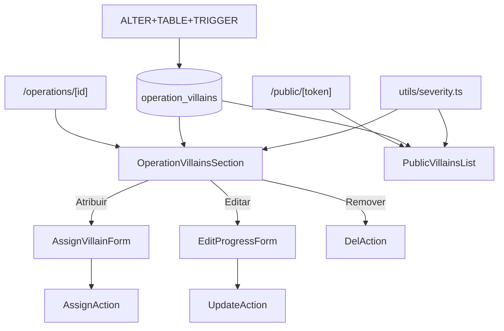

# operation-villains Design

**Spec**: `.specs/features/operation-villains/spec.md`

---

## Architecture Overview

M:N entre operations e villains. Trigger SQL enforça write-once de `initial_severity` (Inv. 07). UI section inline em /operations/[id] + section pública em /public/[token]. Helper de progress bar reusável.



---

## Code Reuse

| What | How |
|---|---|
| `resolveVillainIcon` | mostrar icon do vilão (catalog) |
| `Pill` variants | severity + progress |
| `Card` | wrapper |
| RHF + zodResolver | AssignVillainForm + EditProgressForm |
| ActionResult | actions |
| `requireUserAction` | guard |
| `listVillains` (filter ativos) | select de atribuir |
| `createAdmin` | public list (bypass RLS) |

---

## Data Model

### Enum severity_level

```sql
DO $$
BEGIN
  IF NOT EXISTS (SELECT 1 FROM pg_type WHERE typname = 'severity_level') THEN
    CREATE TYPE severity_level AS ENUM ('low', 'medium', 'high', 'critical');
  END IF;
END $$;
```

### Tabela operation_villains

```sql
CREATE TABLE public.operation_villains (
  id uuid PRIMARY KEY DEFAULT gen_random_uuid(),
  operation_id uuid NOT NULL,
  villain_id uuid NOT NULL,
  initial_severity severity_level NOT NULL,
  progress_pct integer NOT NULL DEFAULT 0,
  evidence text,
  created_at timestamptz NOT NULL DEFAULT now(),
  updated_at timestamptz NOT NULL DEFAULT now(),
  CONSTRAINT fk_operation_villains_operation_id
    FOREIGN KEY (operation_id) REFERENCES public.operations(id) ON DELETE CASCADE,
  CONSTRAINT fk_operation_villains_villain_id
    FOREIGN KEY (villain_id) REFERENCES public.villains(id) ON DELETE RESTRICT,
  CONSTRAINT uq_operation_villains_op_villain
    UNIQUE (operation_id, villain_id),
  CONSTRAINT chk_operation_villains_progress_range
    CHECK (progress_pct >= 0 AND progress_pct <= 100),
  CONSTRAINT chk_operation_villains_evidence_length
    CHECK (evidence IS NULL OR length(evidence) <= 1000)
);

CREATE INDEX idx_operation_villains_operation_created
  ON public.operation_villains (operation_id, created_at DESC);

COMMENT ON TABLE public.operation_villains IS
  'M:N entre operation e villain. Inv. 07: initial_severity write-once via trigger. Inv. 08: progress_pct capped 0-100.';
COMMENT ON COLUMN public.operation_villains.initial_severity IS
  'Write-once: vem do diagnóstico, não muda. Trigger BEFORE UPDATE bloqueia mudanças.';
```

### Trigger write-once (Inv. 07)

```sql
CREATE OR REPLACE FUNCTION public.lock_operation_villain_initial_severity()
RETURNS TRIGGER AS $$
BEGIN
  IF NEW.initial_severity IS DISTINCT FROM OLD.initial_severity THEN
    RAISE EXCEPTION 'initial_severity é write-once (Inv. 07). Para mudar, delete e recrie a atribuição.'
      USING ERRCODE = 'check_violation';
  END IF;
  RETURN NEW;
END;
$$ LANGUAGE plpgsql;

DROP TRIGGER IF EXISTS lock_operation_villains_initial_severity
  ON public.operation_villains;
CREATE TRIGGER lock_operation_villains_initial_severity
  BEFORE UPDATE ON public.operation_villains
  FOR EACH ROW EXECUTE FUNCTION public.lock_operation_villain_initial_severity();
```

### Trigger updated_at

```sql
CREATE TRIGGER set_operation_villains_updated_at
  BEFORE UPDATE ON public.operation_villains
  FOR EACH ROW EXECUTE FUNCTION public.set_updated_at();
```

### RLS

```sql
ALTER TABLE public.operation_villains ENABLE ROW LEVEL SECURITY;

CREATE POLICY operation_villains_authenticated_full
  ON public.operation_villains FOR ALL TO authenticated
  USING (true) WITH CHECK (true);
```

---

## Componentes Novos

### `src/lib/utils/severity.ts`

```ts
import type { PillVariant } from "@/components/ui/Pill";

export type SeverityLevel = "low" | "medium" | "high" | "critical";

export const SEVERITY_LABEL: Record<SeverityLevel, string> = {
  low: "Baixa",
  medium: "Média",
  high: "Alta",
  critical: "Crítica",
};

export const SEVERITY_VARIANT: Record<SeverityLevel, PillVariant> = {
  low: "neutral",
  medium: "oak",
  high: "warning",
  critical: "critical",
};

// Variant do progresso baseado em pct (0-100)
export function progressVariant(pct: number): PillVariant {
  if (pct >= 75) return "sage";
  if (pct >= 50) return "ok";
  if (pct >= 25) return "oak";
  return "warning";
}
```

### `src/lib/validators/operation-villain.ts`

```ts
const progressInput = z.preprocess((v) => {
  if (typeof v === "number") return v;
  if (typeof v === "string" && v !== "") {
    const n = Number(v);
    return Number.isFinite(n) ? Math.trunc(n) : v;
  }
  return v;
}, z.number().int().min(0, "Min 0").max(100, "Max 100"));

const optionalEvidence = z.preprocess(
  (v) => (v === "" || v == null ? undefined : v),
  z.string().max(1000).optional(),
);

export const assignVillainSchema = z.object({
  villain_id: z.string().uuid("Vilão obrigatório."),
  initial_severity: z.enum(["low", "medium", "high", "critical"]),
  progress_pct: progressInput,
  evidence: optionalEvidence,
});

// Edit: severity locked
export const editOperationVillainSchema = z.object({
  progress_pct: progressInput,
  evidence: optionalEvidence,
});
```

### `src/lib/db/queries/operation-villains.ts`

```ts
export type OperationVillainListItem = {
  id; operationId; villainId; initialSeverity; progressPct; evidence; createdAt;
  villain: {
    name; slug; quote; description; iconName; pillVariant; archivedAt;
  };
};

async function listVillainsByOperation(operationId): Promise<OperationVillainListItem[]>;
//   embed villain via FK; order by progress_pct DESC, severity (critical first)
async function getOperationVillain(id): Promise<...>;
async function listPublicVillains(operationId): Promise<OperationVillainListItem[]>;
//   usa createAdmin; mesma shape
async function listAvailableVillains(operationId): Promise<VillainListItem[]>;
//   villains ativos NOT IN (operation_villains.villain_id WHERE operation_id = $1)
```

### `src/lib/actions/operation-villains.ts`

```ts
async function assignVillainAction(operationId, formData): Promise<ActionResult<{ id }>>;
//   Guard + assignVillainSchema + INSERT + map 23505 → already_assigned
async function updateOperationVillainAction(id, formData): Promise<ActionResult<{ id }>>;
//   Guard + editOperationVillainSchema + UPDATE (sem initial_severity no patch); trigger banco protege se vazar
//   Map check_violation → err `severity_locked`
async function deleteOperationVillainAction(id): Promise<ActionResult<{ operationId }>>;
//   Guard + DELETE
```

### Components

- `src/components/domain/OperationVillainsSection.tsx` — server; props: items, availableVillains, operationId. Header + AssignVillainForm collapse + lista.
- `src/components/domain/AssignVillainForm.tsx` — client; RHF inline; select vilão + severity + evidence
- `src/components/domain/OperationVillainRow.tsx` — server; card individual com toggle pra edit
- `src/components/domain/EditOperationVillainForm.tsx` — client; toggleable inline form
- `src/components/domain/RemoveOperationVillainButton.tsx` — client; × + window.confirm
- `src/components/domain/VillainProgressBar.tsx` — server; barra visual com gradient
- `src/components/domain/PublicVillainsList.tsx` — server; cards públicos com narrativa

---

## Páginas / Pontos de integração

| Ponto | Mudança |
|---|---|
| `/operations/[id]/page.tsx` | Promise.all adiciona listVillainsByOperation + listAvailableVillains; substitui PlaceholderSection "Vilões em luta" |
| `/public/[token]/page.tsx` | Promise.all adiciona listPublicVillains; renderiza PublicVillainsList |

---

## Error Handling

| Scenario | Action | UI |
|---|---|---|
| Auth ausente | err unauthenticated | toast |
| Vilão arquivado entre fetch e submit | listAvailableVillains filtra; race rara | inline |
| Vilão já atribuído | 23505 → err `already_assigned` | inline general |
| progress_pct > 100 | Zod + CHECK | inline |
| evidence > 1000 | Zod + CHECK | inline |
| Trigger rejeita mudança em initial_severity | check_violation → err `severity_locked` | toast (UI nunca deveria mandar; defense-in-depth) |
| Tentar DELETE de villain referenciado | RESTRICT bloqueia | n/a (Inv. 06 já bloqueia DELETE de villains) |

---

## Tech Decisions

| Decision | Choice | Rationale |
|---|---|---|
| PK próprio + UNIQUE | Sim | URL row-level + UI ergonômica |
| Trigger write-once | Sim | Inv. 07 no ponto certo (banco) |
| FK villain RESTRICT | Sim | Tropeço extra se DELETE escapar |
| Edit form severity locked | Triplo guard (UI hint + action ignora + trigger banco) | Defesa em profundidade |
| Evidence campo único max 1000 | Sim, CHECK no banco | Concisão; sem markdown |
| Public exposure | Sim com narrativa de marca | Princípio 05 |
| Public description vs evidence | description (catalog) | Evidence é interno; cliente vê descrição de marca |
| Ordering admin | progress_pct DESC, severity DESC | Vitórias primeiro + criticidade tie-breaker |
| Ordering público | progress_pct DESC | Vitórias visíveis |
| created_at vs detected_at | Único | MVP simples; diagnostic feature pode renomear depois |
| CASCADE op | Sim | Limpeza ao deletar |
| Allow assign quando op archived | Sim no MVP | Archive é flag; sem bloqueio extra |
| UI: inline forms vs route dedicada | Inline | Densidade; sem rota nova |

---

## Notes

- DATABASE_SCHEMA.md ganha `operation_villains` (15ª) + enum `severity_level`.
- `OperationDetail` query **não precisa** mudar — vilões fetchados em Promise.all paralela.
- Public view ordering ascendente por archived_at IS NULL + progress_pct DESC.
- Migration: enum + tabela + trigger + RLS + index em 1 arquivo.
- Sem teste automatizado da trigger, mas smoke manual: tentar UPDATE de initial_severity via SQL direto → erro esperado.
