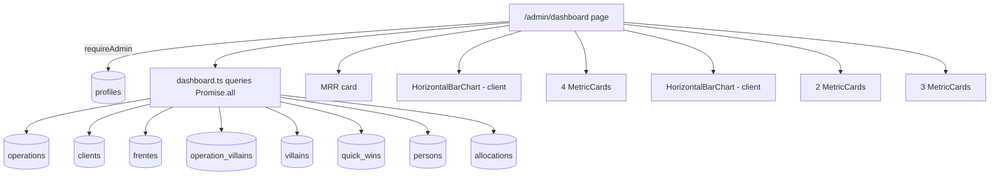

# painel-admin Design

**Spec**: `.specs/features/painel-admin/spec.md`

---

## Architecture Overview

Página server `/admin/dashboard` busca 7 agregações em paralelo via novo módulo `dashboard.ts` em queries. Cards numéricos renderizam server-side; 2 gráficos Recharts vivem em wrapper client (`HorizontalBarChart`). Tudo admin-only via `requireAdmin()`. Sidebar ganha entrada nova "Painel" antes de "Catálogo"/"Admin" (renomeação).



---

## Code Reuse

| What | How |
|---|---|
| `requireAdmin` | guard da página |
| `formatMoneyBR` | MRR + tooltips |
| `countActiveOperations`, `countActivePersons` | reuso direto |
| `Pill` variants (sage/warning/oak/neutral) | cards de estado |
| `PageHeader` | header da página |
| `staleness` thresholds (`hot`=14d) | matched com threshold de frentes stale |
| Recharts (já instalado v3.8) | BarChart horizontal |
| `createServer` | client tipado |

---

## Data Model

**Sem migration nova.** Apenas queries agregadas em `src/lib/db/queries/dashboard.ts` (arquivo novo).

### Queries necessárias

```ts
// src/lib/db/queries/dashboard.ts

export type DashboardSummary = {
  mrrTotal: number;
  activeOperations: number;
  archivedOperations: number;
  frentesHealthy: number;
  frentesStale: number;
  quickWinsLast30d: number;
  internalPersons: number;
  externalPersons: number;
  openAllocations: number;
};

export type ClientMRR = { clientId: string; name: string; mrr: number };
export type VillainFrequency = { villainId: string; name: string; count: number };

export async function getDashboardSummary(): Promise<DashboardSummary>;
export async function getTopClientsByMRR(limit?: number): Promise<ClientMRR[]>;
export async function getTopVillainsByFrequency(limit?: number): Promise<VillainFrequency[]>;
```

**Implementações:**

```ts
// MRR total + counts via single fetch das operations
const ops = await supabase
  .from('operations')
  .select('id, client_id, monthly_recurring_revenue, archived_at');

const active = ops.data?.filter(o => !o.archived_at) ?? [];
const archived = ops.data?.filter(o => o.archived_at) ?? [];
const mrrTotal = active.reduce((s, o) => s + (o.monthly_recurring_revenue ?? 0), 0);

// Frentes saudáveis/stale — threshold 14d (= STALENESS_THRESHOLDS.hot)
const frentes = await supabase
  .from('frentes')
  .select('id, actionable_status, updated_at, archived_at')
  .is('archived_at', null);

const threshold = new Date(Date.now() - 14 * 86_400_000).toISOString();
const healthy = frentes.data?.filter(f =>
  f.actionable_status && f.updated_at > threshold
).length ?? 0;
const stale = (frentes.data?.length ?? 0) - healthy;

// QW últimos 30d
const since30 = new Date(Date.now() - 30 * 86_400_000).toISOString();
const qw = await supabase
  .from('quick_wins')
  .select('id', { count: 'exact', head: true })
  .gte('created_at', since30);

// Personas
const internal = await supabase
  .from('persons')
  .select('id', { count: 'exact', head: true })
  .eq('kind', 'internal').is('archived_at', null);
const external = await supabase
  .from('persons')
  .select('id', { count: 'exact', head: true })
  .eq('kind', 'external').is('archived_at', null);

// Alocações abertas
const allocs = await supabase
  .from('allocations')
  .select('id', { count: 'exact', head: true })
  .is('end_date', null);
```

```ts
// Top clientes por MRR
const ops = await supabase
  .from('operations')
  .select('client_id, monthly_recurring_revenue, clients!inner(id, name)')
  .is('archived_at', null);

const byClient = new Map<string, ClientMRR>();
for (const op of ops.data ?? []) {
  const c = (op as any).clients;
  if (!c) continue;
  const cur = byClient.get(c.id) ?? { clientId: c.id, name: c.name, mrr: 0 };
  cur.mrr += op.monthly_recurring_revenue ?? 0;
  byClient.set(c.id, cur);
}
return Array.from(byClient.values())
  .filter(c => c.mrr > 0)
  .sort((a, b) => b.mrr - a.mrr)
  .slice(0, limit ?? 5);
```

```ts
// Top vilões por frequência
const ov = await supabase
  .from('operation_villains')
  .select('villain_id, villains!inner(id, name, archived_at)')
  .filter('villains.archived_at', 'is', null);

const byVillain = new Map<string, VillainFrequency>();
for (const row of ov.data ?? []) {
  const v = (row as any).villains;
  if (!v) continue;
  const cur = byVillain.get(v.id) ?? { villainId: v.id, name: v.name, count: 0 };
  cur.count += 1;
  byVillain.set(v.id, cur);
}
return Array.from(byVillain.values())
  .sort((a, b) => b.count - a.count)
  .slice(0, limit ?? 5);
```

**Tipos do Supabase**: cast `(op as any).clients` é feio mas o gerador de types do Supabase devolve relação como array por padrão (`clients: ClientRow[] | null`) mesmo com `!inner`. Solução: tipar manualmente o shape esperado num type local. Implementar com type guards no T-Implement.

---

## Componentes Novos

### `src/components/ui/MetricCard.tsx` (server, reusable)

```tsx
type Props = {
  label: string;
  value: number | string;
  hint?: string;
  variant?: PillVariant; // colore o accent do card
};
// Render: card com Funnel Display 600 36px pro número, label small caps mute, hint opcional
```

### `src/components/ui/HorizontalBarChart.tsx` (client)

```tsx
"use client";

import { BarChart, Bar, XAxis, YAxis, Tooltip, ResponsiveContainer } from "recharts";

type Datum = { label: string; value: number };
type Props = {
  data: Datum[];
  formatValue?: (v: number) => string;
  color?: string; // default sage var
  height?: number;
};
```

Render: `<ResponsiveContainer width="100%" height={height ?? 240}>` com BarChart horizontal (`layout="vertical"`). Eixo Y categórico (labels truncados 20 chars), eixo X numérico oculto. Tooltip simples mostra `formatValue(value)`. Sem grid. Cor única.

### `src/components/domain/DashboardMRRSection.tsx` (server)

Composição: MetricCard "MRR total" grande + HorizontalBarChart top clientes. Recebe `mrrTotal`, `activeOps`, `topClients`.

### `src/components/domain/DashboardCountsGrid.tsx` (server)

4 MetricCards lado a lado: Operações ativas, Operações arquivadas, Frentes saudáveis, Frentes stale.

### `src/components/domain/DashboardVillainsSection.tsx` (server)

HorizontalBarChart top vilões + 2 MetricCards (QW 30d count, Impacto 30d → "—" placeholder).

### `src/components/domain/DashboardPersonsSection.tsx` (server)

3 MetricCards: Internas, Externas, Alocações abertas.

---

## Updates em componentes existentes

| Componente | Mudança |
|---|---|
| `SidebarNav.tsx` | adicionar item "Painel" → `/admin/dashboard` (LayoutDashboard icon) ANTES de "Catálogo"; renomear item `/admin` de "Painel" → "Admin"; novo icon pra `/admin`: `Settings` (Lucide) |

```ts
const adminGroup: NavGroup = {
  label: "Admin",
  items: [
    { href: "/admin/dashboard", label: "Painel", icon: LayoutDashboard },
    { href: "/catalog", label: "Catálogo", icon: BookOpen },
    { href: "/admin", label: "Admin", icon: Settings },
  ],
};
```

**Atenção active state**: `pathname.startsWith('/admin')` faz `/admin/dashboard` triggerar tanto "Painel" quanto "Admin". Solução: a lógica atual (`pathname === item.href || pathname.startsWith(`${item.href}/`)`) já cobre — `/admin` só ativo se exato OR começa com `/admin/` (E NÃO `/admin/dashboard`). 

Verificando: `/admin/dashboard`.startsWith(`/admin/`) = true. Bug. Precisa fix:
- Item `/admin`: ativo apenas se `pathname === '/admin'` (exato), não startsWith.
- Item `/admin/dashboard`: ativo se exato ou startsWith.
- Generalização: rotear active via `exactMatch?: boolean` opcional no NavItem.

```ts
type NavItem = {
  href: string;
  label: string;
  icon: ComponentType<SVGProps<SVGSVGElement>>;
  count?: number | undefined;
  exactMatch?: boolean; // default false
};

// /admin recebe exactMatch: true
```

---

## Pages

### Nova: `src/app/(app)/admin/dashboard/page.tsx`

```tsx
import { PageHeader } from "@/components/layout/PageHeader";
import { requireAdmin } from "@/lib/auth/server";
import {
  getDashboardSummary,
  getTopClientsByMRR,
  getTopVillainsByFrequency,
} from "@/lib/db/queries/dashboard";
import { DashboardMRRSection } from "@/components/domain/DashboardMRRSection";
import { DashboardCountsGrid } from "@/components/domain/DashboardCountsGrid";
import { DashboardVillainsSection } from "@/components/domain/DashboardVillainsSection";
import { DashboardPersonsSection } from "@/components/domain/DashboardPersonsSection";

export default async function Page() {
  await requireAdmin();
  const [summary, topClients, topVillains] = await Promise.all([
    getDashboardSummary(),
    getTopClientsByMRR(5),
    getTopVillainsByFrequency(5),
  ]);

  return (
    <>
      <PageHeader
        title="Painel"
        subtitle="Visão agregada da operação: receita, saúde, capacidade e tração."
      />
      <div className="flex flex-col gap-8">
        <DashboardMRRSection
          mrrTotal={summary.mrrTotal}
          activeOperations={summary.activeOperations}
          topClients={topClients}
        />
        <DashboardCountsGrid
          activeOperations={summary.activeOperations}
          archivedOperations={summary.archivedOperations}
          frentesHealthy={summary.frentesHealthy}
          frentesStale={summary.frentesStale}
        />
        <DashboardVillainsSection
          topVillains={topVillains}
          quickWinsLast30d={summary.quickWinsLast30d}
        />
        <DashboardPersonsSection
          internalPersons={summary.internalPersons}
          externalPersons={summary.externalPersons}
          openAllocations={summary.openAllocations}
        />
      </div>
    </>
  );
}
```

---

## Error Handling

| Scenario | Action |
|---|---|
| Member acessa `/admin/dashboard` via URL | `requireAdmin()` → redirect `/` |
| Query agregada falha (DB down) | Page throws → Next error.tsx fallback |
| Lista vazia (sem ops/vilões) | Empty state inline em cada section ("Sem dados ainda") |
| MRR null em operação | `??  0` no reduce (já no design da query) |
| Cliente com 0 MRR | Filtrado no `getTopClientsByMRR` |
| Recharts SSR clash | Component marcado `'use client'` |

Sem `error.tsx` específico pro dashboard; o existente em `(app)` cobre.

---

## Tech Decisions

| Decision | Choice | Rationale |
|---|---|---|
| Rota | `/admin/dashboard` (nova) | `/admin` continua com Usuários; dashboard separado |
| Guard | `requireAdmin()` | Padrão existente |
| Queries em arquivo dedicado | Sim, `dashboard.ts` | Agregações específicas; encapsula joins |
| Promise.all no page | Sim | 3 queries paralelas (summary + clients + villains) |
| Recharts client wrapper | Sim | window required; isola SSR |
| `HorizontalBarChart` reusável | Sim | clientes + vilões usam mesmo shape |
| `MetricCard` reusável | Sim | 9 instances total (4 counts + 2 QW + 3 persons) |
| Threshold stale 14d | Hardcoded; ref `STALENESS_THRESHOLDS.hot` | Coerente com staleness module |
| QW impacto somado | Pulado no MVP | JSONB shape requer schema check; v2 |
| Sidebar: 3 items no group Admin | Sim | Painel + Catálogo + Admin |
| Active state `/admin` exato | exactMatch flag novo | Resolve overlap com `/admin/dashboard` |
| Cast types Supabase joins | Type local + manual narrowing | Tipos gerados retornam array; cast pontual aceitável |
| Empty state | Inline em cada section | Sem suspense fallback no MVP |
| RLS impact | Nenhum | Queries acessam tabelas com RLS `authenticated_full` |
| Recharts color | Token sage do design system | Inv. 09: 5 cores canonical; sage = positivo |
| Truncate label | 20 chars no chart | Sem tooltip de hover no MVP; label completo via Recharts tooltip |
| Ordenação client MRR | DESC | Top primeiro |
| Cliente sem op ativa | Excluído | Foco no agora |

---

## Notes

- Sem migration: feature 100% de leitura.
- Tipos Supabase: o gerador devolve `clients: Database["public"]["Tables"]["clients"]["Row"][] | null` em joins. Cast no T-Implement com type narrowing.
- Após implementação, verificar com SQL manual: `SELECT sum(monthly_recurring_revenue) FROM operations WHERE archived_at IS NULL` deve casar com card MRR.
- `Settings` icon do Lucide pra `/admin` (existe na lib).
- `LayoutDashboard` já importado em `SidebarNav.tsx` — só reusar.
- `MetricCard` pode virar primitivo do DS — mas só promover se 3+ features pedirem.
- DATABASE_SCHEMA.md: sem mudança (nenhuma tabela nova).
- Performance: estimativa < 200ms total. 6-8 queries paralelas em tabelas pequenas (< 100 rows cada).
- Empty states textos: "Sem operações ativas — adicione em /operations", "Catálogo de vilões ainda não foi aplicado a operações", etc.
