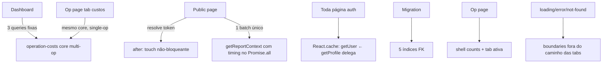

# Perf de Queries — Design

**Spec**: `.specs/features/perf-queries/spec.md` · **Issue**: #131 · **Status**: Draft

---

## Architecture Overview

Seis frentes independentes, sem mudança de schema além de índices. O princípio
unificador: **filtro e agregação acontecem no PostgREST (server-side), JS só
computa**; e **nenhum dado é buscado se quem renderiza não vai usar**.



---

## Code Reuse Analysis

| Existente | Localização | Como usar |
|---|---|---|
| Padrão `!inner` + filtro em embed + guard JS de defesa | `public-report.ts:82-128` (fetchUpcomingTasks, tema 2) | Replicar em `listPublicTeam` e na query de allocations de custos |
| `pickOne<T>` unwrap defensivo | `operation-costs.ts:122-125` | Manter nos novos shapes |
| Counts `head: true` | `incidents.ts:103`, `tasks.ts:135` etc. | Modelo pros 4 counts novos |
| `Pill`/tokens DS | `components/ui` | Skeletons e páginas de erro/404 |
| Convenção de migration idempotente | `supabase/migrations/*` | Migration dos índices |
| `formatHours`/layout público sem chrome | `public/[token]` | error/not-found públicos |

---

## D1 — Custos: core multi-op (achado #9 + caso single-op)

**Refactor de `src/lib/db/queries/operation-costs.ts`** em 3 camadas:

1. **Fetch** (3 queries, sempre `Promise.all` — hoje são seriais até no single-op):
   - `operations`: `id, monthly_fixed_cost` — dashboard: `.is("archived_at", null)`; single-op: `.eq("id", opId)`.
   - `operation_costs`: janela de datas atual + dashboard: embed `operation:operations!fk_operation_costs_operation_id!inner(archived_at)` com `.is("operation.archived_at", null)`; single-op: `.eq("operation_id", opId)`.
   - `allocations`: embed atual + dashboard: `frente:frentes!fk_allocations_frente_id!inner(operation_id, archived_at, operation:operations!fk_frentes_operation_id!inner(archived_at))` com `.is("frente.archived_at", null)` e `.is("frente.operation.archived_at", null)`; single-op: `.eq("frente.operation_id", opId)` (+ archived). Janela `end_date` continua server-side (`.or`).
2. **Compute puro** — extrair a matemática atual (rate, effectiveWeekly, monthly) para função pura `computeBreakdown(opFixedCost, costRows, allocRows): OperationCostBreakdown`. **Mesma função para dashboard e single-op** → paridade de KPI por construção (AC3 do spec).
3. **API**:
   - `getOperationMonthlyCosts(operationId)` — assinatura e retorno **inalterados** (CostsTab não muda). **O caminho single-op NÃO aplica o filtro `operation.archived_at`** (preserva o comportamento atual byte-a-byte — quem decide se a op é visível é o caller, como hoje; AC4 do spec exige JSON idêntico).
   - `getActiveOperationsMonthlyCostsTotal(): Promise<number>` — novo. **A iteração é sobre o resultado da query de `operations`** (todas as ativas), com rows de costs/allocations agrupadas por `operation_id` defaultando pra `[]` — op ativa com `monthly_fixed_cost > 0` e zero rows **contribui com o fixed cost** (gate: agrupar pelas rows dropava essas ops do KPI). Dashboard troca o `.map(getOperationMonthlyCosts)` por 1 chamada.

Guard JS de defesa em profundidade mantido (filtros `operation_id`/`archived_at` re-checados no agrupamento, com comentário no padrão do tema 2). `createServer` mantido (RLS limita escopo — comportamento atual).

## D2 — `listPublicTeam` (achado #10)

`frente:frentes!fk_allocations_frente_id!inner(...)` + `.eq("frente.operation_id", operationId)` + `.is("frente.archived_at", null)` + `.or("end_date.is.null,end_date.gt.${today}")` server-side. Dedup e roleLabel inalterados; guards JS mantidos como defesa. Comparação de aceite order-insensitive (spec AC2).

## D3 — Waterfall público (achado #11)

- `page.tsx`: depois de `if (!link) notFound()`, trocar o `await touchPublicLinkAccess(link.id)` por `after(() => touchPublicLinkAccess(link.id))` (`import { after } from "next/server"`). Sem `.catch` extra — a função já engole erro num try/catch interno (`publicLinks.ts`). Seguro: usa `createAdmin` (sem cookies — restrição de `after.md` não se aplica); agendado **só após** resolve OK; janela residual pós-resolve documentada no spec. **Semântica deliberada de `last_accessed_at`: acesso = page view.** O download route resolve o mesmo token e nunca tocou o campo — pré-existente e mantido de propósito; não "corrigir" depois.
- `getReportContext`: `fetchOperationTiming` entra no `Promise.all` (todas as 8 chamadas dependem só de `operationId`); `timing === null` continua → `return null` → 404.

Resultado: 2 ondas (resolve → batch), antes 4.

## D4 — `React.cache` (achado #12)

Em `src/lib/auth/server.ts`:

```typescript
import { cache } from "react";

export const getUser = cache(async (): Promise<User | null> => { /* atual */ });

export const getProfile = cache(async (): Promise<ProfileLite | null> => {
  const user = await getUser();          // ← delega ao cacheado (1 chamada de rede)
  if (!user) return null;
  const supabase = await createServer();
  /* query profiles atual */
});
```

`require*` e `requireAdminAction` **não** são envolvidos (fazem `redirect()`/lógica de erro — só leitura pura recebe cache; eles chamam as versões cacheadas). Cache é per-render (RSC) — sem vazamento entre requests por construção.

## D5 — Índices FK (achado #13)

Migration `2026XXXXXXXXXX_hot_fk_indexes.sql`:

```sql
CREATE INDEX IF NOT EXISTS idx_frentes_operation_id  ON public.frentes (operation_id);
CREATE INDEX IF NOT EXISTS idx_allocations_frente_id ON public.allocations (frente_id);
CREATE INDEX IF NOT EXISTS idx_allocations_person_id ON public.allocations (person_id);
CREATE INDEX IF NOT EXISTS idx_operations_client_id  ON public.operations (client_id);
CREATE INDEX IF NOT EXISTS idx_persons_client_id     ON public.persons (client_id);
```

`CREATE INDEX` simples (não `CONCURRENTLY` — `apply_migration` roda em transação; tabelas minúsculas, lock irrelevante). Aplicar via MCP, `generate_typescript_types` depois (no-op esperado, mantém ritual), `get_advisors` confirma saída dos 5 da lista `unindexed_foreign_keys`. Atualizar `docs/DATABASE_SCHEMA.md` (tabela de migrations).

## D6 — Página de Operação: 2 ondas + matriz shell/tab (achado #14)

**Problema circular resolvido em 2 ondas**: `normalizeTab` precisa de `showAreaTab`/`isAdmin`, que precisam de queries; e a tab define quais queries de conteúdo rodam.

- **Onda 1 (gates, paralela)**: `getProfile()` + `getOperation(id)` + `canCreateAreaTaskInOperation(id)` + `countAreaTasksByOperation(id)` → `isAdmin`, `showAreaTab` (`count > 0 || canCreate`), `notFound()` cedo, hero. (Hoje `getProfile` já era uma onda serial — não há onda nova, ela só ficou mais cheia e paralela.)
- **Onda 2 (paralela)**: counts de shell que faltam + conteúdo da tab ativa + `canWriteOperation(id)` + (`isAdmin` ? `getOperationMonthlyCosts(id)` : skip).

**Matriz query→shell/tab** (~21 queries DB hoje, sempre):

| Query | Hoje | Vira |
|---|---|---|
| `getOperation` | sempre | **shell** (onda 1; hero + count/lista de frentes — tab frentes não tem query própria) |
| `getProfile` | serial | **shell** (onda 1) |
| `getBriefingFreshness` | sempre | **shell** (OperationHero usa) |
| `canWriteOperation` | sempre | **shell** (frentes/eventos/sla) |
| `canCreateAreaTaskInOperation` | sempre | **shell** (onda 1, gate) |
| `listAreaTasksByOperation` | sempre | tab **interno**; shell usa novo `countAreaTasksByOperation` (gate + badge) |
| `listMeetingsByOperation` + `listDecisionsByOperation` | sempre | tab **eventos**; shell usa novos `countMeetingsByOperation`/`countDecisionsByOperation` (badge) — **atenção: as listas têm `limit 20`** (`meetings.ts`/`decisions.ts`), ver regra de badge abaixo |
| `countAttachmentsByMeeting` | sempre | tab **eventos** |
| `listAttachmentsByOperation` | sempre | tab **anexos**; shell usa novo `countOperationAttachments` (badge; mesma semântica do list: `meeting_id IS NULL`) |
| `listIncidentsByOperation` | sempre | tab **sla**; badge continua `countOpenIncidents` (**shell**, já existe) |
| `listVillainsByOperation`, `listAvailableVillains`, `listQuickWinsByOperation`, `listVillainNarratives`, `listActiveQuickWinCatalog` | sempre | tab **visao** |
| `getOperationMonthlyCosts` (3 queries) | sempre, todo papel | **shell se admin** (margin no hero + badge custos via `breakdown.adHocItems.length` + tab custos); **nunca pra member** (hoje busca e descarta) |
| `listPublicLinksByOperation` + `getBaseUrl` | sempre | tab **publico** (`getBaseUrl` nem é DB) |

**Regra de badge (substituiu o "anti-double-fetch", derrubado no gate)**: **badges SEMPRE vêm dos counts `head:true` do shell, em toda tab** — nunca de `lista.length`. Razão (BLOCKER do gate): `listMeetingsByOperation`/`listDecisionsByOperation` têm `limit 20`; badge derivado de lista capped flip-flopa entre tabs quando há >20 registros (35 na visao, 20 na eventos). Counts head são baratos (~1 RTT agregado no `Promise.all`); uniformidade > micro-economia. Exceção única: badge de frentes deriva de `op.frentes` (embed do `getOperation`, comprovadamente uncapped). **Mudança de dado deliberada**: o badge eventos passa a mostrar o total real, não o capped em 40 — é correção, registrada aqui pra não parecer regressão no diff de validação. (Corolário: na tab interno, count [onda 1, gate] e lista [onda 2] coexistem — esperado, valores idênticos sob a mesma RLS.)

Contagem resultante: shell ≈ 9-11 queries (papel-dependente) + 0–5 da tab ativa, vs ~21 sempre. Pior caso (admin, tab visao) ≈ 16; member em qualquer tab ≤ 12.

**`prefetch` do TabsNav (MAJOR do gate)**: `TabsNav.tsx` hoje passa `prefetch` (full) em cada tab `<Link>` — numa visita à op page isso dispara ~9 prefetches de rota dinâmica em background, **cada um re-executando shell+tab no servidor** (o custo real por visita era ~9× a aritmética acima), e `use-link-status.md` é explícito: rota prefetched pula o pending state (o TabPendingDot viraria dead code). Mudar para `prefetch={false}` nos tabs: corta o fan-out de prefetch E habilita o feedback de pending. Trade-off aceito: clique de tab paga 1 RTT que antes podia estar prefetched — compensado pelo batch enxuto (a resposta ficou ~3× menor) e pelo pending visual.

**Counts novos** (4, todos `head: true`, mesma cara de `countOpenIncidents`): `countMeetingsByOperation`, `countDecisionsByOperation`, `countOperationAttachments`, `countAreaTasksByOperation` — cada um no arquivo de queries do seu domínio.

## D7 — loading/error/not-found (achado #15)

**Restrição dura (generalizada pelo gate)**: a regra real NÃO é "tem TabsNav" — é **"nenhum `loading.tsx` pode ser ancestral de página dirigida por searchParams"**, porque navegação same-page com searchParams diferente re-dispara o boundary. Isso se aplica às tabs (`?tab=` na op page e pública) E aos filtros: clients `?q=`, persons, tasks `?filter=/?assignee=`, catalog `?view=`. Cada clique de filtro flasharia skeleton full-page — a mesma doença do AC2 do spec, só que nos filtros. Como `loading.tsx` cobre os filhos do segmento, isso proíbe boundary em `(app)/`, em qualquer segmento de lista filtrável e em `public/`.

**Critério pra um segmento receber `loading.tsx`**: nem a page do segmento nem nenhum descendente lê `searchParams` (verificar com grep antes de criar o arquivo — vira passo de task).

| Arquivo | Conteúdo |
|---|---|
| `(app)/clients/[id]/loading.tsx`, `(app)/operations/[id]/frentes/[fid]/loading.tsx` | Skeleton DS (blocos `bg-surface` pulsando) — páginas de detalhe sem searchParams (validar com grep; se algum descendente ler searchParams, o segmento sai da lista) |
| `(app)/` raiz, segmentos de lista filtrável (clients/, persons/, tasks/, catalog/), `(app)/operations/`, `public/` | **SEM loading.tsx** (restrição acima). Navegação mantém conteúdo atual visível (comportamento browser-like de hoje) + pending feedback via `useLinkStatus` onde houver tabs |
| `TabsNav.tsx` | + `useLinkStatus` (subcomponente `TabPendingDot` dentro de cada `Link` — opacity/shimmer no tab clicado) **+ `prefetch={false}`** (sem isso o pending nunca aparece — ver D6). Cobre op page E pública; `TabsNav` já é `"use client"` |
| `src/app/error.tsx` (root) | `"use client"`; genérico DS, sem `error.message`. **Necessário porque `(app)/error.tsx` NÃO captura erro do próprio layout** — o Sidebar roda 5 queries que lançam (`Sidebar.tsx`) e erro de layout sobe pro boundary acima do layout. Sem root boundary, banco soluçando = 500 cru (MAJOR do gate) |
| `(app)/error.tsx` | `"use client"`; mensagem genérica DS + botão "Tentar de novo" (`reset()`); **não** renderiza `error.message`. Cobre o subtree das pages (batches das queries) |
| `public/[token]/error.tsx` | Neutro, sem chrome interno, sem detalhe; "Não foi possível carregar o relatório" |
| `src/app/not-found.tsx` (global) | 404 DS **com copy neutra** (sem assumir usuário logado; link "ir para o início" apenas) — também é o que visitante externo vê em URL pública malformada fora do shape `[token]` (`/public`, `/public/x/y`), então nada de informação interna |
| `public/[token]/not-found.tsx` | 404 neutra pública ("Link inválido ou expirado") — cobre o `notFound()` do resolver de token |

Trade-off registrado (atualiza o AC1 do spec, ver nota no spec): skeletons ficam restritos a páginas de detalhe sem searchParams; listas filtráveis e dashboard mantêm o comportamento atual (conteúdo anterior visível durante navegação). Flash em filtro/tab é regressão pior que ausência de skeleton.

---

## Error Handling Strategy

| Cenário | Tratamento | Usuário vê |
|---|---|---|
| Query do batch da op page lança | `(app)/error.tsx` (boundary) | Mensagem genérica + retry |
| Query do Sidebar (layout) lança | `src/app/error.tsx` root (erro de layout NÃO é pego pelo error.tsx do mesmo segmento) | Página de erro genérica DS |
| Query pública lança | `public/[token]/error.tsx` | Página neutra, sem detalhe |
| `after(touch)` falha pós-resposta | `.catch(() => {})` (resposta já saiu) | Nada — acesso não registrado nessa view |
| Op some entre onda 1 e onda 2 | `notFound()` na onda 1; onda 2 herda 404/erro boundary | 404 |
| Count e lista divergem (corrida entre queries) | Badge pode diferir ±1 da lista por instantes — aceito (já era possível entre `meetings.length` e render) | Imperceptível |

---

## Tech Decisions (não-óbvias)

| Decisão | Escolha | Racional |
|---|---|---|
| Filtro de op ativa nos custos | Join embedado `archived_at IS NULL`, não `.in(ids)` | Payload constante; sem edge case de lista vazia (gate do spec) |
| Paridade de KPI | Função pura `computeBreakdown` compartilhada | Paridade por construção, não por teste |
| `after()` vs fire-and-forget promise | `after()` | Documentado pro runtime do Vercel; promise solta pode ser morta no freeze da lambda |
| Tab pending | `useLinkStatus` no TabsNav **com `prefetch={false}`** | Único mecanismo do Next pra pending de Link sem boundary full-page; com prefetch full o pending é pulado E cada visita paga ~9 prefetches re-executando a page (doc `use-link-status.md`) |
| loading.tsx só em detalhe sem searchParams | Regra "nenhum ancestral de página searchParams-driven" | Flash em tab/filtro viola AC2 do spec; tabs e filtros são a mesma classe de navegação |
| error.tsx no root além do (app) | `src/app/error.tsx` | Erro de layout (Sidebar, 5 queries que lançam) escapa do boundary do próprio segmento |
| Badge sempre de count head | Nunca `lista.length` | Listas com `limit 20` flip-flopam o badge entre tabs (BLOCKER do gate); badge eventos passa a mostrar total real |
| `getOperationMonthlyCosts` só pra admin | Condicional no batch | Member nunca vê margin/custos; hoje paga 3 queries por dado descartado |
| Counts novos por domínio (4 arquivos) | Seguir layout atual de queries | Convenção do repo (1 arquivo por entidade), não centralizar |

## Riscos & mitigação

- **PostgREST nested embed filter** (`frente.operation.archived_at`) — ✅ **validado contra o banco real** (2026-06-11, anon key, 200): os 3 shapes (allocations nested 2 níveis, operation_costs com `!inner`, listPublicTeam scoped) aceitos pelo PostgREST.
- **D6 é o maior refactor** — mitigado por: matriz fechada acima, conteúdo de tab inalterado (mesmos componentes/props), e validação tab-a-tab no preview.
- **`React.cache` + `cookies()`**: `createServer` continua sendo chamado dentro das funções cacheadas (1ª execução) — sem mudança de semântica de cookies.
