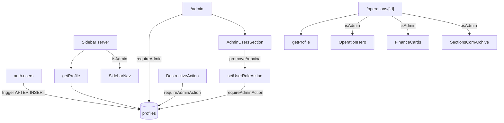

# profiles Design

**Spec**: `.specs/features/profiles/spec.md`

---

## Architecture Overview

1 tabela `profiles` + enum + trigger auto-create. Helpers server-side propagam `isAdmin` boolean a quem renderiza informação ou ação sensível. Defense-in-depth: action layer também faz `requireAdminAction`. Section "Usuários" consolidada em `/admin`.



---

## Code Reuse

| What | How |
|---|---|
| `getUser`, `requireUser` | Estendido com profile join |
| `ActionResult` + helpers | actions |
| `Pill` | role display |
| `Avatar` + `initialsFromEmail` | users list |
| `createAdmin` | resolver emails via auth.admin |
| Pattern `requireUserAction` | base pra `requireAdminAction` |

---

## Data Model

### Enum + tabela profiles

```sql
DO $$
BEGIN
  IF NOT EXISTS (SELECT 1 FROM pg_type WHERE typname = 'user_role') THEN
    CREATE TYPE user_role AS ENUM ('admin', 'member');
  END IF;
END $$;

CREATE TABLE IF NOT EXISTS public.profiles (
  id uuid PRIMARY KEY,
  role user_role NOT NULL DEFAULT 'member',
  name text,
  created_at timestamptz NOT NULL DEFAULT now(),
  updated_at timestamptz NOT NULL DEFAULT now(),
  CONSTRAINT fk_profiles_id
    FOREIGN KEY (id) REFERENCES auth.users(id) ON DELETE CASCADE
);

COMMENT ON TABLE public.profiles IS
  'Profile do usuário autenticado. Inv. 14: role gate (admin/member) gerencia acesso a destrutivas e info comercial.';

DROP TRIGGER IF EXISTS set_profiles_updated_at ON public.profiles;
CREATE TRIGGER set_profiles_updated_at
  BEFORE UPDATE ON public.profiles
  FOR EACH ROW EXECUTE FUNCTION public.set_updated_at();
```

### Trigger auto-create + backfill + seed

```sql
CREATE OR REPLACE FUNCTION public.create_profile_for_new_user()
RETURNS TRIGGER AS $$
BEGIN
  INSERT INTO public.profiles (id, role)
  VALUES (NEW.id, 'member')
  ON CONFLICT (id) DO NOTHING;
  RETURN NEW;
END;
$$ LANGUAGE plpgsql SECURITY DEFINER;

DROP TRIGGER IF EXISTS create_profile_on_user_signup ON auth.users;
CREATE TRIGGER create_profile_on_user_signup
  AFTER INSERT ON auth.users
  FOR EACH ROW EXECUTE FUNCTION public.create_profile_for_new_user();

-- Backfill users existentes
INSERT INTO public.profiles (id, role)
SELECT id, 'member' FROM auth.users
WHERE id NOT IN (SELECT id FROM public.profiles);

-- Seed admin
UPDATE public.profiles
SET role = 'admin'
WHERE id IN (
  SELECT id FROM auth.users WHERE email = 'rafaelemeth@gmail.com'
);
```

### RLS

```sql
ALTER TABLE public.profiles ENABLE ROW LEVEL SECURITY;

-- Todos authenticated podem ler (necessário pra section Users)
CREATE POLICY profiles_authenticated_select
  ON public.profiles FOR SELECT TO authenticated USING (true);

-- Só admin pode UPDATE; check role do próprio user via subquery
CREATE POLICY profiles_admin_update
  ON public.profiles FOR UPDATE TO authenticated
  USING (
    (SELECT role FROM public.profiles WHERE id = auth.uid()) = 'admin'
  )
  WITH CHECK (
    (SELECT role FROM public.profiles WHERE id = auth.uid()) = 'admin'
  );

-- INSERT bloqueado pra authenticated (só via trigger SECURITY DEFINER)
-- DELETE bloqueado (sem policy)
```

---

## Componentes Novos

### Helper `src/lib/auth/server.ts` (estendido)

```ts
export type Role = 'admin' | 'member';

export type ProfileLite = {
  user: User;
  role: Role;
};

export async function getProfile(): Promise<ProfileLite | null> {
  const supabase = await createServer();
  const { data: { user } } = await supabase.auth.getUser();
  if (!user) return null;
  const { data } = await supabase
    .from('profiles')
    .select('role')
    .eq('id', user.id)
    .maybeSingle();
  if (!data) return { user, role: 'member' }; // fallback defensive
  return { user, role: data.role };
}

export async function requireProfile(redirectToOnFail?: string): Promise<ProfileLite> {
  const p = await getProfile();
  if (!p) {
    redirect(`/login?redirectTo=${encodeURIComponent(redirectToOnFail ?? '/')}`);
  }
  return p;
}

export async function requireAdmin(redirectOnFail = '/'): Promise<ProfileLite> {
  const p = await requireProfile();
  if (p.role !== 'admin') redirect(redirectOnFail);
  return p;
}

export async function requireAdminAction(): Promise<ActionResult<ProfileLite>> {
  const userResult = await requireUserAction();
  if (!userResult.ok) return userResult;
  const supabase = await createServer();
  const { data } = await supabase
    .from('profiles')
    .select('role')
    .eq('id', userResult.data.id)
    .maybeSingle();
  if (data?.role !== 'admin') return err('Acesso restrito a admin.', 'forbidden');
  return ok({ user: userResult.data, role: 'admin' });
}

export function isAdmin(role: Role | null | undefined): boolean {
  return role === 'admin';
}
```

### Queries `src/lib/db/queries/profiles.ts`

```ts
export type ProfileListItem = {
  id: string;
  email: string | null;
  name: string | null;
  role: Role;
  createdAt: string;
};

export async function listProfiles(): Promise<ProfileListItem[]> {
  const supabase = await createServer();
  const { data, error } = await supabase
    .from('profiles')
    .select('id, role, name, created_at')
    .order('created_at', { ascending: true });
  if (error) throw new Error(`listProfiles: ${error.message}`);
  if (!data) return [];
  // Resolve emails via admin
  const admin = createAdmin();
  const result: ProfileListItem[] = [];
  for (const p of data) {
    const { data: u } = await admin.auth.admin.getUserById(p.id);
    result.push({
      id: p.id,
      email: u?.user?.email ?? null,
      name: p.name,
      role: p.role,
      createdAt: p.created_at,
    });
  }
  return result;
}
```

### Action `src/lib/actions/profiles.ts`

```ts
async function setUserRoleAction(
  targetUserId: string,
  newRole: 'admin' | 'member',
): Promise<ActionResult<{ id: string; role: Role }>> {
  const guard = await requireAdminAction();
  if (!guard.ok) return guard;

  // Self-demote check
  if (targetUserId === guard.data.user.id && newRole !== 'admin') {
    return err(
      'Você não pode rebaixar seu próprio acesso. Peça pra outro admin.',
      'self_demote_blocked',
    );
  }

  const supabase = await createServer();
  const { error } = await supabase
    .from('profiles')
    .update({ role: newRole })
    .eq('id', targetUserId);
  if (error) return dbErr(error, 'setUserRoleAction');

  revalidatePath('/admin');
  return ok({ id: targetUserId, role: newRole });
}
```

### Components

| Componente | Localização | Função |
|---|---|---|
| `AdminUsersSection.tsx` | src/components/domain | Server; lista profiles com avatar+email+name+pill role+botões |
| `SetUserRoleButton.tsx` | src/components/domain | Client; window.confirm + action; disabled se self |

### Updates em componentes existentes

| Componente | Mudança |
|---|---|
| `Sidebar.tsx` | busca profile; passa role + isAdmin pro SidebarNav; mostra Pill role |
| `SidebarNav.tsx` | aceita prop `isAdmin`; esconde grupo "Admin" (Catálogo + Painel) se false |
| `OperationHero.tsx` | aceita prop `isAdmin`; renderiza MetaChip MRR/Recorrência condicional |
| `OperationCard.tsx` | aceita prop `isAdmin`; esconde campo MRR/Recorrência |
| `FinanceCards.tsx` | retorna `null` se !isAdmin (ou componente pai não renderiza) |
| `OperationForm.tsx` | aceita prop `isAdmin`; esconde inputs MRR/Recorrência; envia hidden inputs com valores atuais pra preservar no UPDATE |
| `VillainCard.tsx` | aceita prop `isAdmin`; esconde Link "Editar →" |
| `ArchiveClientButton`, `RemoveAllocationButton`, etc | Server gateway: passa isAdmin; retorna `null` ou esconde botão se !isAdmin |

### Actions que ganham `requireAdminAction`

Lista (12):

```
archiveClientAction, archiveOperationAction, archiveFrenteAction, archivePersonAction
deleteAllocationAction, deleteIncidentAction, deleteMeetingAction, deleteDecisionAction,
deleteAttachmentAction, deleteOperationVillainAction, deleteQuickWinAction
archiveVillainAction, restoreVillainAction, updateVillainAction
revokePublicLinkAction
setUserRoleAction (própria)
```

### Update `updateOperationAction` (preservar MRR/Recorrência)

Quando member submete edit, valores omitidos devem preservar current state. Implementação:

- Forma 1: form envia hidden inputs com `monthly_recurring_revenue` e `recurrence` atuais (member não muda). Action UPDATE normalmente.
- Forma 2: action fetcha current op + faz merge antes de UPDATE.

**Decisão:** Forma 1 (mais simples; HTML hidden inputs).

---

## Pages

| Página | Mudança |
|---|---|
| `/admin/page.tsx` | requireAdmin; renderiza AdminUsersSection |
| `/catalog/villains/[id]/edit/page.tsx` | requireAdmin (redirect /catalog) |

Outras páginas (operations, clients, etc) não bloqueiam — apenas passam `isAdmin` prop aos componentes filhos.

---

## Error Handling

| Scenario | Action | UI |
|---|---|---|
| Member tenta UPDATE profile via SQL | RLS rejeita | n/a |
| Member tenta action destrutiva via DevTools | requireAdminAction → forbidden | alert/toast |
| Admin rebaixa a si próprio | self_demote_blocked | alert |
| Profile não existe pra user logado | Fallback role='member' | acesso restrito |
| Trigger create_profile falha | User fica sem profile; backfill SQL resolve | edge raro |
| Member acessa /admin/* via URL | redirect / | — |
| Member acessa /catalog/villains/[id]/edit via URL | redirect /catalog | — |

---

## Tech Decisions

| Decision | Choice | Rationale |
|---|---|---|
| 2 roles | admin / member | Time pequeno; viewer = /public |
| RLS amplo | Apenas em profiles | Gate UI/action é suficiente pra time alinhado |
| Trigger SECURITY DEFINER | Sim | Necessário pra INSERT bypass de RLS no auth |
| Backfill na migration | Sim | Sem dependência manual |
| Seed admin via email | Sim, idempotent UPDATE | Single source |
| Fallback role member | Sim | Se profile faltar, conservador |
| `isAdmin` prop drilling | Sim | Server resolve once, propaga |
| Hidden inputs preservam MRR | Sim | Form preserva valor sem action knowing |
| /admin consolidado vs /admin/users | Consolidado | Pedido do usuário |
| Nav Admin escondido | Sim | UX limpa pra member |
| Cat álogo visível pra member (read) | Sim | Inv. 06 espírito: vilões são canon |
| Defense-in-depth (UI + action) | Sim | UI engana, action é a lei |
| Component decision: server-side gating vs client `useEffect` | Server | Renderiza só o que pode |
| createPublicLinkAction gated? | Não | Rotina de onboarding |
| Action `updateOperationAction` gated? | Não — member pode editar (sem mudar MRR) | Edit cotidiano é rotina |
| Pill role na sidebar | Sim | Visibilidade do próprio papel |
| Audit log de role changes | Não | updated_at + Discord futuro cobrem |

---

## Notes

- Migration: enum + tabela + trigger + backfill + seed + RLS num arquivo.
- `Sidebar.tsx` é server component — pode async busy via getProfile.
- `SidebarNav.tsx` é client — recebe prop `isAdmin`.
- Outros componentes (OperationHero, OperationCard, FinanceCards, OperationForm, VillainCard) são server — recebem prop `isAdmin` do parent.
- Botões destrutivos (`RemoveAllocationButton`, etc) são client. Em vez de cada um aceitar isAdmin, fazemos o **parent server** condicionalmente renderizar ou não. Mais limpo.
  - Decisão: o parent server checa `isAdmin` e passa o botão ou null.
  - Forma alternativa: cada botão aceita `isAdmin?` e retorna null. Decisão final: prop drilling é OK; menos refactor.
- DATABASE_SCHEMA.md ganha tabela `profiles` (19ª) + enum.
- Verificar se OperationCard hoje mostra MRR (provavelmente sim — confirmar no T-Implement).
