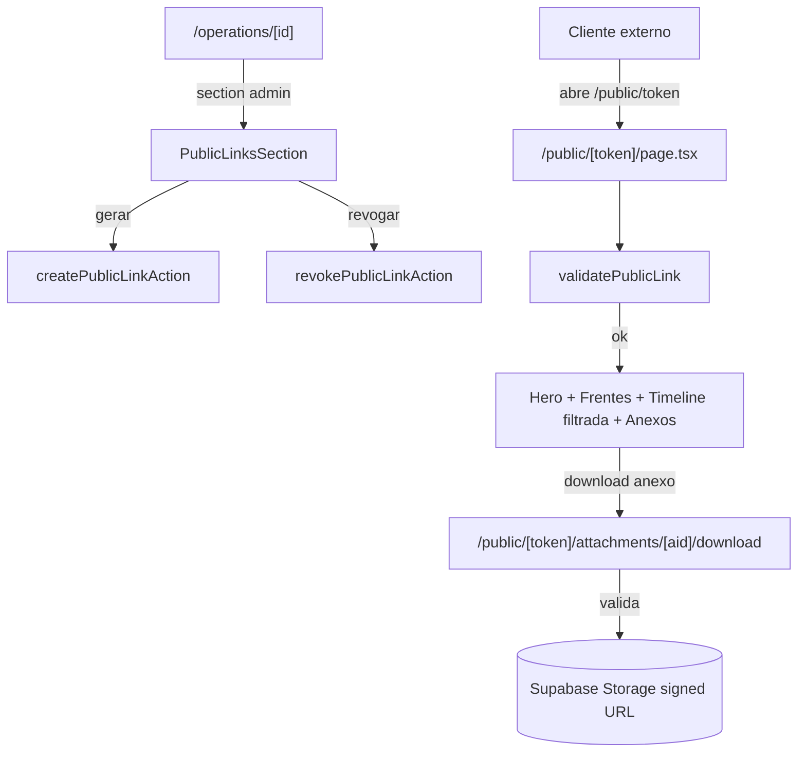

# public-link-skeleton Design

**Spec**: `.specs/features/public-link-skeleton/spec.md`

---

## Architecture Overview

Tabela `public_links` separada, route fora do `(app)`, validação via `createAdmin` (bypassa RLS). View pública é server-rendered com filtro por visibility. Download usa Route Handler dedicado.



---

## Code Reuse

| What | How |
|---|---|
| `createAdmin` server | validatePublicLink + storage signed URL no route handler |
| `getOperation` (filtrado) | base do hero (mas via admin pra bypassar RLS) |
| `listMeetingsByOperation` + `listDecisionsByOperation` | filtrar por visibility no Promise.all |
| `listAttachmentsByOperation(id, "none")` | já filtra meeting_id NULL |
| `relativeFromNow`, `formatDateBR`, `formatBytes` | exibição |
| `Pill`, `Card` | UI |
| Padrão ActionResult | actions |
| MeetingsDecisionsTimeline | NÃO reusa — cria `PublicTimeline` enxuto (sem botões Editar) |
| FrentesListSection | NÃO reusa — cria `PublicFrentesList` enxuto (sem hover Edit) |

---

## Data Model

### Tabela `public_links`

```sql
CREATE TABLE public.public_links (
  id uuid PRIMARY KEY DEFAULT gen_random_uuid(),
  operation_id uuid NOT NULL,
  token uuid NOT NULL UNIQUE DEFAULT gen_random_uuid(),
  label text,
  last_accessed_at timestamptz,
  revoked_at timestamptz,
  expires_at timestamptz,
  created_at timestamptz NOT NULL DEFAULT now(),
  updated_at timestamptz NOT NULL DEFAULT now(),
  CONSTRAINT fk_public_links_operation_id
    FOREIGN KEY (operation_id) REFERENCES public.operations(id) ON DELETE CASCADE
);

CREATE INDEX idx_public_links_operation_created
  ON public.public_links (operation_id, created_at DESC);

COMMENT ON TABLE public.public_links IS
  'public_link: token de acesso externo (sem auth) à Operação. Múltiplos por Op, revogáveis. expires_at reservado (não validado MVP).';

COMMENT ON COLUMN public.public_links.last_accessed_at IS
  'Fire-and-forget update em cada GET válido. Métrica de uso.';
```

### RLS

```sql
ALTER TABLE public.public_links ENABLE ROW LEVEL SECURITY;

CREATE POLICY public_links_authenticated_full
  ON public.public_links FOR ALL TO authenticated
  USING (true) WITH CHECK (true);
```

Validação pública via `createAdmin()` no server (bypassa RLS) — não precisamos policy anonymous.

### Trigger updated_at

```sql
CREATE TRIGGER set_public_links_updated_at
  BEFORE UPDATE ON public.public_links
  FOR EACH ROW EXECUTE FUNCTION public.set_updated_at();
```

---

## Componentes Novos

### `src/lib/db/queries/publicLinks.ts`

```ts
export type PublicLinkRow = ...;
export type PublicLinkListItem = {
  id; token; label; lastAccessedAt; revokedAt; expiresAt; createdAt;
};

export type PublicLinkResolved = {
  id; operationId; revokedAt;
};

async function listPublicLinksByOperation(operationId): Promise<PublicLinkListItem[]>;
async function getPublicLinkByToken(token): Promise<PublicLinkResolved | null>;
//   Usa createAdmin (server-only) pra bypassar RLS
```

### `src/lib/db/queries/public.ts` (queries usadas pela view pública)

Conjunto de queries que **usam createAdmin** (bypassa RLS) e retornam shape específico pra view pública:

```ts
async function getOperationPublicView(operationId): Promise<{
  id; name; clientName; productLine; status; archivedAt;
  frentes: Array<{id, name, cycleType, domain, phase, actionableStatus, actionableStatusSince}>;
}>;

async function listPublicMeetings(operationId): Promise<MeetingPublicItem[]>;
//   WHERE operation_id = $1 AND visibility = 'cliente'
//   Retorna { id, title, scheduledAt, notes }

async function listPublicDecisions(operationId): Promise<DecisionPublicItem[]>;
//   WHERE operation_id = $1 AND visibility = 'cliente'

async function listPublicAttachments(operationId): Promise<AttachmentPublicItem[]>;
//   WHERE operation_id = $1 AND meeting_id IS NULL
```

Decisão: `createAdmin` aqui é seguro porque (a) token já foi validado antes; (b) filtros explícitos por visibility/meeting_id evitam vazamento; (c) attachments público é só os "da Op direto" (mais conservador que cobrir meetings públicas — pra MVP enxuto).

> **Refinamento futuro**: incluir attachments de meetings com `visibility=cliente`. Pra MVP, só Op-direct.

### `src/lib/actions/publicLinks.ts`

```ts
async function createPublicLinkAction(operationId, formData): Promise<ActionResult<{id, token}>>;
//   label opcional do FormData
//   INSERT default token via gen_random_uuid()

async function revokePublicLinkAction(linkId): Promise<ActionResult<{operationId}>>;
//   UPDATE revoked_at = now()

async function touchPublicLinkAccess(linkId): Promise<void>;
//   Server-only helper (não retorna ActionResult — fire and forget)
//   UPDATE last_accessed_at = now()
//   Usa createAdmin
```

`touchPublicLinkAccess` NÃO é action exportada (no `'use server'`). É helper interno chamado pelo server component da view pública.

### `src/components/domain/PublicLinksSection.tsx`

Server. Props: `links: PublicLinkListItem[]`, `operationId`, `baseUrl: string` (vem do env / Request).

- Header h2 "Acesso público" + Pill contagem
- Form inline (client wrapper): `<CreatePublicLinkForm operationId />` — input label opcional + button "Gerar"
- Lista cada link em `<Card>`:
  - URL completa em font mono (`{baseUrl}/public/{token}`)
  - Label se houver
  - Criado + último acesso + Pill "Revogado" se aplicável
  - Botões CopyButton + RevokeButton

### `src/components/domain/CreatePublicLinkForm.tsx`

Client. Form simples (input label + submit). Chama action; router.refresh.

### `src/components/domain/RevokePublicLinkButton.tsx`

Client. window.confirm + revokeAction + router.refresh.

### `src/components/ui/CopyButton.tsx`

Client. Pequeno. `navigator.clipboard.writeText` + estado local "Copiado ✓" 2s.

### `src/components/domain/PublicHero.tsx`

Server. Renderiza nome da Op + cliente + product_line pill + status pill. Variante reduzida do OperationHero (sem links nem ações).

### `src/components/domain/PublicFrentesList.tsx`

Server. Lista compacta de Frentes; sem hover-edit; com actionable_status_since em data relativa.

### `src/components/domain/PublicTimeline.tsx`

Server. Versão enxuta do `MeetingsDecisionsTimeline`: sem botões "+ Reunião/Decisão", sem "Editar →". Continua usando merge+sort+slice.

### `src/components/domain/PublicAttachmentsList.tsx`

Server. Lista anexos; download via `/public/[token]/attachments/[id]/download` (não `/api/attachments/...`). Sem DeleteButton.

### Layout `/public/[token]/layout.tsx`

Layout dedicado. Sem sidebar/nav interno. Header simples com logo + footer "Powered by DRYOS Delivery".

---

## Páginas / Routes

| Caminho | Tipo | Função |
|---|---|---|
| `/src/app/public/[token]/layout.tsx` | Layout | Sem sidebar; header + footer simples |
| `/src/app/public/[token]/page.tsx` | Page (force-dynamic) | Valida token + render view + touchPublicLinkAccess |
| `/src/app/public/[token]/attachments/[aid]/download/route.ts` | Route Handler | Valida token+attachment+visibility; signed URL 5min |

`baseUrl` para mostrar URL completa: obtido via `headers().get('host')` + protocol. Helper `getBaseUrl()` em utils.

### Page `/public/[token]/page.tsx`

```ts
export const dynamic = "force-dynamic";

export default async function Page({ params }: { params: Promise<{ token: string }> }) {
  const { token } = await params;
  if (!UUID_RE.test(token)) notFound();

  const link = await getPublicLinkByToken(token);
  if (!link || link.revokedAt) notFound();

  // Fire-and-forget update; sem await crítico
  await touchPublicLinkAccess(link.id);

  const [op, meetings, decisions, attachments] = await Promise.all([
    getOperationPublicView(link.operationId),
    listPublicMeetings(link.operationId),
    listPublicDecisions(link.operationId),
    listPublicAttachments(link.operationId),
  ]);
  if (!op) notFound();

  return (
    <>
      <PublicHero op={op} />
      <PublicFrentesList frentes={op.frentes} />
      <PublicTimeline meetings={meetings} decisions={decisions} />
      <PublicAttachmentsList attachments={attachments} token={token} />
    </>
  );
}
```

### Page `/operations/[id]/page.tsx` (mudança)

- Promise.all adiciona `listPublicLinksByOperation(id)`
- Renderiza `<PublicLinksSection links operationId baseUrl />` antes de `FinanceCards`

---

## Error Handling

| Scenario | Action | UI |
|---|---|---|
| Token inválido (UUID malformado) | notFound | 404 generic |
| Token UUID válido + não existe | notFound | 404 generic |
| Token + revoked_at NOT NULL | notFound | 404 generic |
| op archived | renderiza com pill "Arquivada" | — |
| `touchPublicLinkAccess` falha | log; segue rendering | — |
| Attachment download: token inválido | 404 | — |
| Attachment download: attachment não pertence à op do token | 404 | — |
| Attachment download: meeting_id NOT NULL AND meeting.visibility != cliente | 403 | — |
| Signed URL falha | 500 generic | — |
| Auth ausente em createPublicLinkAction | err unauthenticated | toast |
| Revoke de link já revogado | ok idempotente | — |

---

## Tech Decisions

| Decision | Choice | Rationale |
|---|---|---|
| Token storage | Tabela `public_links` separada | Múltiplos links, revogar individual, soft delete, expires reservado |
| Token format | uuid v4 (default gen_random_uuid) | Suficientemente longo + indexável |
| Validation | `createAdmin` server-only | Sem precisar criar policy anonymous; reusa pattern do briefings |
| Briefing público | NÃO | Sem visibility por seção; v2 |
| Last accessed update | Fire-and-forget em GET | Métrica leve sem custo crítico |
| Layout dedicado | `/public/[token]/layout.tsx` | Sem sidebar; visual mais clean pro cliente |
| Force-dynamic | Sim | Garante read fresh + update last_accessed |
| Download route separado | `/public/[token]/attachments/[aid]/download` | Não pode usar `/api/attachments/...` (exige auth); separar é mais simples que adicionar token path param |
| Components Public* dedicados | Sim | View interna tem botões/links que vazariam |
| Attachments públicas: só Op-direct | Sim no MVP | Conservador; meeting attachments com visibility cliente vêem na v2 |
| Anonymous storage policy | Não | createAdmin signed URL é mais simples e específico |
| Rate limit | Não no MVP | Token é secreto; Vercel/Supabase têm globais |
| Visit logs detalhados (IP, UA) | Não | Só last_accessed; auditoria vem com painel admin |
| Touch action error handling | Silencioso | UX > telemetria; falha de update não trava view |

---

## Notes

- `createAdmin` aqui usa `SUPABASE_SECRET_KEY` que já está em env. Já usado em briefings/attachments queries.
- `dynamic = 'force-dynamic'` evita cache de página com token; cada request revalida token.
- 404 generic (não "revoked" vs "not exists") protege contra enumeração: atacante não distingue states.
- `baseUrl` resolvido via `headers().get('host')`. Em Vercel ambos http/https. Helper devolve `https://${host}` em prod.
- DATABASE_SCHEMA.md ganha tabela `public_links` (12ª).
- Cobertura visual: PublicHero usa palette cream-paper (light) por default, sem dark toggle.
- Sem proxy/middleware mudança — `/public/...` não está em `(app)` então auth middleware não intercepta. Validar.
