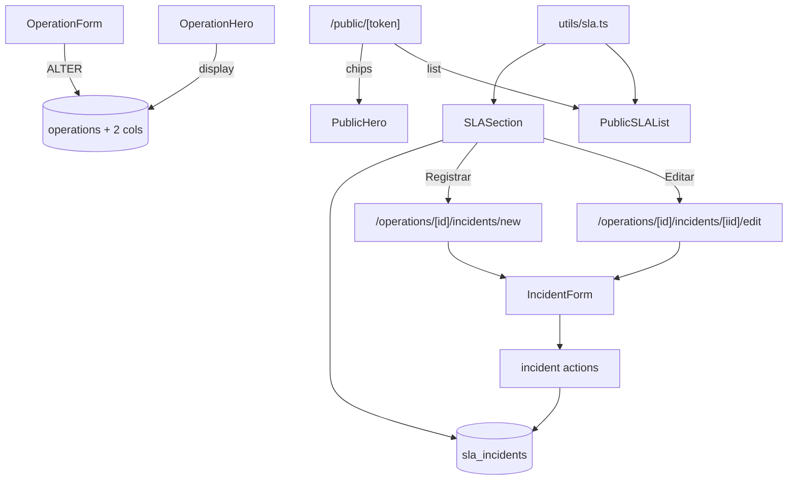

# sla Design

**Spec**: `.specs/features/sla/spec.md`

---

## Architecture Overview

2 mudanças no schema (ALTER operations + tabela `sla_incidents` com 2 enums). Helper puro de breach detection. 4 superfícies de UI consomem o helper. Cliente público vê tudo (sem visibility flag no MVP).



---

## Code Reuse

| What | How |
|---|---|
| ActionResult + helpers | actions |
| `requireUserAction` | guard |
| `Pill`, `Card`, `Button` | UI |
| `relativeFromNow` | datas |
| Padrão hard delete | window.confirm + action |
| RHF + zodResolver | IncidentForm |
| createAdmin() já existe | public view queries |
| OperationHero MetaChip pattern | reusa pra chips SLA |
| PublicHero | estende mesmos chips |

---

## Data Model

### ALTER operations

```sql
ALTER TABLE public.operations
  ADD COLUMN IF NOT EXISTS response_hours integer,
  ADD COLUMN IF NOT EXISTS resolution_hours integer;

ALTER TABLE public.operations
  ADD CONSTRAINT chk_operations_response_hours_range
    CHECK (response_hours IS NULL OR (response_hours >= 0 AND response_hours <= 720));

ALTER TABLE public.operations
  ADD CONSTRAINT chk_operations_resolution_hours_range
    CHECK (resolution_hours IS NULL OR (resolution_hours >= 0 AND resolution_hours <= 720));

COMMENT ON COLUMN public.operations.response_hours IS
  'SLA prometido pra primeira resposta, em horas corridas (0-720). Null = sem SLA.';
COMMENT ON COLUMN public.operations.resolution_hours IS
  'SLA prometido pra resolução total, em horas corridas (0-720). Null = sem SLA.';
```

### Enums + tabela sla_incidents

```sql
DO $$
BEGIN
  IF NOT EXISTS (SELECT 1 FROM pg_type WHERE typname = 'sla_severity') THEN
    CREATE TYPE sla_severity AS ENUM ('low', 'medium', 'high');
  END IF;
  IF NOT EXISTS (SELECT 1 FROM pg_type WHERE typname = 'sla_incident_status') THEN
    CREATE TYPE sla_incident_status AS ENUM ('open', 'responded', 'resolved', 'cancelled');
  END IF;
END $$;

CREATE TABLE IF NOT EXISTS public.sla_incidents (
  id uuid PRIMARY KEY DEFAULT gen_random_uuid(),
  operation_id uuid NOT NULL,
  title text NOT NULL,
  description text,
  severity sla_severity NOT NULL DEFAULT 'medium',
  status sla_incident_status NOT NULL DEFAULT 'open',
  opened_at timestamptz NOT NULL DEFAULT now(),
  responded_at timestamptz,
  resolved_at timestamptz,
  opened_by uuid,
  created_at timestamptz NOT NULL DEFAULT now(),
  updated_at timestamptz NOT NULL DEFAULT now(),
  CONSTRAINT fk_sla_incidents_operation_id
    FOREIGN KEY (operation_id) REFERENCES public.operations(id) ON DELETE CASCADE,
  CONSTRAINT fk_sla_incidents_opened_by
    FOREIGN KEY (opened_by) REFERENCES auth.users(id) ON DELETE SET NULL,
  CONSTRAINT chk_sla_incidents_responded_after_opened
    CHECK (responded_at IS NULL OR responded_at >= opened_at),
  CONSTRAINT chk_sla_incidents_resolved_after_responded
    CHECK (resolved_at IS NULL OR responded_at IS NULL OR resolved_at >= responded_at),
  CONSTRAINT chk_sla_incidents_status_requires_responded
    CHECK (status NOT IN ('responded', 'resolved') OR responded_at IS NOT NULL),
  CONSTRAINT chk_sla_incidents_status_resolved_requires_resolved_at
    CHECK (status != 'resolved' OR resolved_at IS NOT NULL)
);

CREATE INDEX IF NOT EXISTS idx_sla_incidents_operation_opened
  ON public.sla_incidents (operation_id, opened_at DESC);

COMMENT ON TABLE public.sla_incidents IS
  'sla_incident: registro de incidente operacional com timestamps de resposta/resolução. Breach calculado em runtime vs operations.response_hours/resolution_hours.';
```

### Triggers

```sql
CREATE TRIGGER set_sla_incidents_updated_at
  BEFORE UPDATE ON public.sla_incidents
  FOR EACH ROW EXECUTE FUNCTION public.set_updated_at();
```

### RLS

```sql
ALTER TABLE public.sla_incidents ENABLE ROW LEVEL SECURITY;

CREATE POLICY sla_incidents_authenticated_full
  ON public.sla_incidents FOR ALL TO authenticated
  USING (true) WITH CHECK (true);
```

---

## Componentes Novos

### `src/lib/utils/sla.ts`

```ts
export type BreachLevel = "ok" | "approaching" | "response_breach" | "resolution_breach";

export type IncidentForBreach = {
  status: "open" | "responded" | "resolved" | "cancelled";
  opened_at: string;
  responded_at: string | null;
  resolved_at: string | null;
};

export type OpSLAConfig = {
  response_hours: number | null;
  resolution_hours: number | null;
};

export function slaBreachLevel(
  incident: IncidentForBreach,
  op: OpSLAConfig,
): BreachLevel;
//   Lógica:
//   - cancelled → ok
//   - resolved: check (resolved_at - opened_at) vs resolution_hours; (responded_at - opened_at) vs response_hours
//   - responded: check response only; if breached → response_breach
//   - open: simula com now()
//   - "approaching" se > 75% threshold mas não breached
//   - Returns highest severity matching

export function slaBreachPill(level: BreachLevel): { text: string; variant: PillVariant } | null;
//   ok → null
//   approaching → "Próximo do limite" warning
//   response_breach → "Resposta atrasada" critical
//   resolution_breach → "Resolução atrasada" critical
```

### `src/lib/validators/operation.ts` (update existente)

Adicionar campos opcionais:
```ts
const optionalIntHours = z.preprocess(...);

operationSchema = z.object({
  ...existing,
  response_hours: optionalIntHours,
  resolution_hours: optionalIntHours,
});
```

### `src/lib/validators/incident.ts` (novo)

```ts
const optionalIso = z.preprocess(
  (v) => (v === "" || v == null ? undefined : v),
  z.string().optional(),
);

export const incidentSchema = z.object({
  title: z.string().trim().min(3).max(200),
  description: optionalText,
  severity: z.enum(["low", "medium", "high"]),
  status: z.enum(["open", "responded", "resolved", "cancelled"]),
  opened_at: z.string().min(1),
  responded_at: optionalIso,
  resolved_at: optionalIso,
}).refine(
  // status responded/resolved requires responded_at
  (d) => !["responded", "resolved"].includes(d.status) || !!d.responded_at,
  { message: "Status responded/resolved exige data de resposta.", path: ["responded_at"] },
).refine(
  (d) => d.status !== "resolved" || !!d.resolved_at,
  { message: "Status resolved exige data de resolução.", path: ["resolved_at"] },
);
```

### `src/lib/db/queries/incidents.ts`

```ts
export type IncidentRow = ...;
export type IncidentListItem = {
  id; title; description; severity; status;
  openedAt; respondedAt; resolvedAt;
  opener: { email: string | null };
};

async function listIncidentsByOperation(operationId, opts?: { excludeCancelled?: boolean }): Promise<IncidentListItem[]>;
async function getIncident(id): Promise<IncidentRow | null>;
async function countOpenIncidents(operationId): Promise<number>;
async function listPublicIncidents(operationId): Promise<IncidentListItem[]>; // excludes cancelled, uses createAdmin
```

### `src/lib/actions/incidents.ts`

```ts
async function createIncidentAction(operationId, formData): Promise<ActionResult<{ id, operationId }>>;
async function updateIncidentAction(incidentId, formData): Promise<ActionResult<{ id, operationId }>>;
async function deleteIncidentAction(incidentId): Promise<ActionResult<{ operationId }>>;
```

### Components

- `src/components/domain/IncidentForm.tsx` — RHF, igual ao MeetingForm pattern
- `src/components/domain/SLASection.tsx` — server; header + promessa + lista
- `src/components/domain/IncidentRow.tsx` — linha individual no SLASection (server)
- `src/components/domain/PublicSLAList.tsx` — server; lista pública
- Update `OperationForm` — 2 novos inputs
- Update `OperationHero` — 2 MetaChips condicionais
- Update `PublicHero` — 2 chips condicionais
- Update `OperationDetail` query — adiciona response_hours, resolution_hours

---

## Páginas

| Rota | Função |
|---|---|
| `/operations/[id]/incidents/new` | IncidentForm create |
| `/operations/[id]/incidents/[iid]/edit` | IncidentForm edit + delete |
| `/operations/[id]/page.tsx` | adiciona SLASection (antes de PublicLinksSection) |
| `/public/[token]/page.tsx` | adiciona PublicSLAList (após Anexos) |

---

## Error Handling

| Scenario | Action | UI |
|---|---|---|
| Auth ausente | err unauthenticated | toast |
| title < 3 | Zod inline | erro inline |
| response_hours > 720 | Zod / CHECK | inline |
| responded_at < opened_at | Zod / CHECK | inline |
| status=resolved sem resolved_at | refine + CHECK | inline |
| incident não pertence à op do path | redirect | — |
| Op archived | bloqueia create incident? Não — permitir registrar histórico mesmo arquivada | — |
| Cancel após resolve | permitido (override) | — |
| CASCADE de Op deletada | incidents derrubados | — |

---

## Tech Decisions

| Decision | Choice | Rationale |
|---|---|---|
| Schema location | ALTER operations + tabela nova | Minimal + reusa Op |
| Hours format | int 0-720 | Cobre até 30d; minutos é overkill |
| Enums separados | sla_severity + sla_incident_status | Conceitualmente distintos |
| State machine | Não rígida; transitions livres + CHECKs | Flex; CHECKs evitam inconsistência grave |
| Approaching threshold | 75% | Dá tempo de agir |
| Breach detection | Helper puro server/client safe | Reusa em N lugares |
| Public visibility flag | Não no MVP | Aceitar transparência; v2 refina |
| Excludecancelled em public | Sim | Cliente não vê ruído |
| opener tracking | FK auth.users SET NULL | Preserva mesmo se user removido |
| Anexos em incident | Não no MVP | Usa attachments separado se precisar |
| RHF para form | Sim | Mesma maturity do resto |
| Hard delete | Sim | CASCADE da Op |
| OperationDetail fields update | Sim | Hero precisa |
| Visual breach pill em incident | Sim, mas só em incidents com SLA definido | Sem SLA = sem breach |
| Hero breach total | NÃO | Hero mostra promessa, não breach total (clutter) |

---

## Notes

- DATABASE_SCHEMA.md ganha `sla_incidents` + nota de campos novos em operations.
- 2 enums novos em Enums table.
- `OperationDetail` (query) precisa carregar response_hours, resolution_hours.
- `OperationForm`: 2 inputs lado a lado em grid cols 2.
- Component `MetaChip` em OperationHero é interno; reusa pattern (já tem na file).
- Migration unifica ALTER + CREATE TABLE + RLS em 1 arquivo (`<ts>_sla.sql`).
- Total: ~7-8 arquivos novos + 4-5 modificados.
