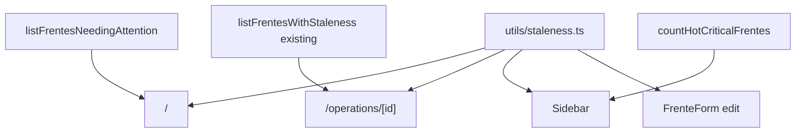

# status-acionavel-polish Design

**Spec**: `.specs/features/status-acionavel-polish/spec.md`

---

## Architecture Overview

Polish layer sem mudança de schema (exceto 1 index). Helper compartilhado define níveis; queries enriquecidas com `actionableStatusSince`; 4 pontos de UI consomem o helper.



---

## Code Reuse

| What | How |
|---|---|
| Existing `FrentesListSection` | adicionar pill via novo helper |
| Existing `Sidebar` | adicionar badge prop |
| Existing `FrenteForm` | adicionar hint inline |
| `Pill` UI | reusa variants oak/warning/critical |
| `relativeFromNow` | NÃO — usa `daysSince` (Math.floor) pra ser determinístico em dias |
| Constants pattern | igual `visibility.ts` |

---

## Data Model

**Sem tabela nova.** Apenas 1 index pra otimizar queries da Home + sidebar:

```sql
CREATE INDEX IF NOT EXISTS idx_frentes_actionable_status_since_active
  ON public.frentes (actionable_status_since ASC)
  WHERE archived_at IS NULL;
```

Index parcial (só ativas) — economia + cobre 100% das queries de staleness.

---

## Componentes Novos

### `src/lib/utils/staleness.ts`

```ts
import type { PillVariant } from "@/components/ui/Pill";

export const STALENESS_THRESHOLDS = {
  warm: 7,
  hot: 14,
  critical: 21,
} as const;

export type StalenessLevel = "fresh" | "warm" | "hot" | "critical";

export function daysSince(since: string | null | undefined): number {
  if (!since) return 0;
  const d = new Date(since);
  if (Number.isNaN(d.getTime())) return 0;
  const diff = Date.now() - d.getTime();
  return Math.max(0, Math.floor(diff / 86_400_000));
}

export function stalenessLevel(since: string | null | undefined): StalenessLevel {
  const days = daysSince(since);
  if (days < STALENESS_THRESHOLDS.warm) return "fresh";
  if (days < STALENESS_THRESHOLDS.hot) return "warm";
  if (days < STALENESS_THRESHOLDS.critical) return "hot";
  return "critical";
}

export type StalenessLabel = {
  text: string;
  variant: PillVariant;
};

export function stalenessLabel(
  since: string | null | undefined,
): StalenessLabel | null {
  const level = stalenessLevel(since);
  const days = daysSince(since);
  if (level === "fresh") return null;
  if (level === "warm") return { text: `Há ${days}d`, variant: "oak" };
  if (level === "hot")
    return { text: `Há ${days}d · revisitar`, variant: "warning" };
  return { text: `Há ${days}d · atenção`, variant: "critical" };
}

export function isHotOrCritical(level: StalenessLevel): boolean {
  return level === "hot" || level === "critical";
}
```

### `src/components/ui/StalenessPill.tsx`

```tsx
"use client" não necessário; server-renderable.

export function StalenessPill({ since }: { since: string | null | undefined }) {
  const label = stalenessLabel(since);
  if (!label) return null;
  return <Pill variant={label.variant}>{label.text}</Pill>;
}
```

### Queries em `src/lib/db/queries/frentes.ts`

Adicionar **2 funções novas** (sem mexer nas existentes):

```ts
export type FrenteAttentionItem = {
  id; name; cycleType; actionableStatus; actionableStatusSince;
  operation: { id, name };
  client: { name };
  responsible: { id, name } | null;
};

async function listFrentesNeedingAttention(limit = 8): Promise<FrenteAttentionItem[]>;
//   WHERE archived_at IS NULL AND actionable_status_since < now() - interval '7 days'
//   ORDER BY actionable_status_since ASC
//   LIMIT 8
//   Embed: operation+client+responsible

async function countHotCriticalFrentes(): Promise<number>;
//   WHERE archived_at IS NULL AND actionable_status_since < now() - interval '14 days'
//   COUNT(*) head only
```

### `src/components/domain/FrentesAttentionSection.tsx`

Server. Lista no /. Reusa `StalenessPill`.

Estrutura:
- Header h2 + Pill contagem total (hot+critical)
- Lista linhas com Avatar + nome Frente (Link) + Op name (Link) + Pills (cycle + staleness) + preview actionable_status 80 chars
- Empty state "Tudo em dia."

### Update `FrentesListSection.tsx` existing

Adicionar `<StalenessPill since={f.actionableStatusSince} />` no item. Verificar que `frentes` já carrega esse campo (deve carregar — é Row default).

### Update `Sidebar.tsx` existing

Aceitar prop opcional `hotCriticalCount?: number`. Renderiza Pill `critical` se > 0, "9+" se >= 10. Page `/` busca count e passa. Outras pages NÃO precisam — só Home recebe (ou passamos via layout? — decisão: passar via layout `(app)`).

Decisão: `(app)/layout.tsx` busca `countHotCriticalFrentes()` em Promise.all com o user; passa pro Sidebar. Significa que cada navegação no app puxa esse count (1 query rápida com index).

### Update `FrenteForm.tsx` existing

Em mode edit, ao lado do label "Status acionável", renderiza hint:
```tsx
{mode === "edit" && (
  <span className="font-mono text-[10px] text-mute">
    Atualizado há {daysSince(initialData.actionable_status_since)}d
  </span>
)}
```

---

## Pages

| Página | Mudança |
|---|---|
| `/` (Home) | Promise.all puxa `listFrentesNeedingAttention()` + `countHotCriticalFrentes()`; renderiza section nova |
| `/operations/[id]/page.tsx` | nada (FrentesListSection já tem dados — basta atualizar internamente) |
| `(app)/layout.tsx` | Promise.all com user + countHotCriticalFrentes; passa pro Sidebar |

---

## Error Handling

| Scenario | Action | UI |
|---|---|---|
| Query falha em Home | throw → boundary | error page |
| Helper recebe data inválida | retorna fresh (0d) | sem pill |
| Sidebar count falha | passa 0 | sem badge (graceful) |
| `actionable_status_since` null | tratado em daysSince | fresh |

---

## Tech Decisions

| Decision | Choice | Rationale |
|---|---|---|
| Helper module | `staleness.ts` puro | Reusabilidade + testabilidade |
| Threshold valores | Hard-coded 7/14/21 | MVP simples; tune em obs |
| Pill warm na sidebar count | NÃO incluído | Evita alarme falso; só hot+critical |
| StalenessPill component | Sim, wrapper de Pill | Encapsula null logic |
| Index novo | Parcial em frentes(actionable_status_since) WHERE archived_at IS NULL | Cobre 100% das queries + economia |
| `daysSince` vs `relativeFromNow` | daysSince novo | Determinístico (apenas dias); relative gera "há 1h" desnecessário |
| Sidebar via layout | Sim | Reflete em toda navegação no app |
| countHotCritical em toda navegação | Aceito | 1 query indexed; trivial |
| Encerrada conta como stale | Sim | Aceito até v2 refinar |

---

## Notes

- Migration: 1 index parcial. Sem RLS / sem comment de tabela. Pequena e segura.
- `Sidebar.tsx` é server component — pode receber count via prop sem cliente.
- DATABASE_SCHEMA.md: index novo mencionado abaixo de `frentes` (não nova tabela).
- Quando o usuário atualiza `actionable_status`, action já atualiza `actionable_status_since` (trigger ou explícito — verificar). Se não, ajustar action.
