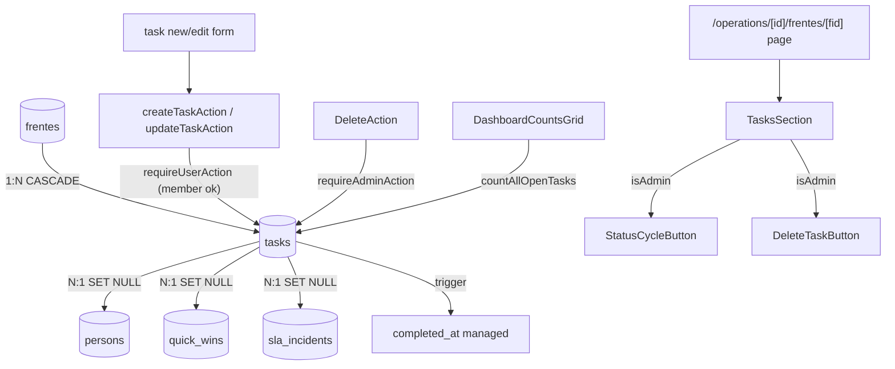

# tasks Design

**Spec**: `.specs/features/tasks/spec.md`

---

## Architecture Overview

Tabela `tasks` (frente-owned) + enum `task_status` + trigger `manage_task_completed_at`. Como `/operations/[id]/frentes/[fid]/page.tsx` ainda não existe, criamos a página de detalhe da Frente aproveitando o slot pra hospedar a section de Tarefas. CRUD via Server Actions seguindo o padrão `ActionResult<T>`. UI segue o vocabulário existente (Pill, Avatar, Button, StalenessPill).



---

## Code Reuse

| What | How |
|---|---|
| `set_updated_at` fn | Reuso direto no trigger updated_at |
| `requireUserAction` / `requireAdminAction` | Auth pattern dos outros actions |
| `ActionResult<T>` helpers | `_types.ts` |
| `Pill`, `Avatar`, `Button`, `StalenessPill` | Lista e form |
| `formatDate` (date.ts) | Due date display |
| Pattern `MeetingForm` / `IncidentForm` | Form layout, controlled fields |
| Pattern `FrentesListSection` | List rendering layout |
| `DashboardCountsGrid` | Recebe novo prop `openTasks` |
| `revalidatePath` | Re-render após mutation |

---

## Data Model

### Migration `<ts>_tasks.sql`

```sql
-- Enum
DO $$
BEGIN
  IF NOT EXISTS (SELECT 1 FROM pg_type WHERE typname = 'task_status') THEN
    CREATE TYPE task_status AS ENUM ('todo', 'doing', 'blocked', 'done');
  END IF;
END $$;

-- Tabela
CREATE TABLE IF NOT EXISTS public.tasks (
  id uuid PRIMARY KEY DEFAULT gen_random_uuid(),
  frente_id uuid NOT NULL,
  title text NOT NULL,
  description text,
  status task_status NOT NULL DEFAULT 'todo',
  assignee_person_id uuid,
  due_date date,
  tags text[],
  quick_win_id uuid,
  sla_incident_id uuid,
  created_at timestamptz NOT NULL DEFAULT now(),
  updated_at timestamptz NOT NULL DEFAULT now(),
  completed_at timestamptz,
  CONSTRAINT fk_tasks_frente_id FOREIGN KEY (frente_id)
    REFERENCES public.frentes(id) ON DELETE CASCADE,
  CONSTRAINT fk_tasks_assignee_person_id FOREIGN KEY (assignee_person_id)
    REFERENCES public.persons(id) ON DELETE SET NULL,
  CONSTRAINT fk_tasks_quick_win_id FOREIGN KEY (quick_win_id)
    REFERENCES public.quick_wins(id) ON DELETE SET NULL,
  CONSTRAINT fk_tasks_sla_incident_id FOREIGN KEY (sla_incident_id)
    REFERENCES public.sla_incidents(id) ON DELETE SET NULL,
  CONSTRAINT check_tasks_title_length CHECK (char_length(title) >= 3)
);

COMMENT ON TABLE public.tasks IS
  'frente: tarefas planejadas de execução. Inv. de família: frente_id NOT NULL (Task não existe sem Frente). Interna (sem visibility — não aparece em /public).';

COMMENT ON COLUMN public.tasks.completed_at IS
  'Auto-managed por trigger: set quando status → done, clear quando sai de done.';
COMMENT ON COLUMN public.tasks.tags IS
  'Tags livres (sem catálogo). Dedup é responsabilidade do front.';

-- Index for common queries
CREATE INDEX IF NOT EXISTS idx_tasks_frente_status
  ON public.tasks(frente_id, status);
CREATE INDEX IF NOT EXISTS idx_tasks_assignee
  ON public.tasks(assignee_person_id) WHERE assignee_person_id IS NOT NULL;

-- Trigger: updated_at
DROP TRIGGER IF EXISTS set_tasks_updated_at ON public.tasks;
CREATE TRIGGER set_tasks_updated_at
  BEFORE UPDATE ON public.tasks
  FOR EACH ROW EXECUTE FUNCTION public.set_updated_at();

-- Trigger: completed_at auto-manage
CREATE OR REPLACE FUNCTION public.manage_task_completed_at()
RETURNS TRIGGER AS $$
BEGIN
  IF (TG_OP = 'INSERT' AND NEW.status = 'done') THEN
    NEW.completed_at := COALESCE(NEW.completed_at, now());
  ELSIF (TG_OP = 'UPDATE') THEN
    IF NEW.status = 'done' AND (OLD.status IS DISTINCT FROM 'done') THEN
      NEW.completed_at := now();
    ELSIF NEW.status <> 'done' AND OLD.status = 'done' THEN
      NEW.completed_at := NULL;
    END IF;
  END IF;
  RETURN NEW;
END;
$$ LANGUAGE plpgsql;

DROP TRIGGER IF EXISTS manage_task_completed_at ON public.tasks;
CREATE TRIGGER manage_task_completed_at
  BEFORE INSERT OR UPDATE ON public.tasks
  FOR EACH ROW EXECUTE FUNCTION public.manage_task_completed_at();

-- RLS
ALTER TABLE public.tasks ENABLE ROW LEVEL SECURITY;
CREATE POLICY tasks_authenticated_full ON public.tasks
  FOR ALL TO authenticated USING (true) WITH CHECK (true);
```

---

## Queries — `src/lib/db/queries/tasks.ts` (novo)

```ts
export type TaskStatus = "todo" | "doing" | "blocked" | "done";

export type TaskRow = {
  id: string;
  frenteId: string;
  title: string;
  description: string | null;
  status: TaskStatus;
  assigneePersonId: string | null;
  assigneeName: string | null;
  dueDate: string | null;
  tags: string[] | null;
  quickWinId: string | null;
  slaIncidentId: string | null;
  createdAt: string;
  updatedAt: string;
  completedAt: string | null;
};

export async function listTasksByFrente(frenteId: string): Promise<TaskRow[]>;
export async function getTask(id: string): Promise<TaskRow | null>;
export async function countOpenTasksByFrente(frenteId: string): Promise<number>;
export async function countAllOpenTasks(): Promise<number>;
```

Ordering em `listTasksByFrente`:
- Tasks com status `done` por último (use `CASE WHEN status='done' THEN 1 ELSE 0 END`)
- Depois `due_date asc nulls last`
- Depois `created_at desc`

Assignee resolvido via `persons!left(id, full_name)` join.

---

## Actions — `src/lib/actions/tasks.ts` (novo)

```ts
type TaskInput = {
  title: string;
  description: string | null;
  status: TaskStatus;
  assigneePersonId: string | null;
  dueDate: string | null; // ISO date YYYY-MM-DD
  tags: string[] | null;
  quickWinId: string | null;
  slaIncidentId: string | null;
};

createTaskAction(frenteId: string, formData: FormData): ActionResult<{ id: string }>;
updateTaskAction(id: string, formData: FormData): ActionResult<{ id: string }>;
changeTaskStatusAction(id: string, newStatus: TaskStatus): ActionResult<{ id: string }>;
deleteTaskAction(id: string): ActionResult<{ id: string }>;   // requireAdminAction
```

- `createTaskAction`/`updateTaskAction`: `requireUserAction` apenas; member pode criar/editar
- `deleteTaskAction`: `requireUserAction` + `requireAdminAction` (Inv. 14)
- `changeTaskStatusAction`: `requireUserAction`; revalidates frente page
- Validação Zod em `src/lib/validators/task.ts` (novo): title min 3, status enum, tags array de strings 1-30 chars

`formDataToTaskInput(formData: FormData): TaskInput` helper:
- title: required string
- description: trim, "" → null
- status: enum, default "todo"
- assignee_person_id: "" → null
- due_date: "" → null
- tags: comma-separated string → array (split, trim, dedup, filter empty)
- quick_win_id: "" → null
- sla_incident_id: "" → null

---

## Components Novos

### `src/components/domain/TasksSection.tsx` (server)

```tsx
type Props = {
  tasks: TaskRow[];
  frenteId: string;
  operationId: string;
  isAdmin: boolean;
  filterStatus?: "open" | "done" | "all"; // via search param
  quickWins: { id: string; title: string }[]; // pro filtro/contexto
};
```

Render:
- Header: `<h2>Tarefas</h2>` + count + filter tabs (Abertas / Concluídas / Todas) + botão `+ Nova tarefa`
- Lista `<ul>` com `TaskListItem` por linha
- Empty state

### `src/components/domain/TaskListItem.tsx` (server)

Props: `task: TaskRow`, `frenteId`, `operationId`, `isAdmin`.

Layout grid 12-col:
- col-span-1: `StatusCycleButton` (client, ciclo todo→doing→done)
- col-span-5: title (linkado para `.../tasks/[tid]/edit`)
- col-span-2: Avatar assignee + initials (ou —)
- col-span-2: Pill due_date (warning se atrasada, oak se ≤ 3d, neutral senão; sem pill se null)
- col-span-1: tags como Pill cluster (truncar 1-2; "+N" se mais)
- col-span-1 right: `DeleteTaskButton` se isAdmin

### `src/components/domain/StatusCycleButton.tsx` (client)

Props: `taskId: string`, `currentStatus: TaskStatus`.

Comportamento:
- Visual: checkbox quadrado vazio (todo), preenchido azul (doing), check verde (done), ícone alerta (blocked)
- onClick: cicla todo → doing → done → todo (blocked tem dropdown ou modal separado — no MVP: ciclo simples; blocked só via form edit)
- Chama `changeTaskStatusAction(taskId, nextStatus)`
- Disabled durante mutation

### `src/components/domain/TaskForm.tsx` (client wrapper)

Form com React Hook Form (padrão do projeto). Campos:
- title (input)
- description (textarea md, 5 rows)
- status (select)
- assignee_person_id (select de persons; busca via prop)
- due_date (input type=date)
- tags (input comma-separated com helper text)
- quick_win_id (select; opcional; opções vêm da Operação)
- sla_incident_id (select; opcional; opções vêm da Operação)

Submit via Server Action; redirect `/operations/[id]/frentes/[fid]` no sucesso.

### `src/components/domain/DeleteTaskButton.tsx` (client)

Padrão dos outros delete buttons: window.confirm + action.

### `src/components/domain/FrenteMetaCard.tsx` (server, novo)

Componente leve mostrando meta da Frente na nova página de detalhe:
- Nome + cycle type + domain + phase pills
- Actionable status + StalenessPill
- Responsible avatar/name
- Link "Editar Frente →" se isAdmin

---

## Updates em componentes existentes

| Componente | Mudança |
|---|---|
| `DashboardCountsGrid.tsx` | Aceitar prop `openTasks`; renderizar 5º card "Tarefas abertas" |
| Page `/admin/dashboard/page.tsx` | Buscar `countAllOpenTasks()` no Promise.all; passar prop |
| Page `/admin/dashboard` summary | Estender `DashboardSummary` com `openTasks` |
| `FrentesListSection.tsx` | Tornar nome da Frente um Link para `/operations/[id]/frentes/[fid]` (novo) |
| `DATABASE_SCHEMA.md` | Tabela 20: tasks |

Layout do grid: passar de `grid-cols-2 md:grid-cols-4` pra `grid-cols-2 md:grid-cols-3 lg:grid-cols-5`.

---

## Pages

| Página | Função | Auth |
|---|---|---|
| `/operations/[id]/frentes/[fid]/page.tsx` (nova) | Detalhe da Frente: FrenteMetaCard + TasksSection | requireUser |
| `/operations/[id]/frentes/[fid]/tasks/new/page.tsx` (nova) | Form new task | requireUser |
| `/operations/[id]/frentes/[fid]/tasks/[tid]/edit/page.tsx` (nova) | Form edit task | requireUser |

Estrutura da nova `frentes/[fid]/page.tsx`:

```tsx
export default async function Page({ params, searchParams }: {
  params: Promise<{ id: string; fid: string }>;
  searchParams: Promise<{ filter?: string }>;
}) {
  await requireUser();
  const { id, fid } = await params;
  const { filter } = await searchParams;
  const profile = await getProfile();
  const isAdmin = profile?.role === "admin";

  const [frente, tasks, quickWins] = await Promise.all([
    getFrenteDetail(fid),
    listTasksByFrente(fid),
    listQuickWinsByOperation(id),
  ]);
  if (!frente || frente.operationId !== id) notFound();

  const filterStatus = (filter as "open" | "done" | "all") ?? "open";
  const filtered = applyTaskFilter(tasks, filterStatus);

  return (
    <>
      <PageHeader title={frente.name} backHref={`/operations/${id}`} />
      <FrenteMetaCard frente={frente} isAdmin={isAdmin} />
      <TasksSection
        tasks={filtered}
        frenteId={fid}
        operationId={id}
        isAdmin={isAdmin}
        filterStatus={filterStatus}
        quickWins={quickWins.map(q => ({ id: q.id, title: q.title }))}
      />
    </>
  );
}
```

---

## Error Handling

| Scenario | Action | UI |
|---|---|---|
| Member tenta delete task | requireAdminAction → forbidden | Toast |
| Title < 3 chars | Zod fail | Inline error |
| Mudança status concorrente (race) | UPDATE last-write-wins | aceito |
| Person assignee deletada após task | FK SET NULL | task aparece sem assignee |
| QW/SLA deletados após task | FK SET NULL | task perde vínculo, sobrevive |
| Frente deletada | CASCADE | tasks somem com a Frente |
| Status illegal via Server Action raw | Zod enum rejeita | err `validation_status` |
| Trigger completed_at em INSERT done | Set now() | ok |
| Trigger ao voltar done → todo | NULL | ok |

---

## Tech Decisions

| Decision | Choice | Rationale |
|---|---|---|
| Frente detail page | Criar `/operations/[id]/frentes/[fid]/page.tsx` | Não existe hoje; melhor lugar pra hospedar tarefas e meta da Frente |
| Tasks per Frente, not Operation | frente_id NOT NULL | Match spec; Frente é o agrupador natural |
| Status cycle UI | todo→doing→done; blocked só via form | UX simples no MVP; cycle de 4 fica confuso |
| Auto completed_at via trigger | Sim | Consistência no banco; evita lógica espalhada |
| Tags como text[] | Sim | Flex sem schema; dedup no front |
| Index frente_id + status | Sim | Query mais comum (listTasksByFrente filtra status) |
| Index assignee_person_id | Sim (partial) | Pra futura view "Minha agenda" |
| Hard delete | Sim, admin only | Sem audit log; arquivar tarefa não tem sentido |
| FK SET NULL (não CASCADE) em QW/SLA/Person | Sim | Task continua válida mesmo perdendo vínculo |
| Validação Zod tags max length | 30 chars cada | Evita user-input ruim |
| revalidatePath | `/operations/[id]/frentes/[fid]` e `/operations/[id]` | Ambos podem mostrar tasks |
| Tasks no painel admin | Sim, count aberta | Visibilidade do volume |
| Sidebar entrada `/tasks` | Não | Out do MVP |
| TaskListItem todo grid | 12-col flexível | Match FrentesListSection |
| Form mode | React Hook Form | Padrão do projeto |
| Filter via search param | Sim | URL-stateable; bookmark friendly |
| Default filter | "open" | Caso comum: ver pendências |
| Dropdown de QW e Incident no form | Sim, opcional | Permite vincular sem exigir |
| Public visibility | Não, nunca | Pedido do usuário; task é interna |

---

## Notes

- `getFrenteDetail(fid)` provavelmente já não existe — verificar e criar se necessário (com operationId, name, cycle_type, domain, phase, actionable_status, etc.)
- `listQuickWinsByOperation(id)` já existe (verificado no spec).
- Trigger `manage_task_completed_at` BEFORE INSERT OR UPDATE — IMPORTANT: TG_OP check pra distinguir.
- `OLD` é NULL no INSERT — `OLD.status IS DISTINCT FROM 'done'` é true se OLD é NULL, então pra INSERT separamos com `TG_OP = 'INSERT'`.
- `completed_at` na INSERT: COALESCE permite explicit override raro (test fixture); padrão é now().
- Tags input: front split por vírgula + trim + dedup + filter empty antes de salvar.
- StalenessPill já existe — usar pra due_date também (variante semântica).
- DashboardSummary type: adicionar `openTasks: number`.
- Migration aplicada via MCP `apply_migration` (preferida sobre execute_sql para DDL).
- Regenerar types após apply.
