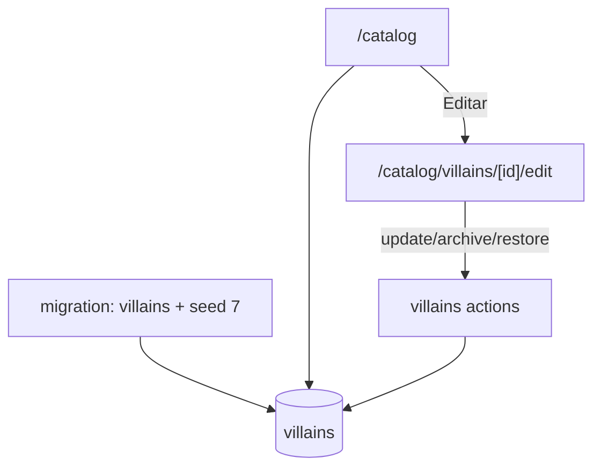

# villains-catalog Design

**Spec**: `.specs/features/villains-catalog/spec.md`

---

## Architecture Overview

1 tabela `villains` com seed inline na migration (7 INSERTs canon). RLS sem policy DELETE (Inv. 06 enforced no banco). `/catalog` reescrita do zero substituindo placeholder. 1 rota edit.



---

## Code Reuse

| What | How |
|---|---|
| RHF + zodResolver | VillainForm |
| ActionResult + helpers | actions |
| `requireUserAction` | guard |
| `Pill`, `Card`, `Button` | UI |
| Slug normalization | reusa pattern de clients |
| Lucide dynamic | mapa de icons string→component |
| `formatDateBR` | exibição archived_at |

---

## Data Model

### Tabela `villains`

```sql
CREATE TABLE public.villains (
  id uuid PRIMARY KEY DEFAULT gen_random_uuid(),
  name text NOT NULL,
  slug text UNIQUE NOT NULL,
  quote text NOT NULL,
  description text NOT NULL,
  icon_name text NOT NULL,
  pill_variant text NOT NULL,
  display_order integer NOT NULL UNIQUE,
  archived_at timestamptz,
  created_at timestamptz NOT NULL DEFAULT now(),
  updated_at timestamptz NOT NULL DEFAULT now(),
  CONSTRAINT chk_villains_pill_variant
    CHECK (pill_variant IN ('neutral', 'oak', 'sage', 'ok', 'warning', 'critical')),
  CONSTRAINT chk_villains_slug_format
    CHECK (slug ~ '^[a-z0-9-]+$' AND length(slug) BETWEEN 2 AND 60),
  CONSTRAINT chk_villains_display_order_range
    CHECK (display_order > 0)
);

CREATE INDEX idx_villains_display_order
  ON public.villains (display_order ASC);

CREATE INDEX idx_villains_active
  ON public.villains (display_order ASC)
  WHERE archived_at IS NULL;

COMMENT ON TABLE public.villains IS
  'villain: catálogo da marca DRYOS, 7 registros canon. Inv. 06: nunca delete, só archive (sem policy DELETE).';
COMMENT ON COLUMN public.villains.icon_name IS
  'Nome do componente Lucide React (ex: ClipboardList). Mapeado em src/lib/constants/villain-icons.ts.';
COMMENT ON COLUMN public.villains.pill_variant IS
  'Variante do componente Pill UI. CHECK enforça valores válidos.';
```

### Seed inline (mesma migration)

```sql
INSERT INTO public.villains (name, slug, quote, description, icon_name, pill_variant, display_order)
VALUES
  ('Capitão Manualis', 'manualis',
   'Sempre foi assim.',
   'Processos manuais repetitivos que consomem horas semanais do time e travam escala.',
   'ClipboardList', 'oak', 1),
  ('Senhor dos Silos', 'silos',
   'Esse dado é do nosso setor.',
   'Dados isolados em planilhas, CRMs e cabeças diferentes — sem visão integrada.',
   'Database', 'warning', 2),
  ('Dama do Retrabalho', 'retrabalho',
   'Já fiz isso semana passada...',
   'Mesmo trabalho refeito por falta de versionamento, padrão ou comunicação.',
   'RotateCcw', 'oak', 3),
  ('General Lento', 'lento',
   'Não dá pra acelerar.',
   'Ciclos de decisão e entrega que se arrastam por hábito, fricção ou falta de prioridade.',
   'Hourglass', 'warning', 4),
  ('Oráculo do Achismo', 'achismo',
   'Eu acho que tá vendendo bem...',
   'Decisões tomadas no feeling, sem indicador objetivo nem evidência.',
   'HelpCircle', 'critical', 5),
  ('Drenador', 'drenador',
   'Só uma reuniãozinha rápida.',
   'Reuniões, status e demandas paralelas que drenam o tempo profundo do time.',
   'Droplet', 'critical', 6),
  ('Enganador', 'enganador',
   'Olha como bateu a meta!',
   'Métricas otimizadas pra parecer boas em vez de gerar valor real ao negócio.',
   'EyeOff', 'critical', 7)
ON CONFLICT (slug) DO NOTHING;
```

### Trigger updated_at

```sql
CREATE TRIGGER set_villains_updated_at
  BEFORE UPDATE ON public.villains
  FOR EACH ROW EXECUTE FUNCTION public.set_updated_at();
```

### RLS — Inv. 06 enforced

```sql
ALTER TABLE public.villains ENABLE ROW LEVEL SECURITY;

-- SELECT pra authenticated
CREATE POLICY villains_authenticated_select
  ON public.villains FOR SELECT TO authenticated USING (true);

-- INSERT (futuro: 8º vilão por admin? não MVP, mas policy não bloqueia se escapar)
CREATE POLICY villains_authenticated_insert
  ON public.villains FOR INSERT TO authenticated WITH CHECK (true);

-- UPDATE (edit + archive/restore via set archived_at)
CREATE POLICY villains_authenticated_update
  ON public.villains FOR UPDATE TO authenticated USING (true) WITH CHECK (true);

-- SEM POLICY DELETE — Inv. 06: nunca deletar
```

---

## Componentes Novos

### `src/lib/validators/villain.ts`

```ts
export const PILL_VARIANTS = ["neutral", "oak", "sage", "ok", "warning", "critical"] as const;

export const villainSchema = z.object({
  name: z.string().trim().min(3, "Mínimo 3").max(120),
  slug: z
    .string()
    .trim()
    .toLowerCase()
    .regex(/^[a-z0-9-]+$/, "Apenas a-z, 0-9 e hífen.")
    .min(2)
    .max(60),
  quote: z.string().trim().min(3).max(200),
  description: z.string().trim().min(10).max(500),
  icon_name: z.string().trim().min(1).max(50),
  pill_variant: z.enum(PILL_VARIANTS),
  display_order: z.coerce.number().int().min(1).max(99),
});
```

### `src/lib/constants/villain-icons.ts`

```ts
import {
  ClipboardList, Database, RotateCcw, Hourglass, HelpCircle,
  Droplet, EyeOff, AlertTriangle, Skull, Flame,
  Bug, Zap, Brain, Volume2, Ghost, Frown,
  TrendingDown, Lock, BatteryLow, ShieldOff,
} from "lucide-react";

export const VILLAIN_ICONS = {
  ClipboardList, Database, RotateCcw, Hourglass, HelpCircle,
  Droplet, EyeOff, AlertTriangle, Skull, Flame,
  Bug, Zap, Brain, Volume2, Ghost, Frown,
  TrendingDown, Lock, BatteryLow, ShieldOff,
} as const;

export type VillainIconName = keyof typeof VILLAIN_ICONS;

export function resolveVillainIcon(name: string) {
  return (VILLAIN_ICONS as Record<string, unknown>)[name]
    ? VILLAIN_ICONS[name as VillainIconName]
    : HelpCircle;
}
```

### `src/lib/db/queries/villains.ts`

```ts
export type VillainRow = Database["public"]["Tables"]["villains"]["Row"];

export type VillainListItem = {
  id; name; slug; quote; description; iconName; pillVariant; displayOrder; archivedAt;
};

async function listVillains(): Promise<VillainListItem[]>;
//   ORDER BY archived_at IS NULL DESC, display_order ASC
//   (não-arquivados primeiro, ordenados por display_order)

async function getVillain(id: string): Promise<VillainRow | null>;
```

### `src/lib/actions/villains.ts`

```ts
async function updateVillainAction(id, formData): Promise<ActionResult<{ id }>>;
async function archiveVillainAction(id): Promise<ActionResult<{ id }>>;
async function restoreVillainAction(id): Promise<ActionResult<{ id }>>;
//   Sem deleteAction — Inv. 06
//   Sem createAction — Inv. 06 (7 fixos)
```

### Components

- `src/components/domain/VillainCard.tsx` — server; mostra card no /catalog
- `src/components/domain/VillainForm.tsx` — client; RHF edit form
- `src/components/domain/ArchiveVillainButton.tsx` — client; window.confirm + archive/restore action

---

## Páginas

| Rota | Função |
|---|---|
| `/catalog/page.tsx` | reescreve placeholder; grid dos 7 vilões |
| `/catalog/villains/[id]/edit/page.tsx` | form edit + archive/restore |

---

## Error Handling

| Scenario | Action | UI |
|---|---|---|
| Auth ausente | err unauthenticated | toast |
| slug duplicado | 23505 → err `validation_slug` "Slug já em uso." | inline |
| display_order duplicado | 23505 → err `validation_display_order` | inline |
| pill_variant inválido | Zod + CHECK | inline |
| icon_name inválido | aceita; render fallback HelpCircle | sem erro |
| Vilão não encontrado | redirect /catalog | — |
| Tentar DELETE | RLS bloqueia (autenticado); UI nem oferece botão | n/a |

---

## Tech Decisions

| Decision | Choice | Rationale |
|---|---|---|
| Tabela em public | Sim | Default |
| Seed inline | Sim, mesma migration | Catálogo é canon imediato; idempotência via ON CONFLICT (slug) DO NOTHING |
| Icon como string + map | Sim | Flexível; map controla disponibilidade |
| Pill variant como text + CHECK | Sim | Reusa palette; sem enum SQL pra evitar migrar quando adicionar variante |
| display_order UNIQUE | Sim | Evita ordem ambígua |
| RLS sem DELETE policy | Sim | Inv. 06 enforced defense-in-depth |
| Create UI | Não | Inv. 06: 7 fixos |
| Service role pode DELETE | Aceito | Escape hatch quando absolutamente necessário |
| Restaurar via mesmo action ou separado? | Separado (`restoreVillainAction`) | Clareza UX e auditoria |
| 20 ícones disponíveis | Curated subset | Evita bundle bloat; cobre conceitos |
| Variant default novo | "oak" | Cor de marca |
| Slug imutável após archive? | Não no MVP | Edit livre; futuro pode travar |
| OperationVillains FK | Não aqui | Próxima feature |
| Vilões em mockup têm "Capitão", "Senhor", "Dama", "General", "Oráculo" prefixos + "Drenador"/"Enganador" sem | Preservar exato | Canon da marca |

---

## Notes

- DATABASE_SCHEMA.md ganha `villains` (14ª tabela).
- /catalog atualmente é PlaceholderSection — reescrita total da page.
- Sidebar já linka /catalog em "Admin" group; mantém.
- Quando próxima feature (operation_villains) for criada, FK será SET NULL ou RESTRICT — decisão lá. Aqui só catálogo.
- Idempotência do seed via `ON CONFLICT (slug) DO NOTHING` permite re-aplicar migration sem duplicar.
- Migration: villains + seed + RLS + trigger + index em 1 arquivo.
