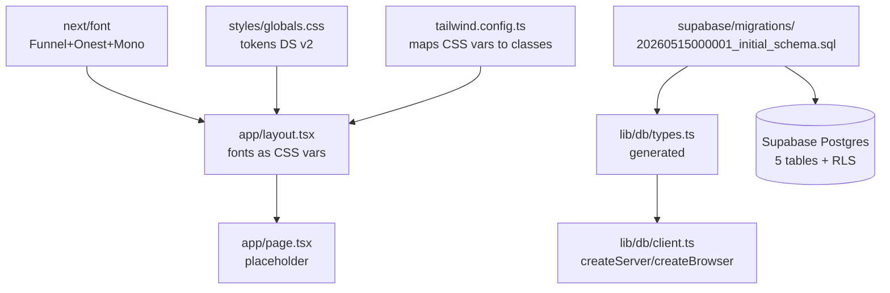

# week-01-setup Design

**Spec**: `.specs/features/week-01-setup/spec.md`
**Status**: Draft

---

## Architecture Overview

Bootstrap puro: nenhuma feature de negócio, só fundação. Três camadas que vão suportar tudo daqui em diante:



Fluxo de geração de tipos: migration → `gen:types` → `lib/db/types.ts` → cliente tipado.

---

## Code Reuse Analysis

### Existing Components to Leverage

| Component / Pattern | Location | How to Use |
|---|---|---|
| Tokens de cor (CSS vars + `@theme inline`) | `.claude/skills/dryos-design-system/SKILL.md` (seções "Tokens / Cores" + "Tailwind 4 — CSS-first config") | **Copiar verbatim** o bloco `:root` + `body.dark` + `@theme inline` pra `src/styles/globals.css`. **Sem `tailwind.config.ts`** (Tailwind 4 é CSS-first). |
| Fontes via `next/font` | `.claude/skills/dryos-design-system/SKILL.md` (seção "Tipografia") | **Copiar verbatim** o snippet de `RootLayout` pra `src/app/layout.tsx`, ajustando o conteúdo do `<body>` pra placeholder |
| Estrutura de pastas | `.claude/skills/dryos-conventions/SKILL.md` (seção "Estrutura de pastas") | Replicar árvore, criar `.gitkeep` nas pastas vazias |
| `tsconfig.json` estrito | `.claude/skills/dryos-conventions/SKILL.md` (seção "TypeScript") | Aplicar `strict + noUncheckedIndexedAccess + noImplicitOverride + exactOptionalPropertyTypes` |
| CHECK constraint do status acionável | `.claude/skills/dryos-conventions/SKILL.md` (seção "Status acionável") | **Copiar verbatim** os 2 `ALTER TABLE frentes ADD CONSTRAINT ... CHECK ...` |
| Convenções de migration (idempotência, FK nomeada, COMMENT) | `CLAUDE.md` (seção "Migrations" + "Antes de criar tabela") | Aplicar em todas as 5 tabelas |
| Invariantes 1, 2, 4, 10, 11, 12 | `CLAUDE.md` (seção "Invariantes de implementação") | Cada vira CHECK ou FK NOT NULL no schema |

### Integration Points

| System | Integration Method |
|---|---|
| Supabase | Cliente via `@supabase/ssr` (createServerClient + createBrowserClient). Types gerados via `supabase gen types typescript` em `src/lib/db/types.ts` |
| Next.js App Router | `src/app/layout.tsx` é root layout; fontes vão como CSS vars; tokens vão via Tailwind |
| Tailwind | Lê tokens de `var(--*)` definidos em `globals.css` |

---

## Components

### `src/app/layout.tsx`

- **Purpose**: Root layout do App Router. Carrega 3 fontes via `next/font/google` como CSS vars; aplica classes base no `<body>`; define `lang="pt-BR"`.
- **Location**: `src/app/layout.tsx`
- **Interfaces**: `export default function RootLayout({ children }: { children: React.ReactNode }): JSX.Element`
- **Dependencies**: `next/font/google`, `./styles/globals.css` (ou via Tailwind), `react`
- **Reuses**: Snippet completo do skill `dryos-design-system`.

### `src/app/page.tsx`

- **Purpose**: Placeholder pra confirmar que app sobe. Não é UI canônica — vai ser substituído pela Home (sem 2).
- **Location**: `src/app/page.tsx`
- **Interfaces**: `export default function Page(): JSX.Element`
- **Dependencies**: Nenhuma
- **Reuses**: Nenhum (placeholder)

### `src/styles/globals.css`

- **Purpose**: CSS vars dos tokens DS v2 (light + dark) + diretivas Tailwind (`@tailwind base/components/utilities`).
- **Location**: `src/styles/globals.css`
- **Interfaces**: N/A (CSS)
- **Dependencies**: Nenhuma
- **Reuses**: Bloco completo do skill `dryos-design-system` seção "Cores".

### ~~`tailwind.config.ts`~~ — **removido (Tailwind 4 é CSS-first)**

Tokens viram bloco `@theme inline { ... }` dentro de `src/styles/globals.css` (junto das CSS vars). Não há arquivo separado. Reuse: skill `dryos-design-system` seção "Tailwind 4 — CSS-first config".

PostCSS plugin (`postcss.config.mjs`): default do create-next-app, `"@tailwindcss/postcss": {}`.

### `tsconfig.json`

- **Purpose**: TypeScript estrito + paths (`@/*` → `./src/*`).
- **Location**: raiz
- **Interfaces**: N/A (JSON)
- **Dependencies**: Nenhuma
- **Reuses**: Configuração do skill `dryos-conventions` + adições do Next.js (`jsx: "preserve"`, `plugins: [{ name: "next" }]`, etc — `create-next-app` gera).

### `src/lib/db/client.ts` (P3)

- **Purpose**: Helpers tipados pra criar cliente Supabase em Server Components/Actions vs Client Components.
- **Location**: `src/lib/db/client.ts`
- **Interfaces**:
  - `createServer(): Promise<SupabaseClient<Database>>` — pra Server Components, Server Actions, Route Handlers (lê cookies via `next/headers`)
  - `createBrowser(): SupabaseClient<Database>` — pra Client Components
- **Dependencies**: `@supabase/ssr`, `next/headers`, `./types`
- **Reuses**: Pattern do skill `dryos-conventions` seção "Supabase / Cliente".

### `src/lib/db/types.ts`

- **Purpose**: Tipos gerados das tabelas Supabase. **Não escrito à mão** — gerado por `npm run gen:types` (depende da migration aplicada).
- **Location**: `src/lib/db/types.ts`
- **Interfaces**: `export type Database = { ... }`
- **Dependencies**: Output do CLI Supabase
- **Reuses**: N/A (auto-gerado)

### `supabase/migrations/20260515000001_initial_schema.sql`

- **Purpose**: Migration única que cria enums, 5 tabelas, FKs nomeadas, CHECKs dos invariantes, triggers `updated_at`, COMMENTs, RLS habilitado e policies básicas.
- **Location**: `supabase/migrations/20260515000001_initial_schema.sql`
- **Interfaces**: N/A (SQL)
- **Dependencies**: Postgres ≥14 (gen_random_uuid), Supabase RLS, `auth` schema do Supabase
- **Reuses**: CHECK do skill `dryos-conventions` (status acionável), padrão de migration do CLAUDE.md.

### `package.json` scripts

- `dev`: `next dev`
- `build`: `next build`
- `start`: `next start`
- `typecheck`: `tsc --noEmit`
- `lint`: `next lint`
- `gen:types`: `supabase gen types typescript --linked > src/lib/db/types.ts` (ou `--local` se rodando Docker local)

### `.env.local.example`

- **Purpose**: Documentação de variáveis de ambiente esperadas.
- **Location**: raiz
- **Interfaces**: N/A
- **Dependencies**: Nenhuma

---

## Data Models

### Enums (Postgres types)

```sql
-- product_line: linha do produto vendida (Operação)
CREATE TYPE public.product_line AS ENUM ('core', 'spark', 'studio');

-- frente_cycle_type: tipos de ciclo da Frente (PRD §04)
CREATE TYPE public.frente_cycle_type AS ENUM ('a', 'b', 'c', 'd', 'e');

-- frente_domain: domínios da Frente (Infra sempre presente; outros opcionais)
CREATE TYPE public.frente_domain AS ENUM ('infra', 'dados_analiticos', 'dados_tecnicos');

-- operation_status: status macro da Operação (informa a Home)
CREATE TYPE public.operation_status AS ENUM ('em_construcao', 'em_operacao', 'janela_critica', 'arquivada');

-- frente_phase: fase atual da Frente (PRD §04 — descoberta → execução → entrega → encerrada)
CREATE TYPE public.frente_phase AS ENUM ('descoberta', 'execucao', 'entrega', 'encerrada');

-- person_kind: discrimina pessoa interna vs externa
CREATE TYPE public.person_kind AS ENUM ('internal', 'external');

-- allocation_role: papel da pessoa na Frente
CREATE TYPE public.allocation_role AS ENUM ('responsavel', 'executor', 'aprovador', 'plantao');

-- recurrence: ritmo de faturamento da Operação
CREATE TYPE public.recurrence AS ENUM ('mensal', 'trimestral', 'anual', 'unica');
```

Idempotência via `DO $$ BEGIN ... EXCEPTION WHEN duplicate_object THEN null; END $$`.

---

### `clients`

```typescript
type Client = {
  id: string;                  // uuid pk
  name: string;                // razão social / nome de mercado
  slug: string;                // unique, usado em URLs (futuro link público)
  notes: string | null;        // observações livres
  created_at: string;          // timestamptz
  updated_at: string;          // timestamptz (trigger)
  archived_at: string | null;  // soft-delete
};
```

**Invariantes**: `name` NOT NULL; `slug` UNIQUE NOT NULL.
**Comment**: `cliente: empresa atendida pela DRYOS. Origem de Operações, Pessoas externas, Credenciais.`

---

### `operations`

```typescript
type Operation = {
  id: string;
  client_id: string;                    // FK clients (RESTRICT — Operação não some quando Cliente arquiva)
  product_line: 'core' | 'spark' | 'studio';
  name: string;                          // ex: "Core Q3 2026", "Spark Inbox", "Studio Launch — Ed. 12"
  status: 'em_construcao' | 'em_operacao' | 'janela_critica' | 'arquivada';
  monthly_recurring_revenue: number | null; // numeric(14,2). Null pra Studio one-off
  recurrence: 'mensal' | 'trimestral' | 'anual' | 'unica' | null;
  start_date: string | null;             // date
  end_date: string | null;               // date. NULL pra Tipo C/E (princípio 03)
  created_at: string;
  updated_at: string;
  archived_at: string | null;
};
```

**Invariantes**: `client_id` NOT NULL (Invariante 2); `product_line` NOT NULL; `name` NOT NULL.
**FK**: `CONSTRAINT fk_operations_client_id FOREIGN KEY (client_id) REFERENCES public.clients(id) ON DELETE RESTRICT`.
**Comment**: `operacao: contrato comercial (Core/Spark/Studio) vendido a um Cliente. Carrega preço, recorrência, status macro. Tipo C/E não tem end_date.`

Nota: a regra "Tipo C/E não tem end_date" depende do `frente_cycle_type` que mora na Frente, não na Operação. No schema base, `operations.end_date` é nullable e a validação fica a cargo do app/frente. Trigger cross-table fica fora do escopo da semana 1.

---

### `frentes`

```typescript
type Frente = {
  id: string;
  operation_id: string;                   // FK operations (CASCADE — Frente morre com Operação arquivada? não. RESTRICT)
  name: string;
  cycle_type: 'a' | 'b' | 'c' | 'd' | 'e';
  domain: 'infra' | 'dados_analiticos' | 'dados_tecnicos';
  phase: 'descoberta' | 'execucao' | 'entrega' | 'encerrada';
  actionable_status: string;              // CHECK length >= 15 + NOT IN genéricos
  actionable_status_since: string;        // timestamptz default now()
  responsible_person_id: string | null;   // FK persons (SET NULL — Frente sobrevive responsável saindo)
  start_date: string | null;
  end_date: string | null;                // CHECK depende de cycle_type (validação no app)
  created_at: string;
  updated_at: string;
  archived_at: string | null;
};
```

**Invariantes**:
- `operation_id` NOT NULL (Invariante 1)
- `cycle_type` NOT NULL, `domain` NOT NULL, `phase` NOT NULL default `'descoberta'`
- `actionable_status` CHECK `char_length(actionable_status) >= 15`
- `actionable_status` CHECK `lower(trim(actionable_status)) NOT IN ('em andamento', 'em revisão', 'pendente', 'a fazer', 'em progresso')` (Invariante 4)

**FKs**:
- `CONSTRAINT fk_frentes_operation_id FOREIGN KEY (operation_id) REFERENCES public.operations(id) ON DELETE RESTRICT`
- `CONSTRAINT fk_frentes_responsible_person_id FOREIGN KEY (responsible_person_id) REFERENCES public.persons(id) ON DELETE SET NULL`

**Comment**: `frente: fluxo de entrega dentro de uma Operacao. Tem ciclo (A-E), dominio e status acionavel validado.`

---

### `persons`

```typescript
type Person = {
  id: string;
  kind: 'internal' | 'external';
  name: string;
  email: string | null;
  specialty: string | null;     // obrigatório se internal, null se external
  external_role: string | null; // obrigatório se external, null se internal
  client_id: string | null;     // obrigatório se external (FK clients), null se internal
  created_at: string;
  updated_at: string;
  archived_at: string | null;
};
```

**Invariantes** (Invariante 10 do CLAUDE.md):
- `kind` NOT NULL
- CHECK constraint `chk_persons_kind_consistency`:
```sql
CHECK (
  (kind = 'internal' AND specialty IS NOT NULL AND external_role IS NULL AND client_id IS NULL)
  OR
  (kind = 'external' AND specialty IS NULL AND external_role IS NOT NULL AND client_id IS NOT NULL)
)
```

**FK**: `CONSTRAINT fk_persons_client_id FOREIGN KEY (client_id) REFERENCES public.clients(id) ON DELETE RESTRICT`.
**Comment**: `pessoa: interna (DRYOS, com specialty) ou externa (do Cliente, com external_role + client_id). Discriminada por kind; campos mutuamente exclusivos via CHECK.`

---

### `allocations`

```typescript
type Allocation = {
  id: string;
  person_id: string;             // FK persons (CASCADE)
  frente_id: string;             // FK frentes (CASCADE)
  role: 'responsavel' | 'executor' | 'aprovador' | 'plantao';
  capacity_weekly_pct: number;   // numeric(5,2), CHECK 0..100
  start_date: string;            // date, default current_date
  end_date: string | null;
  created_at: string;
  updated_at: string;
};
```

**Invariantes** (Invariante 11):
- `capacity_weekly_pct` NOT NULL default 0, CHECK `>= 0 AND <= 100`
- `role` NOT NULL
- `person_id`, `frente_id` NOT NULL

**FKs**:
- `CONSTRAINT fk_allocations_person_id FOREIGN KEY (person_id) REFERENCES public.persons(id) ON DELETE CASCADE`
- `CONSTRAINT fk_allocations_frente_id FOREIGN KEY (frente_id) REFERENCES public.frentes(id) ON DELETE CASCADE`

**Comment**: `alocacao: relacao Pessoa <-> Frente com papel, capacidade semanal (0-100%) e periodo. Soma por pessoa pode exceder 100 (sobrecarga visivel, nao bloqueada).`

Nota sobre cascade: ao arquivar uma Frente, as Alocações dela são lixo e podem cair. Mesmo pra Pessoa arquivada. Por isso CASCADE aqui.

---

### Trigger compartilhado `updated_at`

```sql
CREATE OR REPLACE FUNCTION public.set_updated_at()
RETURNS trigger LANGUAGE plpgsql AS $$
BEGIN
  NEW.updated_at = now();
  RETURN NEW;
END;
$$;

-- Aplicado em cada tabela com updated_at via:
CREATE TRIGGER trg_<tabela>_updated_at
BEFORE UPDATE ON public.<tabela>
FOR EACH ROW EXECUTE FUNCTION public.set_updated_at();
```

---

### RLS Policies (semana 1: autenticado tem acesso total)

```sql
ALTER TABLE public.clients     ENABLE ROW LEVEL SECURITY;
ALTER TABLE public.operations  ENABLE ROW LEVEL SECURITY;
ALTER TABLE public.frentes     ENABLE ROW LEVEL SECURITY;
ALTER TABLE public.persons     ENABLE ROW LEVEL SECURITY;
ALTER TABLE public.allocations ENABLE ROW LEVEL SECURITY;

-- Policy padrão por tabela (4 ações ou 1 FOR ALL):
DROP POLICY IF EXISTS "authenticated_full_access" ON public.<tabela>;
CREATE POLICY "authenticated_full_access" ON public.<tabela>
  FOR ALL TO authenticated
  USING (true)
  WITH CHECK (true);
```

Granularidade Admin/Membro/Visualizador entra na semana 2 quando a tabela `profiles` for criada (registrado em STATE.md AD-002).

---

## Error Handling Strategy

| Error Scenario | Handling | User Impact |
|---|---|---|
| Migration roda em DB que já tem tabela com schema diferente | `CREATE TABLE IF NOT EXISTS` deixa passar silencioso (não diff); ALTER explícito vai em migration futura quando precisar mudar | Dev precisa rodar em DB limpo na semana 1; migration de evolução é responsabilidade explícita |
| `npm run dev` sem `.env.local` | Cliente Supabase lança erro com mensagem clara ao tentar conectar (próxima feature: Auth). No bootstrap, app sobe normal pois nada consulta DB | Console mostra erro descritivo quando primeira query rodar |
| `next/font` offline (fontes não baixam) | Fallback via `font-family: ui-sans-serif, system-ui` automático (next/font já fallback'a) | UI renderiza sem fonte editorial; visual degradado mas funcional |
| `gen:types` sem Supabase CLI | Mensagem do shell: `command not found: supabase` | Dev instala via `npm install -g supabase` ou `brew install supabase/tap/supabase` |
| INSERT viola CHECK (status acionável genérico, person inconsistente, capacity fora 0-100) | Postgres retorna erro `23514 check_violation` com nome da constraint | Server Action (futura) traduz pra `err('Status não pode ser genérico', 'validation_failed')` |
| Aplicar a mesma migration duas vezes | Idempotente (IF NOT EXISTS, DROP POLICY IF EXISTS + CREATE) | Segunda execução é no-op |

---

## Tech Decisions

| Decision | Choice | Rationale |
|---|---|---|
| Schema do Postgres | `public` | DRYOS tem projeto Supabase dedicado, sem coabitação com outros apps (AD-003) |
| Estrutura `src/` | Sim | Convenção do skill `dryos-conventions`; isola código da raiz (configs, docs) |
| TypeScript estrito | `strict + noUncheckedIndexedAccess + noImplicitOverride + exactOptionalPropertyTypes` | Skill `dryos-conventions` exige. Trade-off: 5min de fricção/dia em troca de zero bug de `undefined` |
| `next/font` vs `<link>` Google Fonts | `next/font/google` | Skill exige; CLAUDE.md proíbe `<link>` direto. Inline + zero CLS |
| ORM | Nenhum (Supabase client direto + types gerados) | CLAUDE.md princípio. Migrations puras em SQL versionadas |
| Validação de invariantes | DB CHECK (não só Zod) | Princípio 04 + Invariantes 4, 10, 11. Validar só no front = desvio. Pattern do CLAUDE.md |
| Idempotência da migration | `IF NOT EXISTS` em CREATE; `DROP IF EXISTS + CREATE` em POLICY; `DO $$ EXCEPTION` em CREATE TYPE | Convenção CLAUDE.md. `CREATE TYPE` não tem `IF NOT EXISTS` em Postgres ≤16 |
| RLS na semana 1 | `FOR ALL TO authenticated USING (true)` | Granularidade Admin/Membro/Visualizador depende de `profiles` (semana 2). Defense-in-depth via Server Action guards (CLAUDE.md Invariante 14) |
| Cliente Supabase em `src/lib/db/client.ts` (P3) | Sim, na semana 1 | Custo marginal zero; evita cair no rabo da semana 2. Promovido de P3 → P2 |
| ESLint | Sim (`next lint` default) | Já vem do `create-next-app`. Sem custom rules na semana 1 |
| Path alias `@/*` → `./src/*` | Sim | Default do Next.js + skill (`@/lib/...`, `@/components/...`) |
| Bootstrap via `create-next-app` ou manual? | `create-next-app@latest` (com flags), depois ajusta | Mais rápido; `--ts --tailwind --app --src-dir --import-alias "@/*" --no-eslint --skip-install`. **Latest entrega Next 16.2 + React 19.2 + Tailwind 4** (AD-005) |
| Tailwind 4 CSS-first vs Tailwind 3 config | Tailwind 4, `@theme inline` em `globals.css` | AD-005: skill original era Tailwind 3; adaptada. Sem `tailwind.config.ts` |
| Tratar `AGENTS.md` gerado | Manter | AD-006: framework avisa que Next 16 tem breaking changes; ler `node_modules/next/dist/docs/` antes de tocar API sensível |
| Como aplicar a migration no Supabase | **Decisão adiada** (B-001 em STATE.md) | Spec entrega SQL local; aplicação remota depende de decisão do usuário (project_ref vs criar novo vs adiar) |

---

## Tips/Reuso explícito

- **Snippets vindos diretamente das skills** (não reescrever): tokens CSS, mapeamento Tailwind, `RootLayout` com fontes, CHECK do status acionável.
- **Decisões de schema** (colunas exatas, FKs, ON DELETE) são novidade dessa feature — não copiadas de skill. Vão precisar de aprovação humana no design antes do task breakdown.
- **Cliente Supabase tipado** (`createServer`/`createBrowser`) sai do pattern do skill mas é boilerplate — sem invenção.
